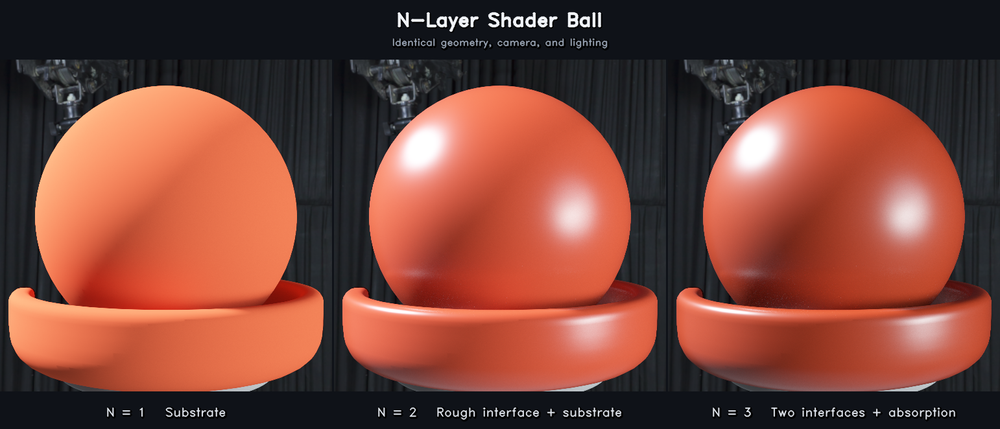

# PathTrace_Validation

BaambooRenderer PathTracer validation snapshots for visual review.

Each scene folder contains:

- `visual_compare_radiance.png`: engine / Mitsuba / PBRT radiance comparison.
- `visual_compare_aovs.png`: geometry and material AOV comparison.

## Gallery Architecture Set

Updated: 2026-07-05 KST

Reference generation:

- Engine: 4096 accumulated samples from BaambooRenderer Debug/D3D12 PathTracer.
- Mitsuba: 1024 spp, max depth 12.
- PBRT-v4: 1024 spp.

| Scene | Radiance | AOV | Notes |
|---|---:|---:|---|
| `gallery_white_room` | PASS | PASS | Visual pass. Reference noise/brightness variance keeps SSIM lower than the other gallery scenes. |
| `gallery_grey_white_room` | PASS | PASS | Visual pass. |
| `gallery_breakfast_room` | PASS | PASS | Visual pass after direct-light visibility offset fix for front chair shadow terminator artifacts. |

Radiance SSIM summary:

| Scene | Mitsuba SSIM | PBRT SSIM |
|---|---:|---:|
| `gallery_white_room` | 0.963415 | 0.957984 |
| `gallery_grey_white_room` | 0.995586 | 0.995602 |
| `gallery_breakfast_room` | 0.993141 | 0.992991 |

## N-Layer Shader Ball

[N=1/N=2/N=3 representative renders and PBRT/Mitsuba/Guo cross-validation](usd_shaderball_nlayer_showcase/README.md)

