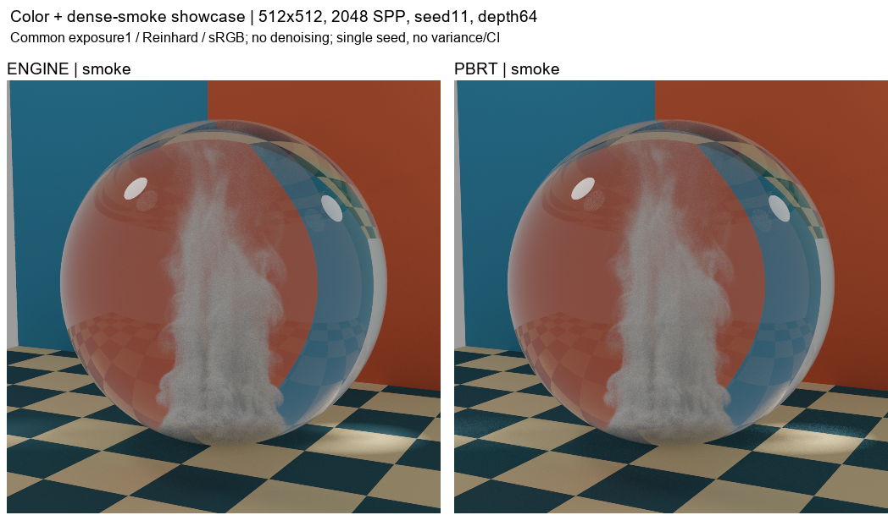

# 실제 대표 이미지와 매질 계측 결과

총406 PNG/64 entries. 기존404 PNG를 모두 보존하고 계측 결과 그래프2장과 결과 문서만 추가했습니다.

**전체 내부 증거는 로컬 보관; 공개자료는 비교 이미지와 결과입니다.** 새 공개 항목은 README·측정값 summary·PNG2장뿐입니다. 소스·패치·실행 도구·상세 내부 provenance·학습 기록은 신규 공개하지 않습니다.

[최신 GPU 시간·매질 작업량 결과](stage4/instrumentation_v1/README.md) · [앞선 엔진/PBRT 성능 비교](stage4/performance_v1/README.md) · [실제 smoke/clear 대표 이미지](stage3-showcase/color_dense_v1/README.md)

사용자는 채도와 연기량을 높인 기존 대표 이미지 정확7 PNG의 육안을 명시 승인했습니다. 기존333+7=340장의 승인 범위이며 Stage2 면제38·과거 미승인24·Stage4 진단 그래프4장으로 확대하지 않습니다. Manifest의 기존 행은 게시 당시 이력을 보존하고, 최신 승인은 별도 overlay로 기록합니다.

이번 계측은 counter OFF의 GPU dispatch 시간과 별도 counter ON의 알고리즘 작업량을 구분합니다. seed7은 사전 지정 워밍업으로 제외하며 startup Primary 시간은 미측정입니다. 원인 후보를 좁히는 관측이고 정상 overhead PASS·인과적 시간 비중·새 수렴 통과·최적화 구현을 뜻하지 않습니다.

Stage2 최신 준비11씬 PASS_SCOPED는 [최종 보고서](stage3-stage2-final-report.md)를 참조하세요. 아래 과거 Stage2 실패/미결정 행은 수정 전 보존 기록입니다.

| Category / scene | PNG | Radiance / scope | Variance | 사용자 육안 |
|---|---:|---|---|---|
| [stage3-showcase / color_dense_v1](stage3-showcase/color_dense_v1/README.md) | 7 | REPRESENTATIVE_RENDER_ONLY_NO_NEW_NUMERICAL_GATE | N/A_SINGLE_SEED | 정확7 PNG 사용자 승인 · 원행은 당시 이력 보존 |
| [stage4 / instrumentation_v1](stage4/instrumentation_v1/README.md) | 2 | IMAGE_IDENTITY_ONLY_NO_NEW_RADIANCE_GATE | NOT_A_NEW_VARIANCE_OR_CONVERGENCE_GATE | 진단 · 새 사용자 승인 주장 없음 |
| [stage4 / performance_v1](stage4/performance_v1/README.md) | 2 | NOT_A_NEW_RADIANCE_GATE | DESCRIPTIVE_FOUR_SEED_ESTIMATES | 진단 · 새 사용자 승인 주장 없음 |
| [stage3-representative / glass_smoke_lighting_v3](stage3-representative/glass_smoke_lighting_v3/README.md) | 24 | {"smoke": "PASS_SCOPED", "clear": "PASS_SCOPED"} | {'smoke': 'PASS_SCOPED', 'clear': 'PASS_SCOPED'} | 승인 · 정확한 SHA |
| [feature-regressions / cornell_box](feature-regressions/cornell_box/README.md) | 11 | 기존 보고서 참조 | See report | 승인 · 정확한 SHA |
| [historical-pbrt-gallery / gallery_breakfast_room](historical-pbrt-gallery/gallery_breakfast_room/README.md) | 8 | 기존 보고서 참조 | See report | 승인 · 정확한 SHA |
| [historical-pbrt-gallery / gallery_glass_of_water](historical-pbrt-gallery/gallery_glass_of_water/README.md) | 5 | 기존 보고서 참조 | See report | 승인 · 정확한 SHA |
| [historical-pbrt-gallery / gallery_grey_white_room](historical-pbrt-gallery/gallery_grey_white_room/README.md) | 5 | 기존 보고서 참조 | See report | 승인 · 정확한 SHA |
| [historical-pbrt-gallery / gallery_white_room](historical-pbrt-gallery/gallery_white_room/README.md) | 5 | 기존 보고서 참조 | See report | 승인 · 정확한 SHA |
| [feature-regressions / cornell_directional_light](feature-regressions/cornell_directional_light/README.md) | 6 | 기존 보고서 참조 | See report | 승인 · 정확한 SHA |
| [feature-regressions / cornell_many_lights](feature-regressions/cornell_many_lights/README.md) | 6 | 기존 보고서 참조 | See report | 승인 · 정확한 SHA |
| [feature-regressions / complex_room_envmap_mis](feature-regressions/complex_room_envmap_mis/README.md) | 6 | 기존 보고서 참조 | See report | 승인 · 정확한 SHA |
| [feature-regressions / cornell_anisotropic_conductor](feature-regressions/cornell_anisotropic_conductor/README.md) | 6 | 기존 보고서 참조 | See report | 승인 · 정확한 SHA |
| [feature-regressions / cornell_box_dielectric](feature-regressions/cornell_box_dielectric/README.md) | 6 | 기존 보고서 참조 | See report | 승인 · 정확한 SHA |
| [feature-regressions / module5d3_water_glass](feature-regressions/module5d3_water_glass/README.md) | 6 | 기존 보고서 참조 | See report | 승인 · 정확한 SHA |
| [feature-regressions / module5d3_camera_inside_water](feature-regressions/module5d3_camera_inside_water/README.md) | 6 | 기존 보고서 참조 | See report | 승인 · 정확한 SHA |
| [feature-regressions / module5d3_thin_neutrality](feature-regressions/module5d3_thin_neutrality/README.md) | 6 | 기존 보고서 참조 | See report | 승인 · 정확한 SHA |
| [secondary-pbrt-layered / gallery_nlayer_sphere_alpha01_n2--analysis_feature_rng_fixed](secondary-pbrt-layered/gallery_nlayer_sphere_alpha01_n2--analysis_feature_rng_fixed/README.md) | 6 | 기존 보고서 참조 | See report | 승인 · 정확한 SHA |
| [feature-regressions / cornell_material_maps](feature-regressions/cornell_material_maps/README.md) | 6 | 기존 보고서 참조 | See report | 승인 · 정확한 SHA |
| [feature-regressions / cornell_normal_map](feature-regressions/cornell_normal_map/README.md) | 6 | 기존 보고서 참조 | See report | 승인 · 정확한 SHA |
| [rgb-supplements / cornell_directional_light](rgb-supplements/cornell_directional_light/README.md) | 3 | 기존 보고서 참조 | See report | 승인 · 정확한 SHA |
| [rgb-supplements / cornell_principled_sheen](rgb-supplements/cornell_principled_sheen/README.md) | 3 | 기존 보고서 참조 | See report | 승인 · 정확한 SHA |
| [secondary-pbrt-layered / gallery_nlayer_sphere_alpha01_n2_constant_env_matched--analysis_constant_control](secondary-pbrt-layered/gallery_nlayer_sphere_alpha01_n2_constant_env_matched--analysis_constant_control/README.md) | 5 | 기존 보고서 참조 | See report | 승인 · 정확한 SHA |
| [secondary-pbrt-layered / gallery_nlayer_sphere_alpha01_n2_constant_env_matched--analysis_internal256_diagnostic](secondary-pbrt-layered/gallery_nlayer_sphere_alpha01_n2_constant_env_matched--analysis_internal256_diagnostic/README.md) | 2 | 기존 보고서 참조 | See report | 승인 · 정확한 SHA |
| [gallery-mitsuba / gallery_breakfast_room](gallery-mitsuba/gallery_breakfast_room/README.md) | 7 | 기존 보고서 참조 | INCONCLUSIVE | 승인 · 정확한 SHA |
| [gallery-mitsuba / gallery_glass_of_water](gallery-mitsuba/gallery_glass_of_water/README.md) | 7 | 기존 보고서 참조 | PASS | 승인 · 정확한 SHA |
| [gallery-mitsuba / gallery_grey_white_room](gallery-mitsuba/gallery_grey_white_room/README.md) | 7 | 기존 보고서 참조 | PASS | 승인 · 정확한 SHA |
| [gallery-mitsuba / gallery_white_room](gallery-mitsuba/gallery_white_room/README.md) | 7 | 기존 보고서 참조 | PASS | 승인 · 정확한 SHA |
| [normal-map-rgb / cornell_normal_map](normal-map-rgb/cornell_normal_map/README.md) | 3 | 기존 보고서 참조 | PASS | 승인 · 정확한 SHA |
| [normal-map-filter-diagnostic / cornell_normal_map](normal-map-filter-diagnostic/cornell_normal_map/README.md) | 4 | 기존 보고서 참조 | PASS | 승인 · 정확한 SHA |
| [corrected-many-lights / cornell_many_lights_matched](corrected-many-lights/cornell_many_lights_matched/README.md) | 8 | 기존 보고서 참조 | PASS | 승인 · 정확한 SHA |
| [corrected-many-lights-spot / cornell_many_lights_matched](corrected-many-lights-spot/cornell_many_lights_matched/README.md) | 8 | 기존 보고서 참조 | PASS | 승인 · 정확한 SHA |
| [layered-guo / gallery_nlayer_sphere_alpha01_n2](layered-guo/gallery_nlayer_sphere_alpha01_n2/README.md) | 5 | 기존 보고서 참조 | PASS | 승인 · 정확한 SHA |
| [layered-guo-surface-fixes / gallery_nlayer_sphere_alpha01_n2](layered-guo-surface-fixes/gallery_nlayer_sphere_alpha01_n2/README.md) | 5 | 기존 보고서 참조 | PASS | 승인 · 정확한 SHA |
| [remaining-native-rgb / complex_room_envmap_mis](remaining-native-rgb/complex_room_envmap_mis/README.md) | 7 | 기존 보고서 참조 | PASS | 승인 · 정확한 SHA |
| [remaining-native-rgb / cornell_anisotropic_conductor](remaining-native-rgb/cornell_anisotropic_conductor/README.md) | 7 | 기존 보고서 참조 | PASS | 승인 · 정확한 SHA |
| [remaining-native-rgb / cornell_material_maps](remaining-native-rgb/cornell_material_maps/README.md) | 7 | 기존 보고서 참조 | PASS | 승인 · 정확한 SHA |
| [remaining-native-rgb / cornell_box_dielectric](remaining-native-rgb/cornell_box_dielectric/README.md) | 7 | 기존 보고서 참조 | PASS | 승인 · 정확한 SHA |
| [remaining-native-rgb / module5d3_water_glass](remaining-native-rgb/module5d3_water_glass/README.md) | 7 | 기존 보고서 참조 | PASS | 승인 · 정확한 SHA |
| [remaining-native-rgb / module5d3_camera_inside_water](remaining-native-rgb/module5d3_camera_inside_water/README.md) | 7 | 기존 보고서 참조 | PASS | 승인 · 정확한 SHA |
| [remaining-native-rgb / module5d3_thin_neutrality](remaining-native-rgb/module5d3_thin_neutrality/README.md) | 7 | 기존 보고서 참조 | PASS | 승인 · 정확한 SHA |
| [engine-surface-fixes / complex_room_envmap_mis](engine-surface-fixes/complex_room_envmap_mis/README.md) | 7 | 기존 보고서 참조 | PASS | 승인 · 정확한 SHA |
| [engine-surface-fixes / gallery_breakfast_room](engine-surface-fixes/gallery_breakfast_room/README.md) | 7 | 기존 보고서 참조 | INCONCLUSIVE | 승인 · 정확한 SHA |
| [engine-surface-fixes / gallery_grey_white_room](engine-surface-fixes/gallery_grey_white_room/README.md) | 7 | 기존 보고서 참조 | PASS | 승인 · 정확한 SHA |
| [engine-surface-fixes / gallery_white_room](engine-surface-fixes/gallery_white_room/README.md) | 7 | 기존 보고서 참조 | PASS | 승인 · 정확한 SHA |
| [glass-conductor-fixed / gallery_glass_of_water](glass-conductor-fixed/gallery_glass_of_water/README.md) | 8 | 기존 보고서 참조 | PASS | 승인 · 정확한 SHA |
| [white-scalar-mask-path / gallery_white_room](white-scalar-mask-path/gallery_white_room/README.md) | 7 | 기존 보고서 참조 | PASS | 승인 · 정확한 SHA |
| [white-scalar-mask-volpath / gallery_white_room](white-scalar-mask-volpath/gallery_white_room/README.md) | 6 | 기존 보고서 참조 | PASS | 승인 · 정확한 SHA |
| [white-floor-distribution-control / gallery_white_room](white-floor-distribution-control/gallery_white_room/README.md) | 5 | 기존 보고서 참조 | PASS | 승인 · 정확한 SHA |
| [layered-showcase-regression / gallery_nlayer_shaderball_n3](layered-showcase-regression/gallery_nlayer_shaderball_n3/README.md) | 8 | 기존 보고서 참조 | PASS_VARIANCE_DECREASE_ONLY | superseded · 미승인 |
| [layered-showcase-hero / gallery_nlayer_shaderball_n3](layered-showcase-hero/gallery_nlayer_shaderball_n3/README.md) | 4 | 기존 보고서 참조 | NOT_APPLICABLE_SINGLE_SEED | superseded · 미승인 |
| [layered-showcase-regression / gallery_nlayer_killeroo_n4_alpha01_bright10x](layered-showcase-regression/gallery_nlayer_killeroo_n4_alpha01_bright10x/README.md) | 8 | 기존 보고서 참조 | PASS_VARIANCE_DECREASE_ONLY | superseded · 미승인 |
| [layered-showcase-hero / gallery_nlayer_killeroo_n4_alpha01_bright10x](layered-showcase-hero/gallery_nlayer_killeroo_n4_alpha01_bright10x/README.md) | 4 | 기존 보고서 참조 | NOT_APPLICABLE_SINGLE_SEED | superseded · 미승인 |
| [sphere-mis-fixed-regression / gallery_nlayer_killeroo_n4_alpha01_bright10x](sphere-mis-fixed-regression/gallery_nlayer_killeroo_n4_alpha01_bright10x/README.md) | 12 | 기존 보고서 참조 | PASS_VARIANCE_DECREASE_ONLY | 승인 · 정확한 SHA |
| [sphere-mis-fixed-regression / gallery_nlayer_shaderball_n3](sphere-mis-fixed-regression/gallery_nlayer_shaderball_n3/README.md) | 12 | 기존 보고서 참조 | PASS_VARIANCE_DECREASE_ONLY | 승인 · 정확한 SHA |
| [sphere-mis-fixed-hero / gallery_nlayer_killeroo_n4_alpha01_bright10x](sphere-mis-fixed-hero/gallery_nlayer_killeroo_n4_alpha01_bright10x/README.md) | 7 | 기존 보고서 참조 | NOT_APPLICABLE_SINGLE_SEED | 승인 · 정확한 SHA |
| [sphere-mis-pbrt-control / lambertian_sphere_scalar](sphere-mis-pbrt-control/lambertian_sphere_scalar/README.md) | 1 | 기존 보고서 참조 | OBSERVED_DECREASE_FOUR_SEEDS | 승인 · 정확한 SHA |
| [stage2-absorption / gallery_medium_stage2_constant_absorption_128](stage2-absorption/gallery_medium_stage2_constant_absorption_128/README.md) | 6 | INCONCLUSIVE | PASS_VARIANCE_DECREASE_ONLY | 면제 · 승인 아님 |
| [stage2-absorption / gallery_medium_stage2_ramp_absorption](stage2-absorption/gallery_medium_stage2_ramp_absorption/README.md) | 6 | INCONCLUSIVE | PASS_VARIANCE_DECREASE_ONLY | 면제 · 승인 아님 |
| [stage2-scattering / gallery_medium_stage2_constant_scatter_g0](stage2-scattering/gallery_medium_stage2_constant_scatter_g0/README.md) | 6 | INCONCLUSIVE | PASS_SCOPED | 면제 · 승인 아님 |
| [stage2-scattering / gallery_medium_stage2_ramp_scatter_gp05](stage2-scattering/gallery_medium_stage2_ramp_scatter_gp05/README.md) | 6 | INCONCLUSIVE | PASS_SCOPED | 면제 · 승인 아님 |
| [stage2-scattering / gallery_medium_stage2_ramp_scatter_gm05](stage2-scattering/gallery_medium_stage2_ramp_scatter_gm05/README.md) | 6 | INCONCLUSIVE | PASS_SCOPED | 면제 · 승인 아님 |
| [stage2-scattering / gallery_medium_stage2_smoke_scatter_g0](stage2-scattering/gallery_medium_stage2_smoke_scatter_g0/README.md) | 6 | INCONCLUSIVE | PASS_SCOPED | 면제 · 승인 아님 |
| [stage2-boundary / boundary_tangent_defect](stage2-boundary/boundary_tangent_defect/README.md) | 2 | FAIL_DETERMINISTIC_VACUUM | NOT_A_STOCHASTIC_VARIANCE_FAILURE | 면제 · 승인 아님 |
