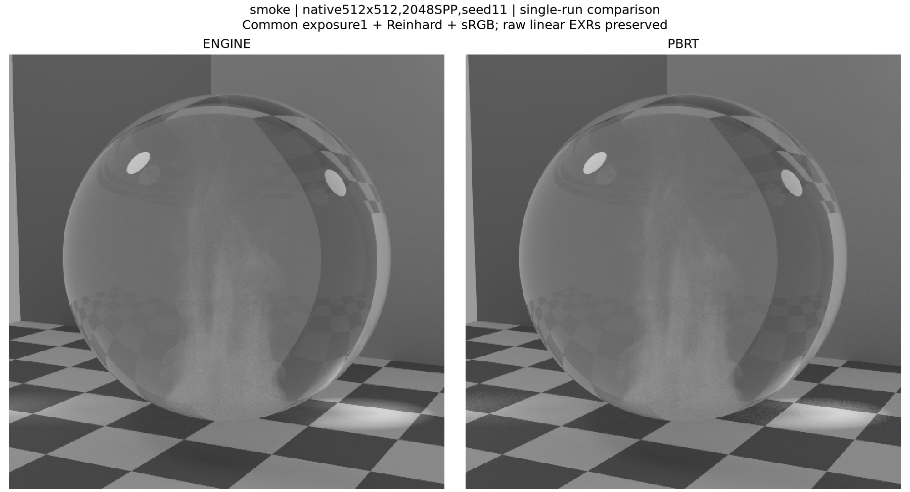

# 전체 검증 이미지 색인

총 395 PNG / 61 entries. 승인 309, superseded 미승인 24, Stage2 면제 38, Stage3 검토 대기 24.

새 Stage3 실제 RGB 비교를 먼저 배치했습니다. 육안 상태는 수치·소스 계약 판정과 별개입니다.

Stage2 최신 준비11씬은 고정된 평균·분산 감소·깊이 기준에서 **PASS_SCOPED**입니다. [최종 기술 보고서](stage3-stage2-final-report.md)를 확인하세요. 아래 Stage2 INCONCLUSIVE/FAIL 행은 수정 전 보존 기록이며 최신 판정은 최종 보고서에 있습니다.

이전 Stage1 수집기의 OPEN 기본 표기는 여기서 «기존 보고서 참조»로 안내합니다. 원 manifest 값·실제 실패/한계·원 이미지·정확 SHA 육안 승인은 그대로 보존하며 새 수치 통과나 미해결 판정을 추론하지 않습니다.

## [glass_smoke_lighting_v3](stage3-representative/glass_smoke_lighting_v3/README.md)

실제 유리구슬 내부 smoke와 동일 glass clear 대조. 68 EXR 정상완료; smoke/clear 평균·분산 감소·depth 기준 PASS_SCOPED. 독립 검산2456항목 일치. 사용자 육안 검토 PENDING, 전체 stage_pass=false. 수치: {"smoke": "PASS_SCOPED", "clear": "PASS_SCOPED"}; 육안: 사용자 검토 대기.

| Category / scene | PNG | Radiance | Variance | 사용자 육안 |
|---|---:|---|---|---|
| [stage3-representative / glass_smoke_lighting_v3](stage3-representative/glass_smoke_lighting_v3/README.md) | 24 | {"smoke": "PASS_SCOPED", "clear": "PASS_SCOPED"} | {"smoke": "PASS_SCOPED", "clear": "PASS_SCOPED"} | 사용자 검토 대기 |
| [feature-regressions / cornell_box](feature-regressions/cornell_box/README.md) | 11 | 기존 보고서 참조 | See report | 승인 · 정확한 SHA |
| [historical-pbrt-gallery / gallery_breakfast_room](historical-pbrt-gallery/gallery_breakfast_room/README.md) | 8 | 기존 보고서 참조 | See report | 승인 · 정확한 SHA |
| [historical-pbrt-gallery / gallery_glass_of_water](historical-pbrt-gallery/gallery_glass_of_water/README.md) | 5 | 기존 보고서 참조 | See report | 승인 · 정확한 SHA |
| [historical-pbrt-gallery / gallery_grey_white_room](historical-pbrt-gallery/gallery_grey_white_room/README.md) | 5 | 기존 보고서 참조 | See report | 승인 · 정확한 SHA |
| [historical-pbrt-gallery / gallery_white_room](historical-pbrt-gallery/gallery_white_room/README.md) | 5 | 기존 보고서 참조 | See report | 승인 · 정확한 SHA |
| [feature-regressions / cornell_directional_light](feature-regressions/cornell_directional_light/README.md) | 6 | 기존 보고서 참조 | See report | 승인 · 정확한 SHA |
| [feature-regressions / cornell_many_lights](feature-regressions/cornell_many_lights/README.md) | 6 | 기존 보고서 참조 | See report | 승인 · 정확한 SHA |
| [feature-regressions / complex_room_envmap_mis](feature-regressions/complex_room_envmap_mis/README.md) | 6 | 기존 보고서 참조 | See report | 승인 · 정확한 SHA |
| [feature-regressions / cornell_anisotropic_conductor](feature-regressions/cornell_anisotropic_conductor/README.md) | 6 | 기존 보고서 참조 | See report | 승인 · 정확한 SHA |
| [feature-regressions / cornell_box_dielectric](feature-regressions/cornell_box_dielectric/README.md) | 6 | 기존 보고서 참조 | See report | 승인 · 정확한 SHA |
| [feature-regressions / module5d3_water_glass](feature-regressions/module5d3_water_glass/README.md) | 6 | 기존 보고서 참조 | See report | 승인 · 정확한 SHA |
| [feature-regressions / module5d3_camera_inside_water](feature-regressions/module5d3_camera_inside_water/README.md) | 6 | 기존 보고서 참조 | See report | 승인 · 정확한 SHA |
| [feature-regressions / module5d3_thin_neutrality](feature-regressions/module5d3_thin_neutrality/README.md) | 6 | 기존 보고서 참조 | See report | 승인 · 정확한 SHA |
| [secondary-pbrt-layered / gallery_nlayer_sphere_alpha01_n2--analysis_feature_rng_fixed](secondary-pbrt-layered/gallery_nlayer_sphere_alpha01_n2--analysis_feature_rng_fixed/README.md) | 6 | 기존 보고서 참조 | See report | 승인 · 정확한 SHA |
| [feature-regressions / cornell_material_maps](feature-regressions/cornell_material_maps/README.md) | 6 | 기존 보고서 참조 | See report | 승인 · 정확한 SHA |
| [feature-regressions / cornell_normal_map](feature-regressions/cornell_normal_map/README.md) | 6 | 기존 보고서 참조 | See report | 승인 · 정확한 SHA |
| [rgb-supplements / cornell_directional_light](rgb-supplements/cornell_directional_light/README.md) | 3 | 기존 보고서 참조 | See report | 승인 · 정확한 SHA |
| [rgb-supplements / cornell_principled_sheen](rgb-supplements/cornell_principled_sheen/README.md) | 3 | 기존 보고서 참조 | See report | 승인 · 정확한 SHA |
| [secondary-pbrt-layered / gallery_nlayer_sphere_alpha01_n2_constant_env_matched--analysis_constant_control](secondary-pbrt-layered/gallery_nlayer_sphere_alpha01_n2_constant_env_matched--analysis_constant_control/README.md) | 5 | 기존 보고서 참조 | See report | 승인 · 정확한 SHA |
| [secondary-pbrt-layered / gallery_nlayer_sphere_alpha01_n2_constant_env_matched--analysis_internal256_diagnostic](secondary-pbrt-layered/gallery_nlayer_sphere_alpha01_n2_constant_env_matched--analysis_internal256_diagnostic/README.md) | 2 | 기존 보고서 참조 | See report | 승인 · 정확한 SHA |
| [gallery-mitsuba / gallery_breakfast_room](gallery-mitsuba/gallery_breakfast_room/README.md) | 7 | 기존 보고서 참조 | INCONCLUSIVE | 승인 · 정확한 SHA |
| [gallery-mitsuba / gallery_glass_of_water](gallery-mitsuba/gallery_glass_of_water/README.md) | 7 | 기존 보고서 참조 | PASS | 승인 · 정확한 SHA |
| [gallery-mitsuba / gallery_grey_white_room](gallery-mitsuba/gallery_grey_white_room/README.md) | 7 | 기존 보고서 참조 | PASS | 승인 · 정확한 SHA |
| [gallery-mitsuba / gallery_white_room](gallery-mitsuba/gallery_white_room/README.md) | 7 | 기존 보고서 참조 | PASS | 승인 · 정확한 SHA |
| [normal-map-rgb / cornell_normal_map](normal-map-rgb/cornell_normal_map/README.md) | 3 | 기존 보고서 참조 | PASS | 승인 · 정확한 SHA |
| [normal-map-filter-diagnostic / cornell_normal_map](normal-map-filter-diagnostic/cornell_normal_map/README.md) | 4 | 기존 보고서 참조 | PASS | 승인 · 정확한 SHA |
| [corrected-many-lights / cornell_many_lights_matched](corrected-many-lights/cornell_many_lights_matched/README.md) | 8 | 기존 보고서 참조 | PASS | 승인 · 정확한 SHA |
| [corrected-many-lights-spot / cornell_many_lights_matched](corrected-many-lights-spot/cornell_many_lights_matched/README.md) | 8 | 기존 보고서 참조 | PASS | 승인 · 정확한 SHA |
| [layered-guo / gallery_nlayer_sphere_alpha01_n2](layered-guo/gallery_nlayer_sphere_alpha01_n2/README.md) | 5 | 기존 보고서 참조 | PASS | 승인 · 정확한 SHA |
| [layered-guo-surface-fixes / gallery_nlayer_sphere_alpha01_n2](layered-guo-surface-fixes/gallery_nlayer_sphere_alpha01_n2/README.md) | 5 | 기존 보고서 참조 | PASS | 승인 · 정확한 SHA |
| [remaining-native-rgb / complex_room_envmap_mis](remaining-native-rgb/complex_room_envmap_mis/README.md) | 7 | 기존 보고서 참조 | PASS | 승인 · 정확한 SHA |
| [remaining-native-rgb / cornell_anisotropic_conductor](remaining-native-rgb/cornell_anisotropic_conductor/README.md) | 7 | 기존 보고서 참조 | PASS | 승인 · 정확한 SHA |
| [remaining-native-rgb / cornell_material_maps](remaining-native-rgb/cornell_material_maps/README.md) | 7 | 기존 보고서 참조 | PASS | 승인 · 정확한 SHA |
| [remaining-native-rgb / cornell_box_dielectric](remaining-native-rgb/cornell_box_dielectric/README.md) | 7 | 기존 보고서 참조 | PASS | 승인 · 정확한 SHA |
| [remaining-native-rgb / module5d3_water_glass](remaining-native-rgb/module5d3_water_glass/README.md) | 7 | 기존 보고서 참조 | PASS | 승인 · 정확한 SHA |
| [remaining-native-rgb / module5d3_camera_inside_water](remaining-native-rgb/module5d3_camera_inside_water/README.md) | 7 | 기존 보고서 참조 | PASS | 승인 · 정확한 SHA |
| [remaining-native-rgb / module5d3_thin_neutrality](remaining-native-rgb/module5d3_thin_neutrality/README.md) | 7 | 기존 보고서 참조 | PASS | 승인 · 정확한 SHA |
| [engine-surface-fixes / complex_room_envmap_mis](engine-surface-fixes/complex_room_envmap_mis/README.md) | 7 | 기존 보고서 참조 | PASS | 승인 · 정확한 SHA |
| [engine-surface-fixes / gallery_breakfast_room](engine-surface-fixes/gallery_breakfast_room/README.md) | 7 | 기존 보고서 참조 | INCONCLUSIVE | 승인 · 정확한 SHA |
| [engine-surface-fixes / gallery_grey_white_room](engine-surface-fixes/gallery_grey_white_room/README.md) | 7 | 기존 보고서 참조 | PASS | 승인 · 정확한 SHA |
| [engine-surface-fixes / gallery_white_room](engine-surface-fixes/gallery_white_room/README.md) | 7 | 기존 보고서 참조 | PASS | 승인 · 정확한 SHA |
| [glass-conductor-fixed / gallery_glass_of_water](glass-conductor-fixed/gallery_glass_of_water/README.md) | 8 | 기존 보고서 참조 | PASS | 승인 · 정확한 SHA |
| [white-scalar-mask-path / gallery_white_room](white-scalar-mask-path/gallery_white_room/README.md) | 7 | 기존 보고서 참조 | PASS | 승인 · 정확한 SHA |
| [white-scalar-mask-volpath / gallery_white_room](white-scalar-mask-volpath/gallery_white_room/README.md) | 6 | 기존 보고서 참조 | PASS | 승인 · 정확한 SHA |
| [white-floor-distribution-control / gallery_white_room](white-floor-distribution-control/gallery_white_room/README.md) | 5 | 기존 보고서 참조 | PASS | 승인 · 정확한 SHA |
| [layered-showcase-regression / gallery_nlayer_shaderball_n3](layered-showcase-regression/gallery_nlayer_shaderball_n3/README.md) | 8 | 기존 보고서 참조 | PASS_VARIANCE_DECREASE_ONLY | superseded · 미승인 |
| [layered-showcase-hero / gallery_nlayer_shaderball_n3](layered-showcase-hero/gallery_nlayer_shaderball_n3/README.md) | 4 | 기존 보고서 참조 | NOT_APPLICABLE_SINGLE_SEED | superseded · 미승인 |
| [layered-showcase-regression / gallery_nlayer_killeroo_n4_alpha01_bright10x](layered-showcase-regression/gallery_nlayer_killeroo_n4_alpha01_bright10x/README.md) | 8 | 기존 보고서 참조 | PASS_VARIANCE_DECREASE_ONLY | superseded · 미승인 |
| [layered-showcase-hero / gallery_nlayer_killeroo_n4_alpha01_bright10x](layered-showcase-hero/gallery_nlayer_killeroo_n4_alpha01_bright10x/README.md) | 4 | 기존 보고서 참조 | NOT_APPLICABLE_SINGLE_SEED | superseded · 미승인 |
| [sphere-mis-fixed-regression / gallery_nlayer_killeroo_n4_alpha01_bright10x](sphere-mis-fixed-regression/gallery_nlayer_killeroo_n4_alpha01_bright10x/README.md) | 12 | 기존 보고서 참조 | PASS_VARIANCE_DECREASE_ONLY | 승인 · 정확한 SHA |
| [sphere-mis-fixed-regression / gallery_nlayer_shaderball_n3](sphere-mis-fixed-regression/gallery_nlayer_shaderball_n3/README.md) | 12 | 기존 보고서 참조 | PASS_VARIANCE_DECREASE_ONLY | 승인 · 정확한 SHA |
| [sphere-mis-fixed-hero / gallery_nlayer_killeroo_n4_alpha01_bright10x](sphere-mis-fixed-hero/gallery_nlayer_killeroo_n4_alpha01_bright10x/README.md) | 7 | 기존 보고서 참조 | NOT_APPLICABLE_SINGLE_SEED | 승인 · 정확한 SHA |
| [sphere-mis-pbrt-control / lambertian_sphere_scalar](sphere-mis-pbrt-control/lambertian_sphere_scalar/README.md) | 1 | 기존 보고서 참조 | OBSERVED_DECREASE_FOUR_SEEDS | 승인 · 정확한 SHA |
| [stage2-absorption / gallery_medium_stage2_constant_absorption_128](stage2-absorption/gallery_medium_stage2_constant_absorption_128/README.md) | 6 | INCONCLUSIVE | PASS_VARIANCE_DECREASE_ONLY | 면제 · 승인 아님 |
| [stage2-absorption / gallery_medium_stage2_ramp_absorption](stage2-absorption/gallery_medium_stage2_ramp_absorption/README.md) | 6 | INCONCLUSIVE | PASS_VARIANCE_DECREASE_ONLY | 면제 · 승인 아님 |
| [stage2-scattering / gallery_medium_stage2_constant_scatter_g0](stage2-scattering/gallery_medium_stage2_constant_scatter_g0/README.md) | 6 | INCONCLUSIVE | PASS_SCOPED | 면제 · 승인 아님 |
| [stage2-scattering / gallery_medium_stage2_ramp_scatter_gp05](stage2-scattering/gallery_medium_stage2_ramp_scatter_gp05/README.md) | 6 | INCONCLUSIVE | PASS_SCOPED | 면제 · 승인 아님 |
| [stage2-scattering / gallery_medium_stage2_ramp_scatter_gm05](stage2-scattering/gallery_medium_stage2_ramp_scatter_gm05/README.md) | 6 | INCONCLUSIVE | PASS_SCOPED | 면제 · 승인 아님 |
| [stage2-scattering / gallery_medium_stage2_smoke_scatter_g0](stage2-scattering/gallery_medium_stage2_smoke_scatter_g0/README.md) | 6 | INCONCLUSIVE | PASS_SCOPED | 면제 · 승인 아님 |
| [stage2-boundary / boundary_tangent_defect](stage2-boundary/boundary_tangent_defect/README.md) | 2 | FAIL_DETERMINISTIC_VACUUM | NOT_A_STOCHASTIC_VARIANCE_FAILURE | 면제 · 승인 아님 |

## 기술 보고서와 근거

Stage2 후속 진단은 문서로 제공합니다. 육안 면제는 승인과 다르며 Stage3 실제 이미지 검토는 별도로 필요합니다.

- [Stage2 failure and repair; Stage3 source and statistical scope](stage3-technical-reports.md)
- [Stage2 final technical report:prepared11-scene results](stage3-stage2-final-report.md)
- [Stage2 final prepared-scope statistics](stage3-stage2-final-summary.json)
- [Stage2 final completion with scoped gates](stage3-stage2-final-completion.json)
- [320 actual Stage2 EXR identities](stage3-stage2-image-inventory.json)
- [Independent verification:320EXRs and3440 numerical comparisons](stage3-stage2-independent-review.json)
- [Bounded GPU contact evidence and limitations](stage3-boundary-gpu-review.json)
- [Scoped v5 application integration context](stage3-stage2-v5-context.json)
- [Formal Stage3 source context; no image acceptance](stage3-source-context.json)
- [Formal Stage3 CPU source and protocol intake](stage3-intake-preflight.json)
- [Stage2 v4: actual image failure and unchanged loss witnesses](stage3-context-stage2-v4-image-failure.json)
- [Stage2 v5: actual application vacuum recovery](stage3-context-stage2-v5-raw-integration.json)
- [V5 loader source delta: host behavior retained](stage3-loader-delta-review.json)
- [Stage3 matched source review and limitations](stage3-source-contract-review.json)
- [Stage3 source review in readable form](stage3-source-contract-review.md)
- [Formal Stage3 frozen source and artifact hashes](stage3-formal-inputs.json)
- [Precommitted radiance, noise, depth and display protocol](stage3-analysis-protocol.json)
- [Formal Stage3 base acquisition plan](stage3-base-plan.json)
- [Formal Stage3 depth acquisition plan](stage3-depth-plan.json)
- [Formal Stage3 hero acquisition plan](stage3-hero-plan.json)
- [Stage2 technical report 1: gallery_medium_stage2_constant_absorption_128](stage3-context-stage2-report-01.json)
- [Stage2 report 1: analysis_receipt](stage3-context-stage2-report-01-analysis_receipt.json)
- [Stage2 report 1: orchestration_receipt](stage3-context-stage2-report-01-orchestration_receipt.json)
- [Stage2 report 1: qa_receipt](stage3-context-stage2-report-01-qa_receipt.json)
- [Stage2 technical report 2: gallery_medium_stage2_ramp_absorption](stage3-context-stage2-report-02.json)
- [Stage2 report 2: analysis_receipt](stage3-context-stage2-report-02-analysis_receipt.json)
- [Stage2 report 2: orchestration_receipt](stage3-context-stage2-report-02-orchestration_receipt.json)
- [Stage2 report 2: qa_receipt](stage3-context-stage2-report-02-qa_receipt.json)
- [Stage2 technical report 3: COMPLETE_SCATTER_REVALIDATION_SCOPED](stage3-context-stage2-report-03.json)
- [Stage2 report 3: orchestration_receipt](stage3-context-stage2-report-03-orchestration_receipt.json)
- [Stage2 report 3: qa_receipt](stage3-context-stage2-report-03-qa_receipt.json)
- [Stage3 actual RGB, fixed gates, noise and depth results](stage3-result-report.md)
- [Stage3 individual24 PNG artifact QA; user review pending](stage3-figure-qa.json)
- [Stage3 independent68 EXR/2456-value review](stage3-independent-statistics-review.json)
- [Original immutable Stage3 statistics receipt](stage3-statistics-original-receipt.json)
- [Stage3 recorded timing scopes; not Stage4](stage3-measured-timings.json)
