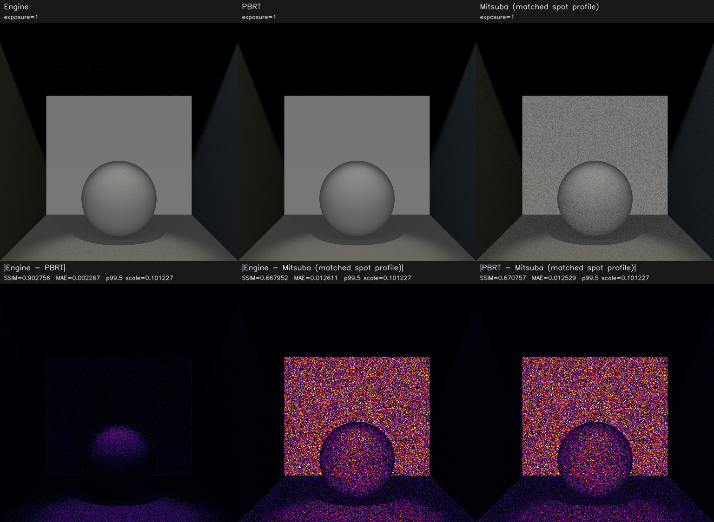
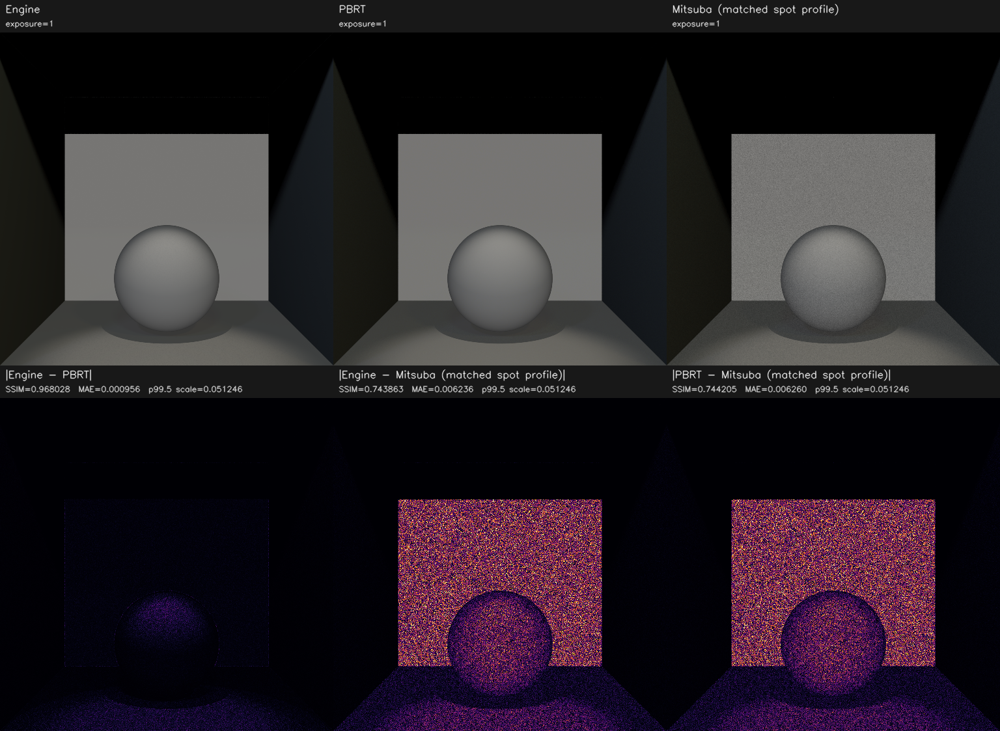
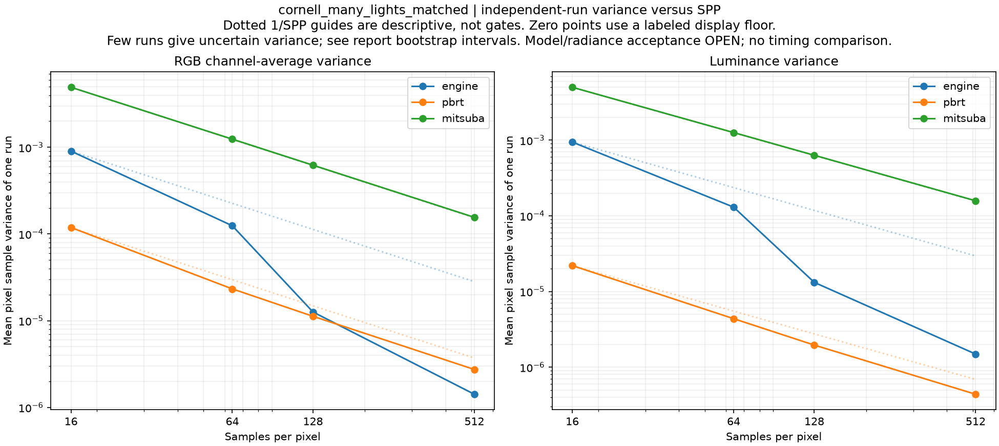
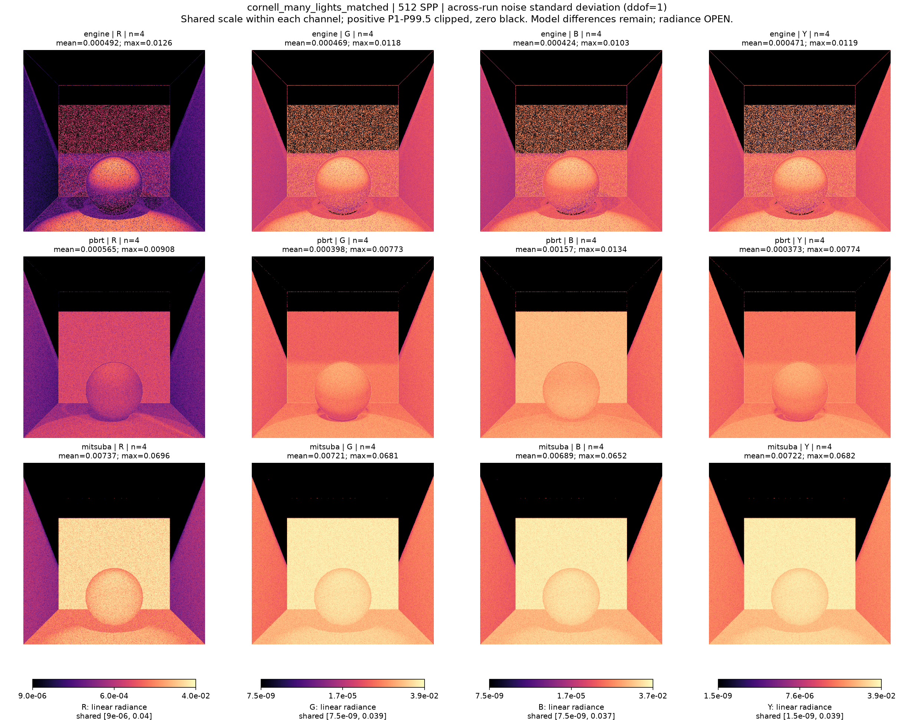
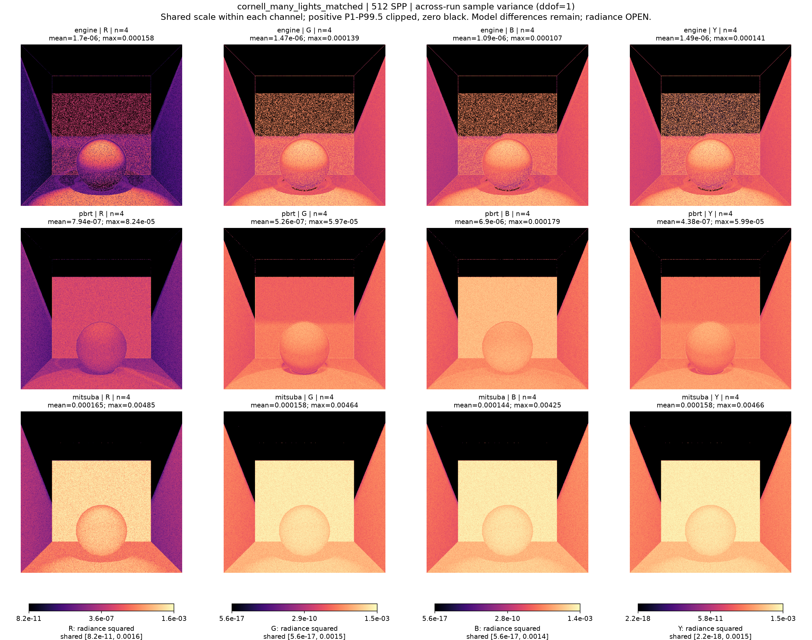
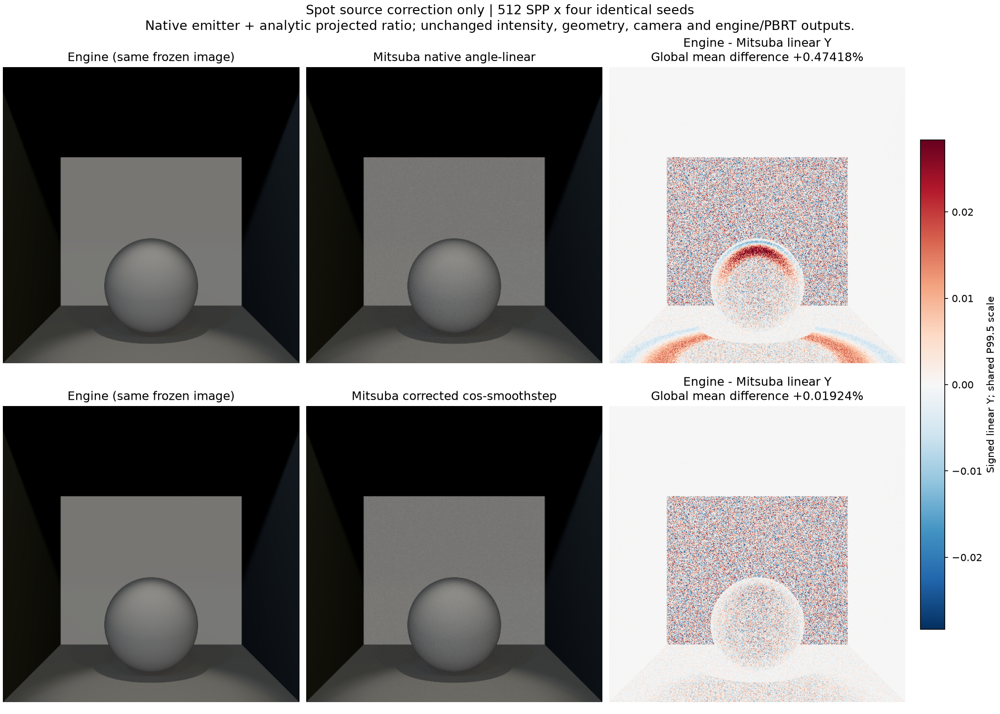

# cornell_many_lights_matched

**Radiance: OPEN · Variance: PASS · 사용자 육안 확인: 승인 (기존 게시 이미지)**

Reference: PBRT primary / Mitsuba cosine-smoothstep spot

Mitsuba spot의 각도 선형 감쇠를 native emitter의 projected texture로 engine/PBRT의 cosine smoothstep에 맞췄습니다. 엔진/PBRT 영상은 직전 fixture와 동일합니다. 512 SPP x 4 engine-minus-Mitsuba 평균 Y +0.47418% → +0.01924%; 양쪽 분산 수렴 PASS. 원시 Mitsuba SSIM 0.836417은 .99 기준 미달이며 그대로 보고합니다. Residual MSE / mean-image variance 예측은 RGB 0.99819, Y 0.99819로 noise-floor와 일치하는 진단이지만 bias 부재 증명은 아닙니다. 우상단의 작은 +0.1505% 평균 residual 구간은 0을 포함하지 않습니다. Mitsuba의 실제 uniform emitter PMF와 engine power-CDF 선택 차이도 기록했습니다.

반복 검증의 평균 영상은 여러 seed를 평균한 결과이며, 대표 이미지로 표시된 단일 seed 렌더와 구분합니다. 노이즈 영상은 seed 간 분산 또는 표준편차입니다. 노이즈 비율 1은 통과 기준이 아닙니다. 색상 스케일·SPP·seed 수는 각 그림에 표시됩니다.

## radiance_mean4_128.png

## radiance_mean4_512.png

## radiance_seed11_128.png

## radiance_seed11_512.png

## replicate_noise_convergence.png

## replicate_noise_stddev_512.png

## replicate_noise_variance_512.png

## spot_profile_before_after_512.png

