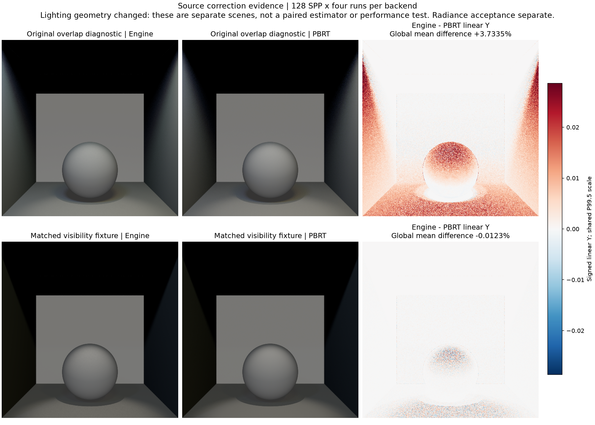
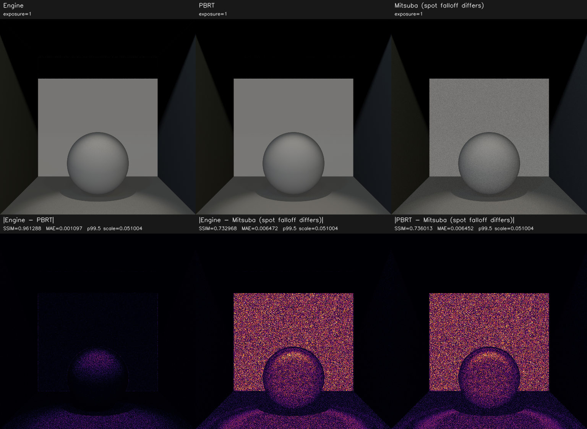
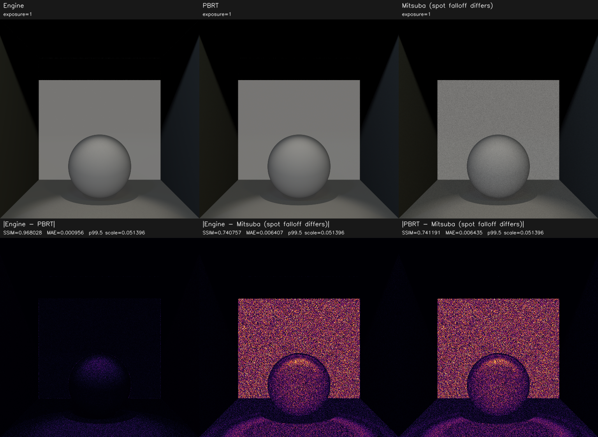
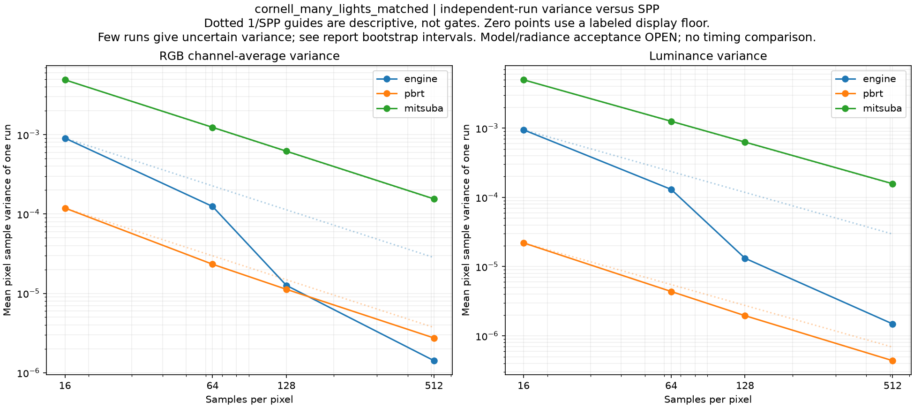
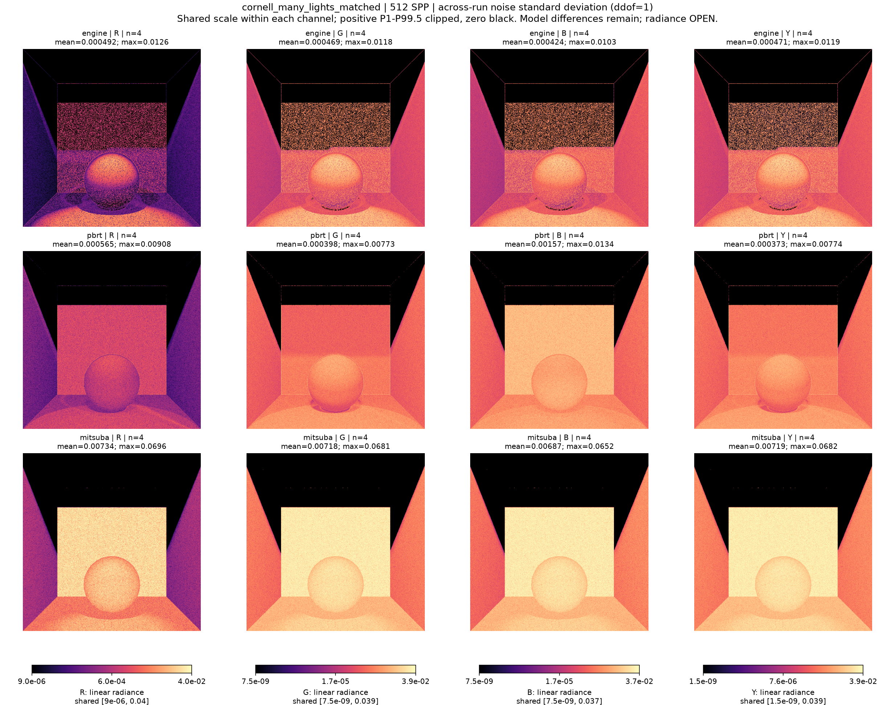
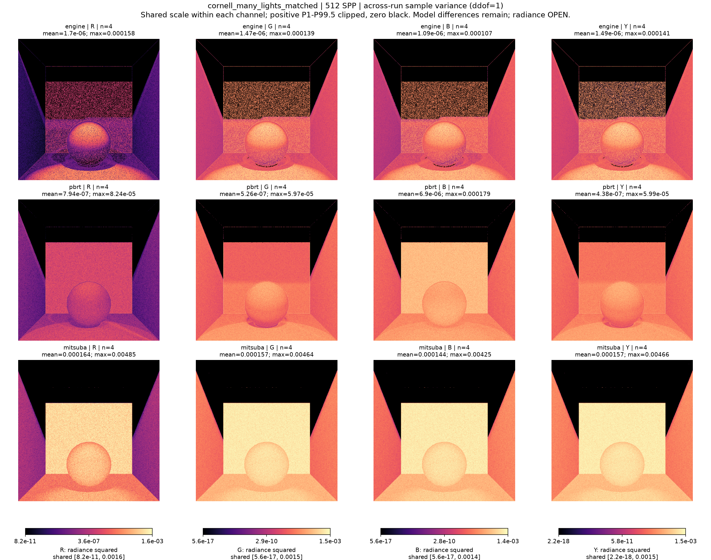

# cornell_many_lights_matched

**Radiance: OPEN · Variance: PASS · 사용자 육안 확인: 승인 (기존 게시 이미지)**

Reference: PBRT primary / Mitsuba diagnostic

기존 finite-light geometry 동작에 맞도록 발광체 간 차폐가 없는 별도 fixture를 추가했습니다. 동일 receiver mesh와 open-cylinder emitter를 사용합니다. PBRT 평균 Y 차이: 기존 128 SPP +3.7335%, 새 128 SPP −0.0123%, 새 512 SPP −0.0147%. 512 SPP mean SSIM 0.990714로 기존 0.99 기준을 통과했습니다. Engine/PBRT Y variance ratio 3.3952, RGB variance ratio 0.5177을 각각 보고합니다. Mitsuba spot falloff 차이는 아직 이 진단에 남아 있습니다.

반복 검증의 평균 영상은 여러 seed를 평균한 결과이며, 대표 이미지로 표시된 단일 seed 렌더와 구분합니다. 노이즈 영상은 seed 간 분산 또는 표준편차입니다. 노이즈 비율 1은 통과 기준이 아닙니다. 색상 스케일·SPP·seed 수는 각 그림에 표시됩니다.

## original_vs_matched_128.png

## radiance_mean4_128.png

## radiance_mean4_512.png

## radiance_seed11_128.png

## radiance_seed11_512.png

## replicate_noise_convergence.png

## replicate_noise_stddev_512.png

## replicate_noise_variance_512.png

