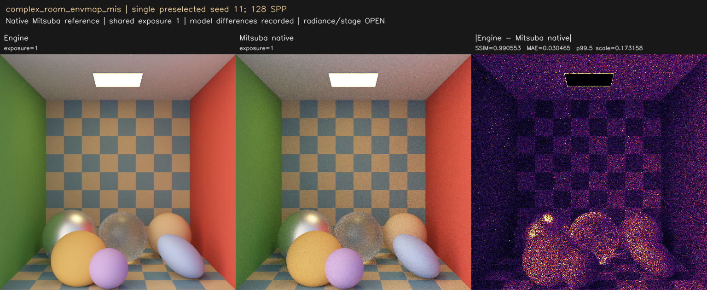
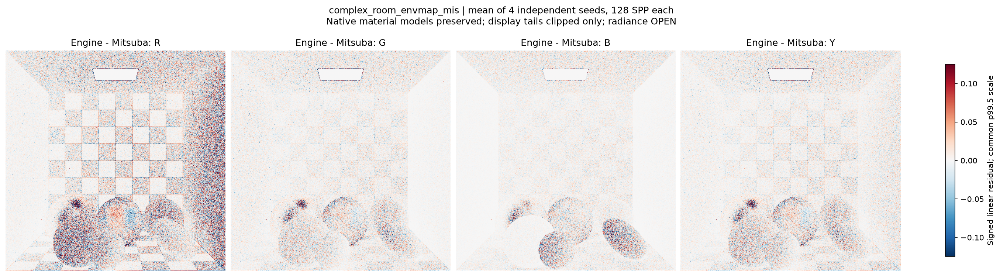
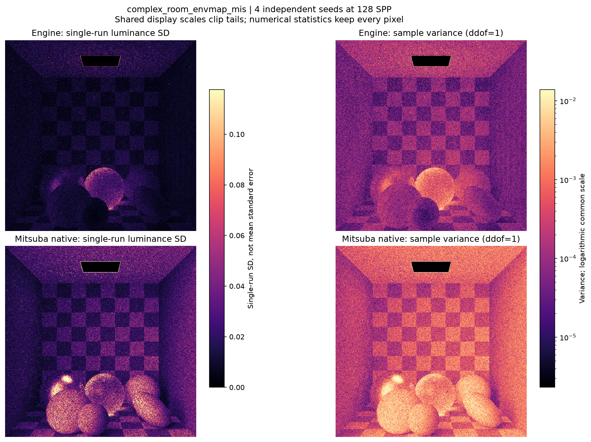
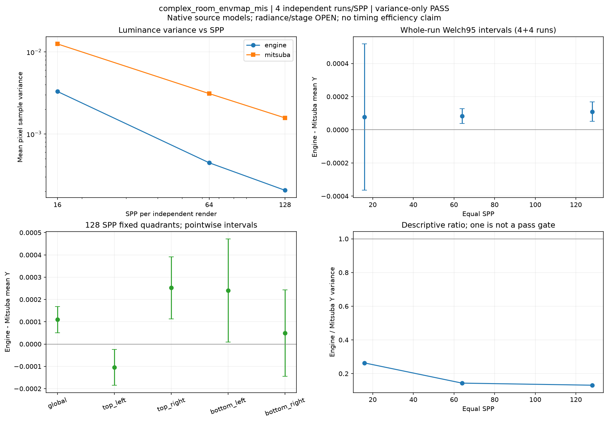

현재 사용자 육안 상태: **승인**. Radiance/variance의 역사적 판정은 바꾸지 않습니다.

---

# complex_room_envmap_mis

**Radiance: OPEN · Variance: PASS · 사용자 육안 확인: 승인 (기존 게시 이미지)**

Reference: Mitsuba 3.9.1 native RGB

환경맵 U 이음매 및 generic conductor 반사율 수정 후 production shader(0be9f4cf...)의 새 엔진 렌더입니다. 128 SPP 평균 Y 차이 +0.028259%, renderer당 4 seeds. 기존 SSIM .99 검사: 0.997503 / PASSED. 원본 Mitsuba reference는 보존했고 수정 전 baseline과 비교했습니다. 현재 variance 판정과 남은 material/filter 모델 차이를 함께 보세요. 환경맵 수정은 GPU 이음매/극점 검사에서 재현·검증했으며, 씬에서 실제 사용하는 환경 방향에 따라 영상 변화가 없을 수도 있습니다.

반복 검증의 평균 영상은 여러 seed를 평균한 결과이며, 대표 이미지로 표시된 단일 seed 렌더와 구분합니다. 노이즈 영상은 seed 간 분산 또는 표준편차입니다. 노이즈 비율 1은 통과 기준이 아닙니다. 색상 스케일·SPP·seed 수는 각 그림에 표시됩니다.

## radiance_mean4_spp16.png

## radiance_mean4_spp64.png

## radiance_mean4_spp128.png

## radiance_seed11_spp128.png

## signed_residuals.png

## noise_variance.png

## convergence_uncertainty.png

