# cornell_box

**Radiance: OPEN · Variance: See report · 사용자 육안 확인: 대기**

Reference: PBRT / Mitsuba

RNG 수정 후 최초 엔진 회귀 baseline입니다. 이후 수정 비교는 최상위 최신 결과 링크를 사용하세요. 분산 감소와 radiance 일치는 별도입니다. 원본 many-lights 차폐 불일치와 normal-map 필터 차이는 이 baseline에 남아 있습니다.

평균 영상은 여러 seed의 평균이며 단일 렌더와 구분했습니다. 노이즈 영상은 seed 간 분산입니다. 노이즈 비율 1은 통과 기준이 아닙니다. 색상 스케일·SPP·seed 수는 각 그림에 표시됩니다.

## noise_convergence.png

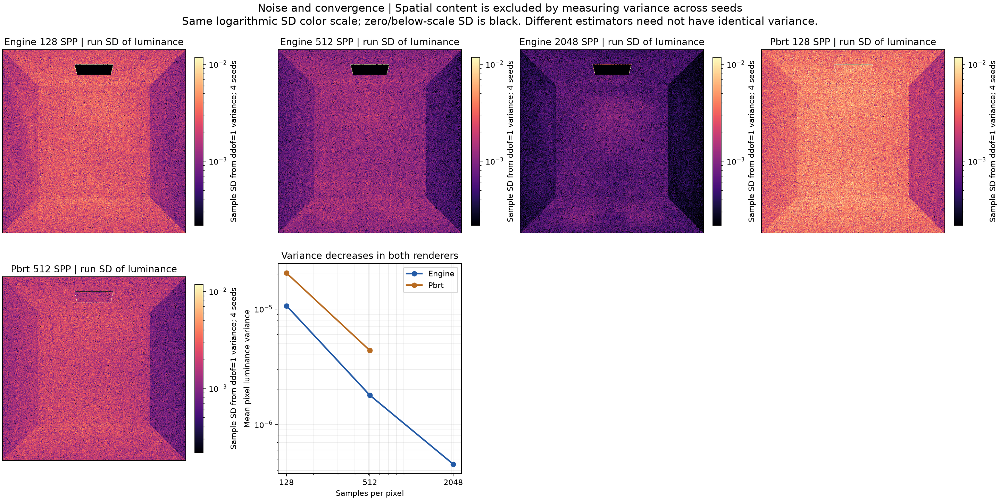

## noise_convergence_mitsuba.png

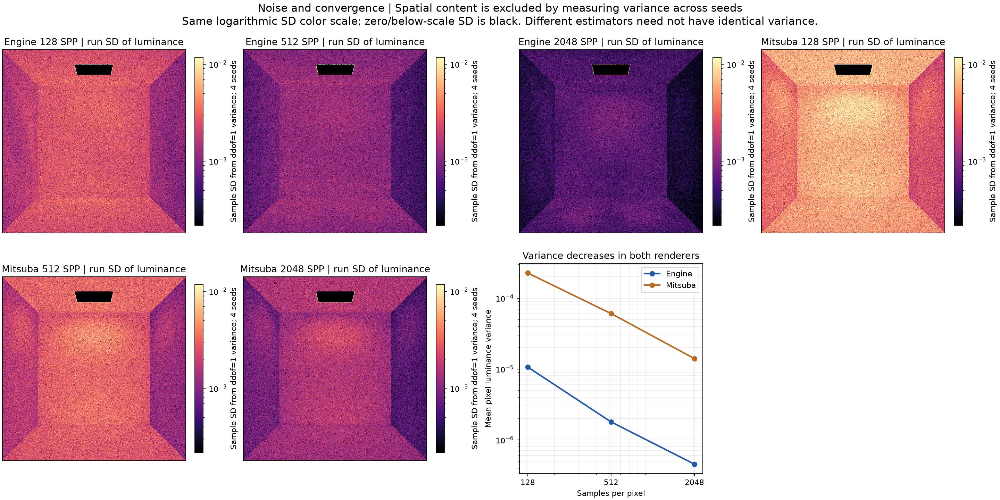

## radiance_comparison.png

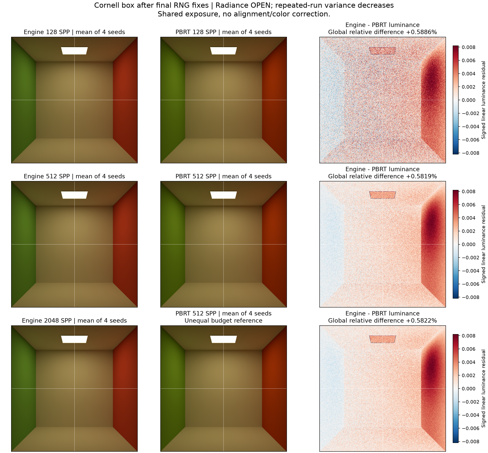

## radiance_comparison_mitsuba.png

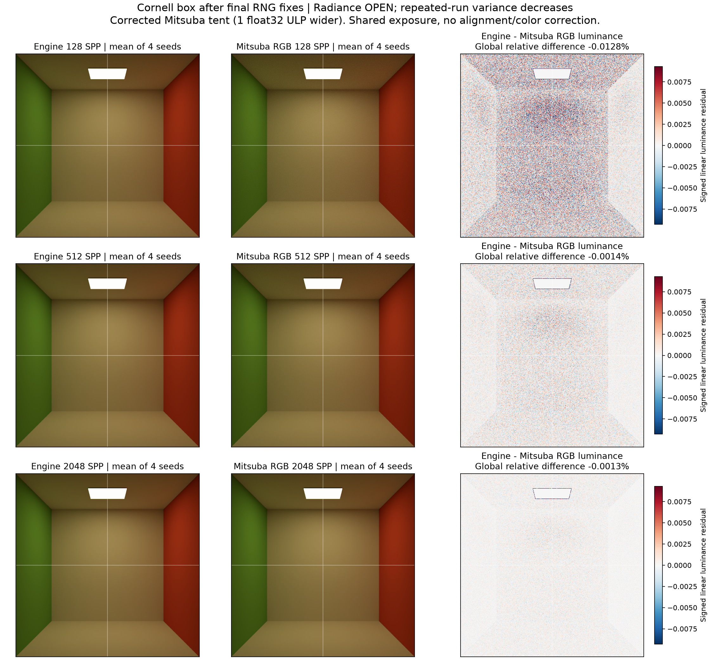

## radiance_uncertainty.png

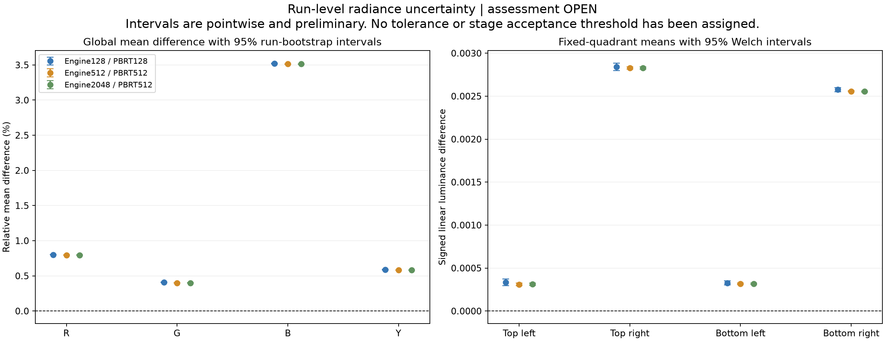

## radiance_uncertainty_mitsuba.png

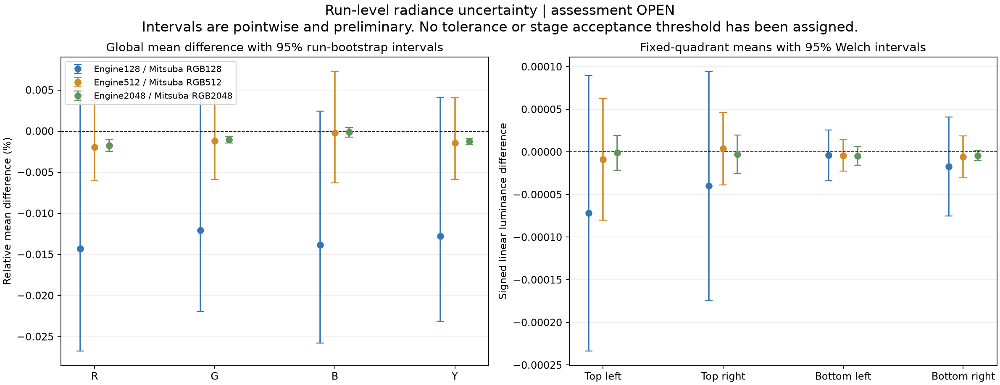

## residual_channels_512.png

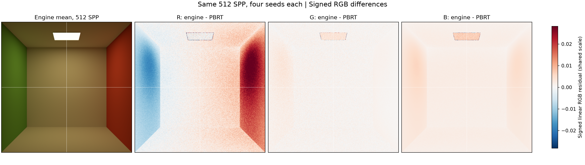

## residual_channels_512_mitsuba.png

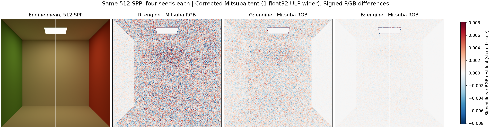

## roi_localization.png

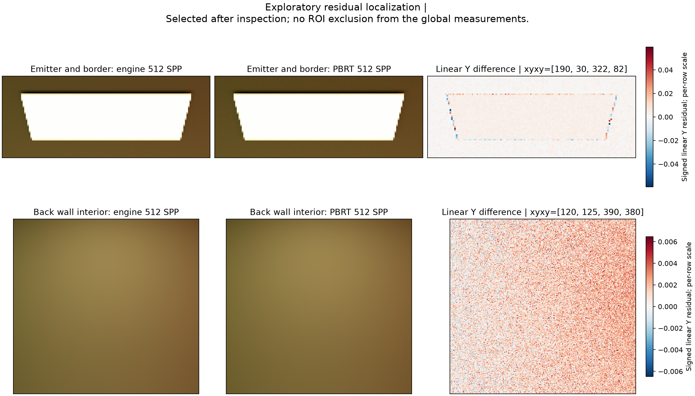

## roi_localization_mitsuba.png

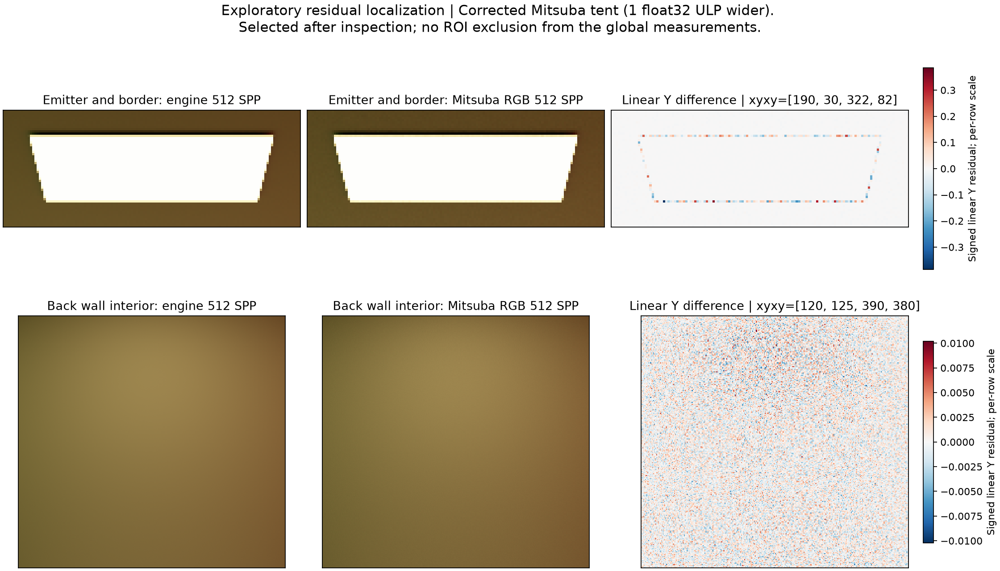

## three_renderer_overview.png

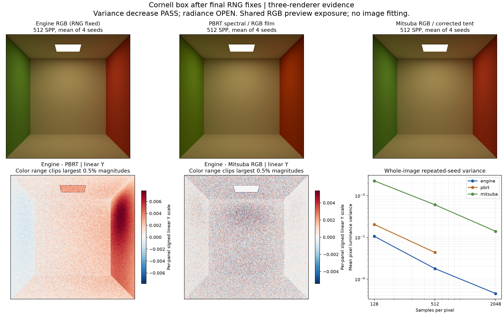
