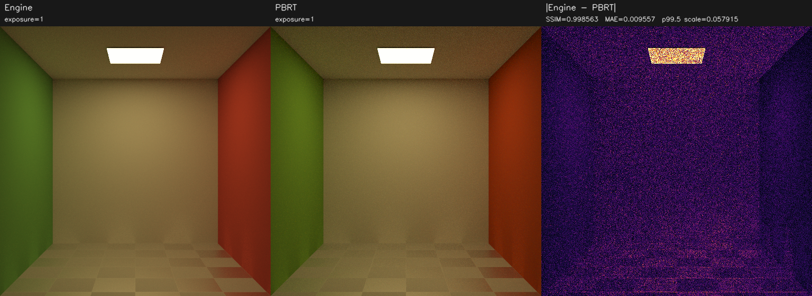
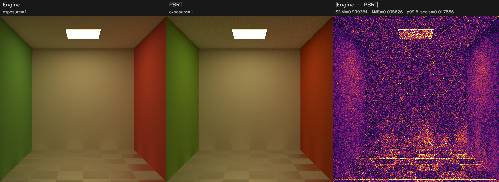
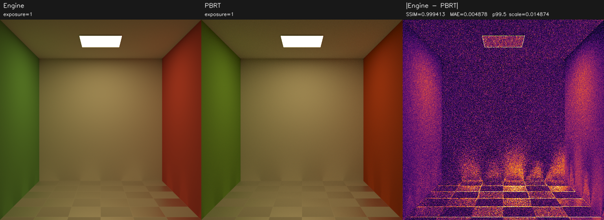
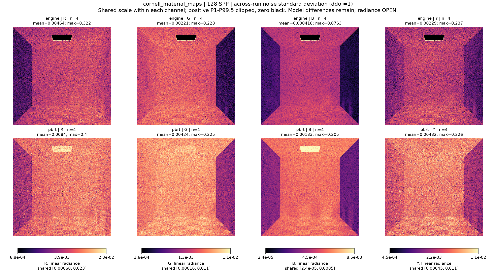
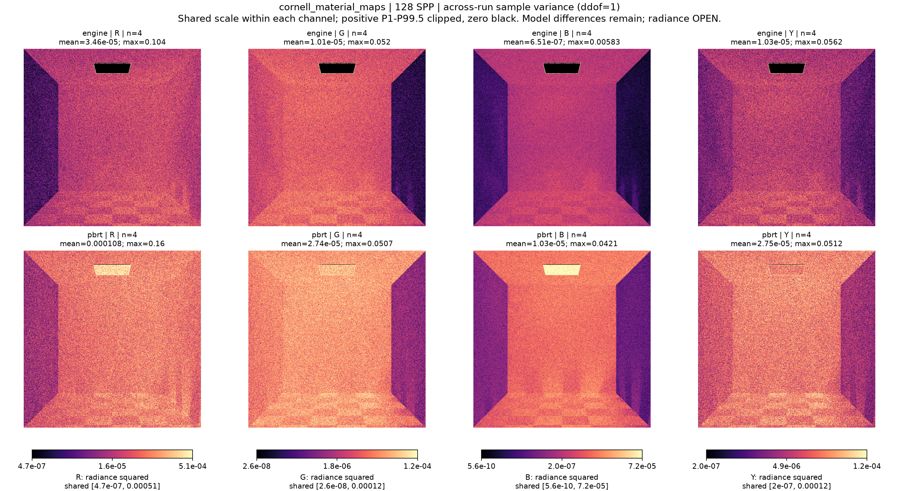
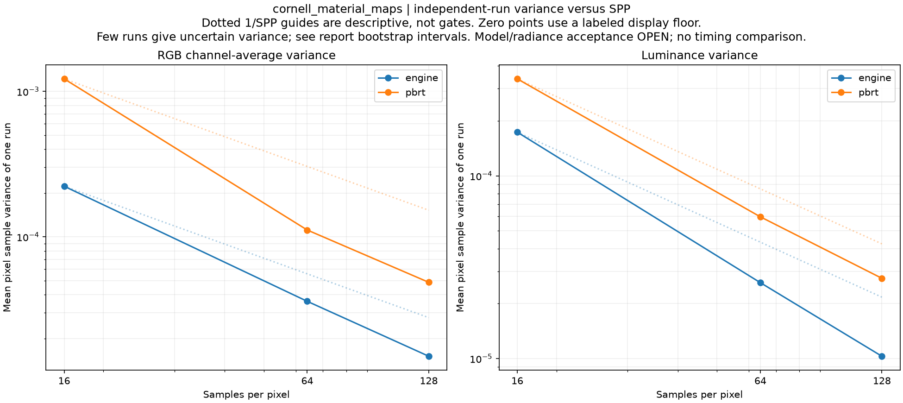

# cornell_material_maps

**Radiance: OPEN · Variance: See report · 사용자 육안 확인: 승인 (기존 게시 이미지)**

Reference: PBRT

RNG 수정 후 최초 엔진 회귀 baseline입니다. 이후 수정 비교는 최상위 최신 결과 링크를 사용하세요. 분산 감소와 radiance 일치는 별도입니다. 원본 many-lights 차폐 불일치와 normal-map 필터 차이는 이 baseline에 남아 있습니다.

반복 검증의 평균 영상은 여러 seed를 평균한 결과이며, 대표 이미지로 표시된 단일 seed 렌더와 구분합니다. 노이즈 영상은 seed 간 분산 또는 표준편차입니다. 노이즈 비율 1은 통과 기준이 아닙니다. 색상 스케일·SPP·seed 수는 각 그림에 표시됩니다.

## comparison_spp_16.png

## comparison_spp_64.png

## comparison_spp_128.png

## replicate_noise_stddev_128.png

## replicate_noise_variance_128.png

## replicate_noise_convergence.png

