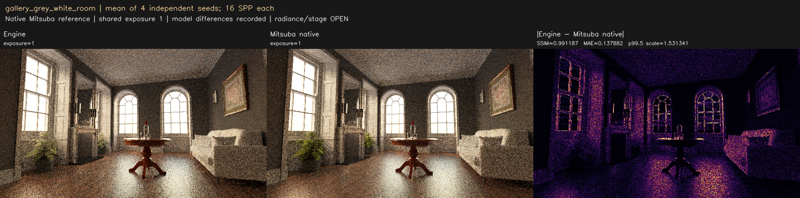
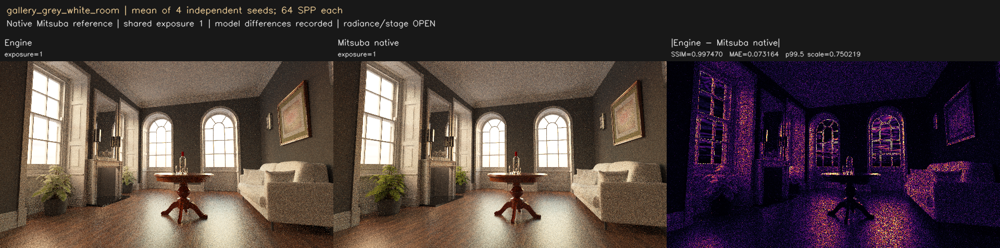
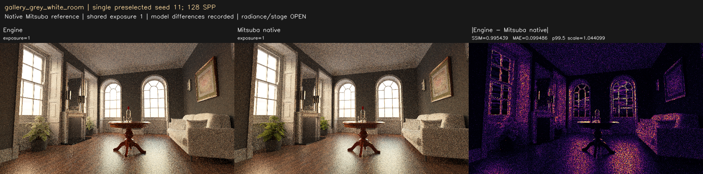
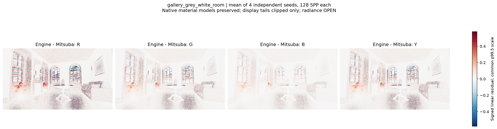
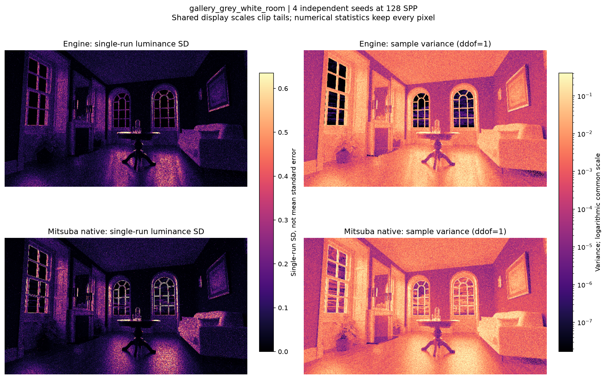
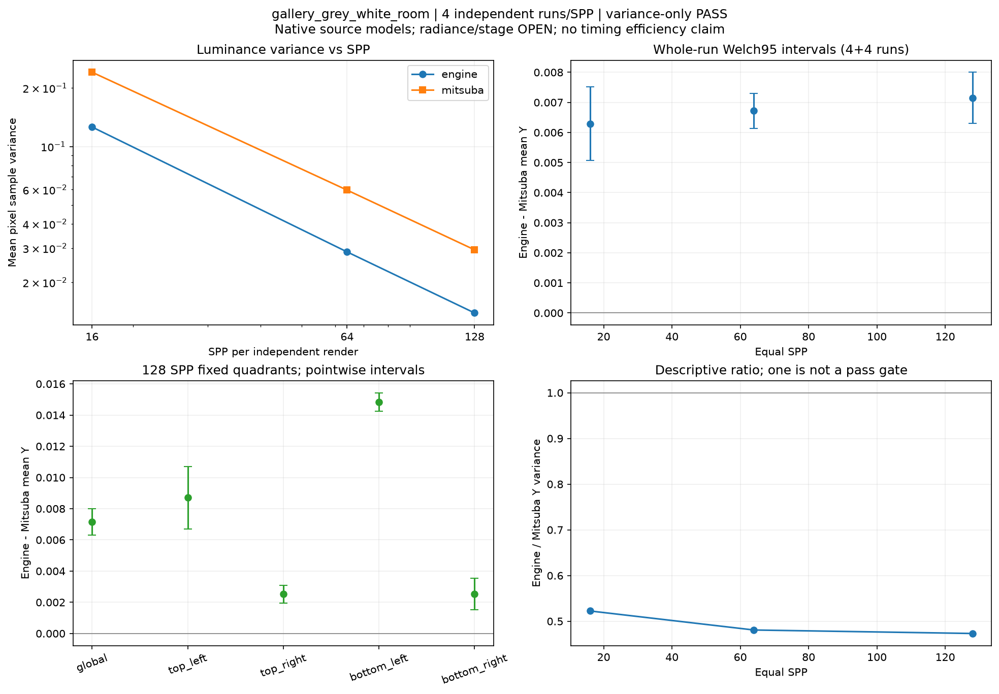

# gallery_grey_white_room

**Radiance: OPEN · Variance: PASS · 사용자 육안 확인: 대기**

Reference: Mitsuba 3.9.1 cuda_ad_rgb (원본 gallery)

사용자가 지정한 Mitsuba 레퍼런스로 재검증했습니다. 원본 XML의 재질/광원/형상/카메라를 보존했고 film/SPP/depth를 명시적으로 맞췄습니다. importer가 바꾸는 재질 모델 차이는 여전히 결과 해석에 포함됩니다.

평균 영상은 여러 seed의 평균이며 단일 렌더와 구분했습니다. 노이즈 영상은 seed 간 분산입니다. 노이즈 비율 1은 통과 기준이 아닙니다. 색상 스케일·SPP·seed 수는 각 그림에 표시됩니다.

## radiance_mean4_spp16.png

## radiance_mean4_spp64.png

## radiance_mean4_spp128.png

## radiance_seed11_spp128.png

## signed_residuals.png

## noise_variance.png

## convergence_uncertainty.png

