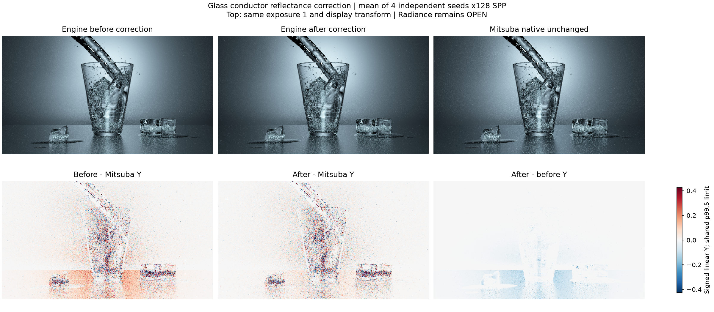
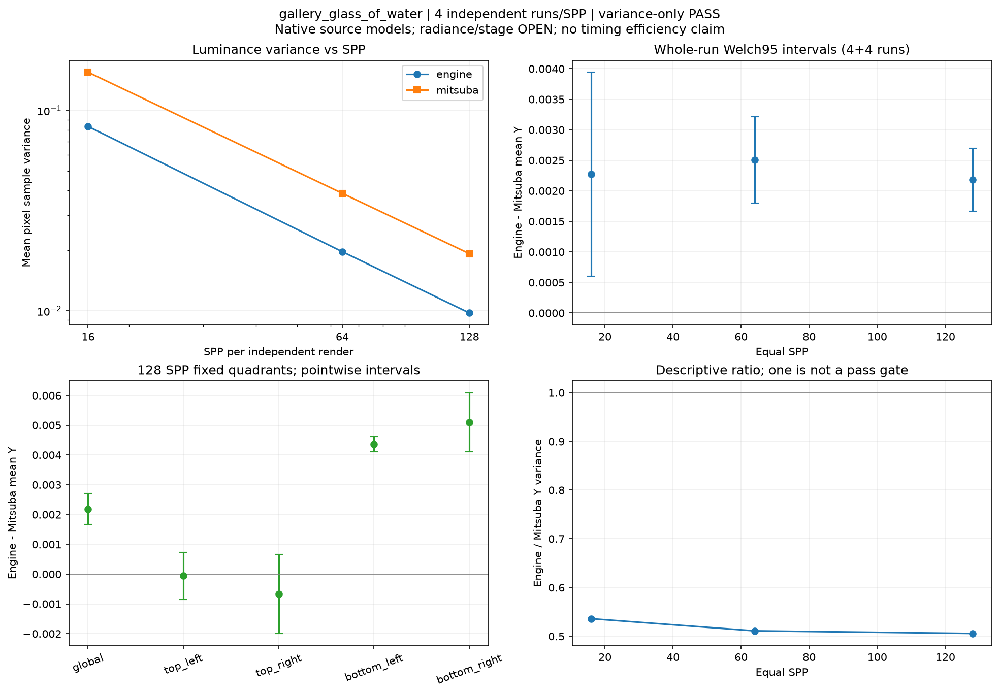
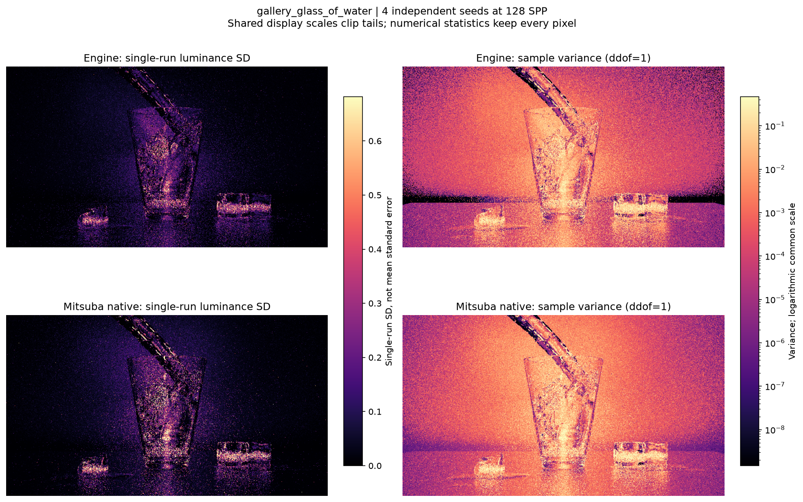
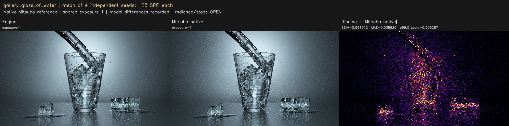
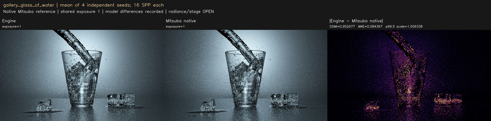
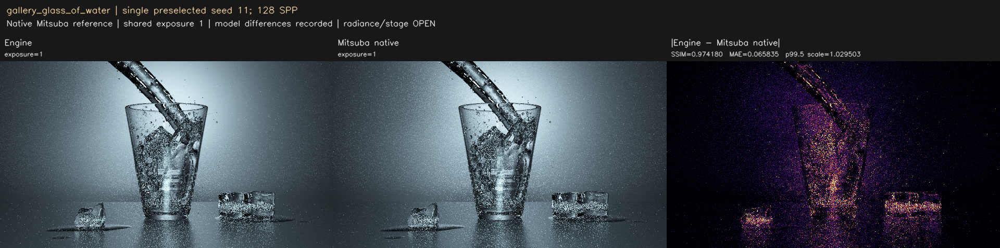
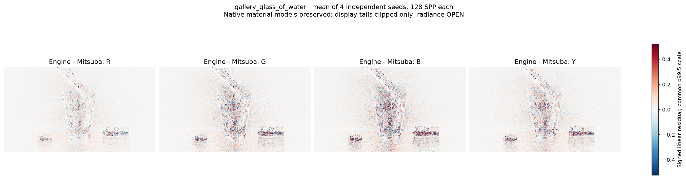

현재 사용자 육안 상태: **승인**. Radiance/variance의 역사적 판정은 바꾸지 않습니다.

---

# gallery_glass_of_water

**Radiance: OPEN · Variance: PASS · 사용자 육안 확인: 승인 (기존 게시 이미지)**

Reference: Mitsuba 3.9.1 native original gallery

원본 Mitsuba 재질의 scalar reflectance가 Fresnel F0 안에 곱해지던 importer/engine 처리를 고쳤습니다. 동일 seed 전후 대조에서 평균 Y 차이 +4.759972% → +0.910382%. 기존 mean4 128SPP SSIM .99 검사: 0.991912 / PASSED. 수정 후/전 Y 분산 비율 0.944657, 엔진/Mitsuba 비율 0.505708. 남은 평균 Y 차이의 Welch 95% 구간은 0을 포함하지 않습니다. 정확한 complex-IOR/Schlick 및 재질 모델 동등성은 별도이며, 이번 수정으로 모든 잔차가 해소되었다고 판정하지 않습니다. 원본 reference/meshes와 이전 엔진 baseline은 보존했습니다.

반복 검증의 평균 영상은 여러 seed를 평균한 결과이며, 대표 이미지로 표시된 단일 seed 렌더와 구분합니다. 노이즈 영상은 seed 간 분산 또는 표준편차입니다. 노이즈 비율 1은 통과 기준이 아닙니다. 색상 스케일·SPP·seed 수는 각 그림에 표시됩니다.

## before_after_correction.png

## convergence_uncertainty.png

## noise_variance.png

## radiance_mean4_spp128.png

## radiance_mean4_spp16.png

## radiance_mean4_spp64.png

## radiance_seed11_spp128.png

## signed_residuals.png

