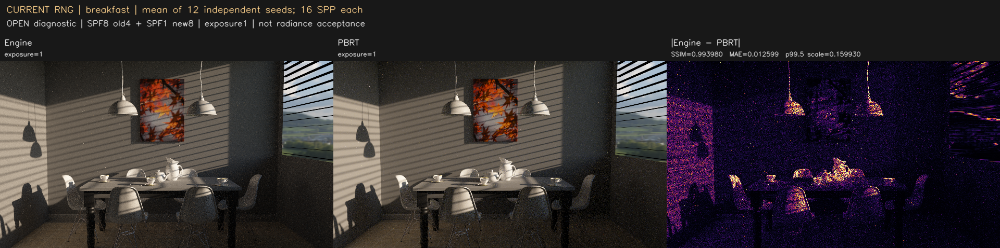
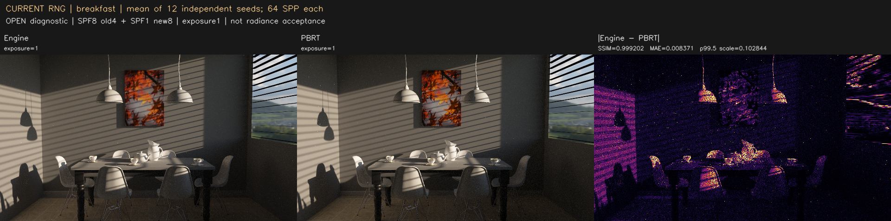
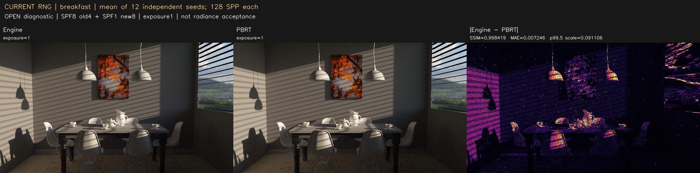
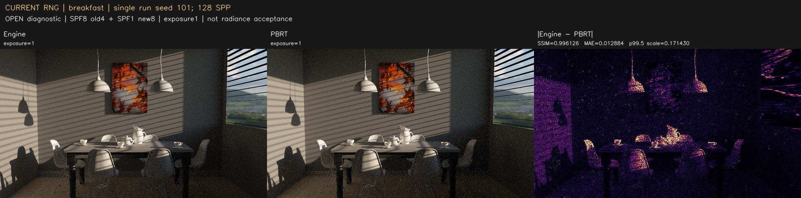
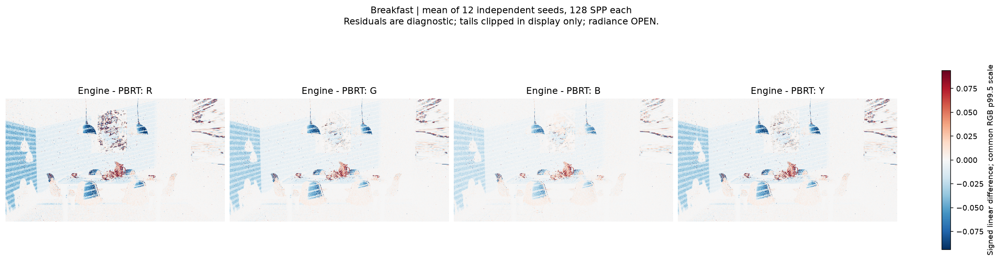
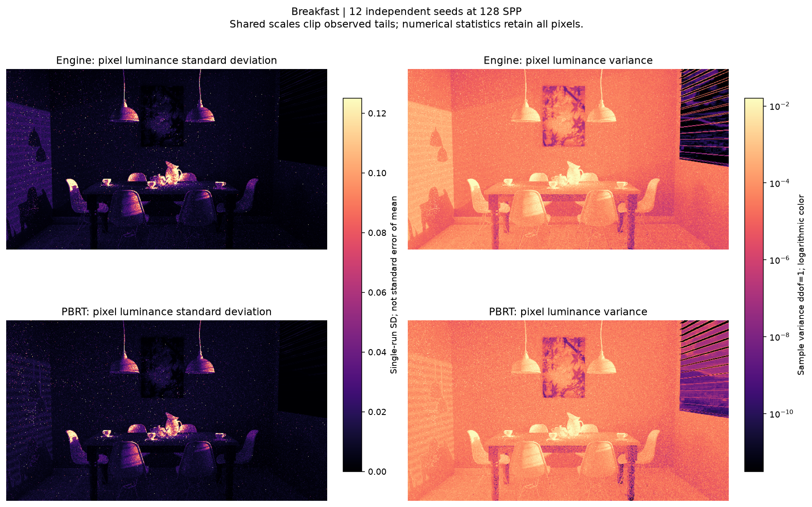
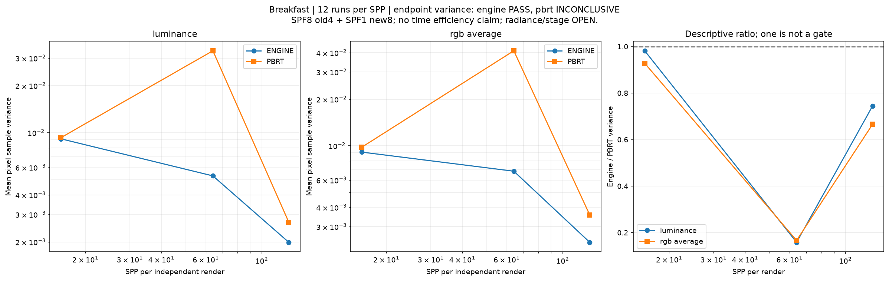

# gallery_breakfast_room

**Radiance: OPEN · Variance: See report · 사용자 육안 확인: 대기**

Reference: PBRT (진단용; gallery의 지정 레퍼런스가 아님)

이전 턴의 PBRT 비교입니다. 올바른 gallery 레퍼런스 비교는 아래가 아니라 최상위 gallery-mitsuba 목록을 사용하세요.

평균 영상은 여러 seed의 평균이며 단일 렌더와 구분했습니다. 노이즈 영상은 seed 간 분산입니다. 노이즈 비율 1은 통과 기준이 아닙니다. 색상 스케일·SPP·seed 수는 각 그림에 표시됩니다.

## radiance_mean12_spp16.png

## radiance_mean12_spp64.png

## radiance_mean12_spp128.png

## radiance_seed11_spp128.png

## radiance_seed101_spp128.png

## radiance_signed_residuals_mean12_spp128.png

## noise_variance_12seeds_spp128.png

## noise_convergence_12seeds.png

