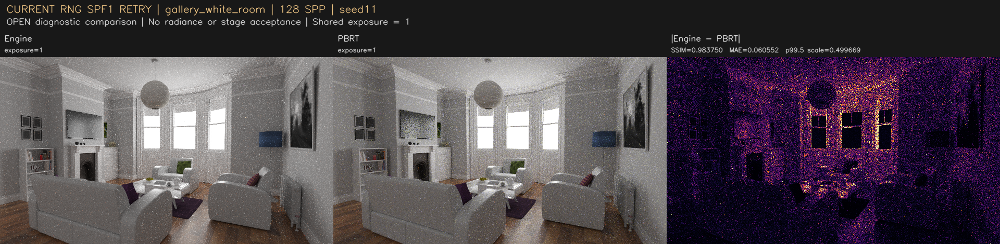
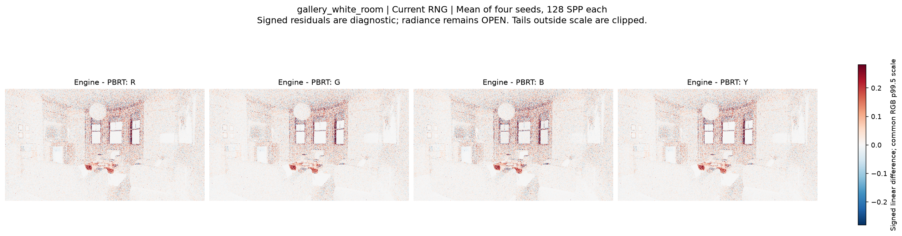
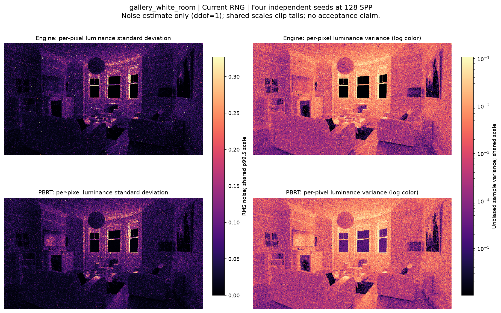
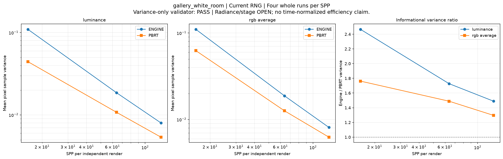

# gallery_white_room

**Radiance: OPEN · Variance: See report · 사용자 육안 확인: 승인 (기존 게시 이미지)**

Reference: PBRT (진단용; gallery의 지정 레퍼런스가 아님)

이전 턴의 PBRT 비교입니다. 올바른 gallery 레퍼런스 비교는 아래가 아니라 최상위 gallery-mitsuba 목록을 사용하세요.

반복 검증의 평균 영상은 여러 seed를 평균한 결과이며, 대표 이미지로 표시된 단일 seed 렌더와 구분합니다. 노이즈 영상은 seed 간 분산 또는 표준편차입니다. 노이즈 비율 1은 통과 기준이 아닙니다. 색상 스케일·SPP·seed 수는 각 그림에 표시됩니다.

## radiance_seed11_128_rng_fixed_spf1.png

## radiance_mean4_128_rng_fixed_spf1.png

## radiance_signed_residuals_128_rng_fixed_spf1.png

## noise_variance_128_rng_fixed_spf1.png

## noise_convergence_rng_fixed_spf1.png

