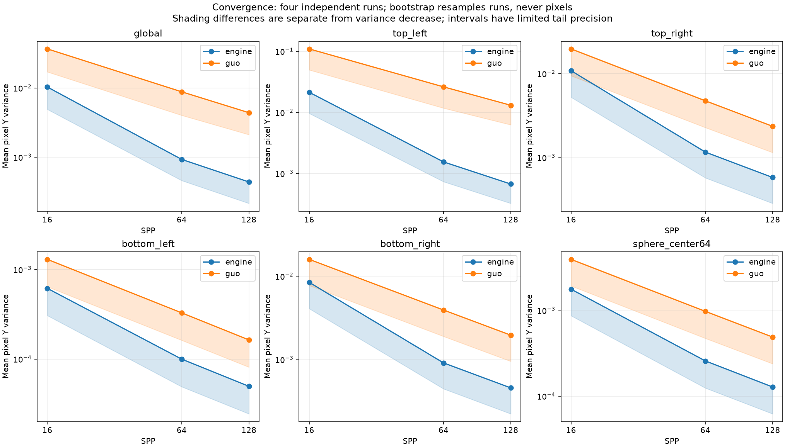
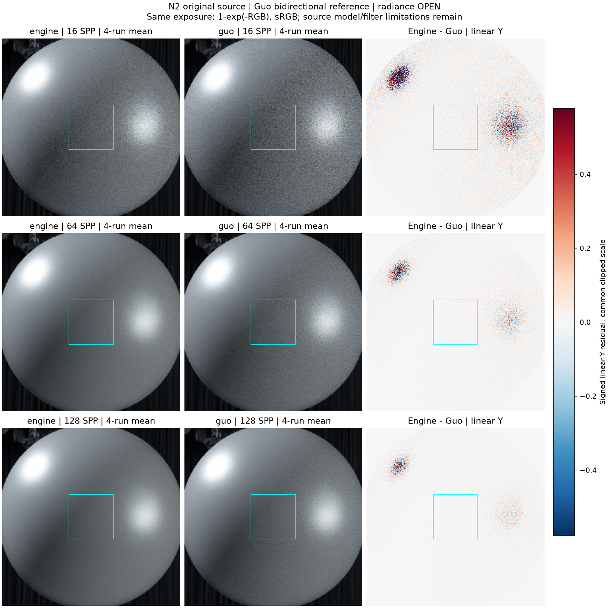
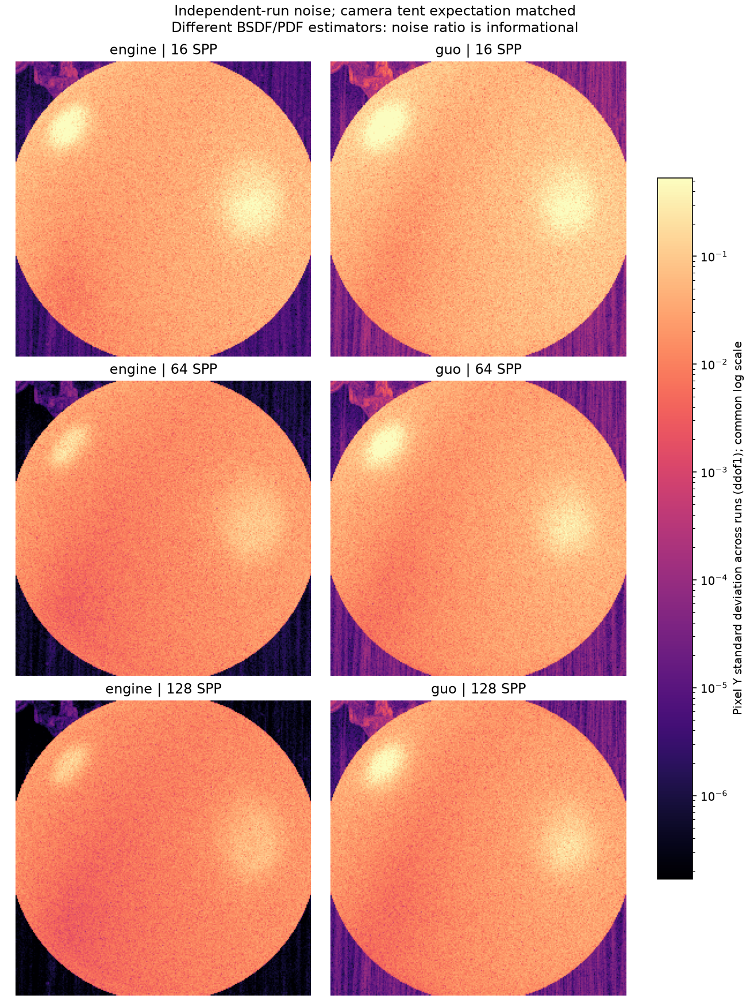
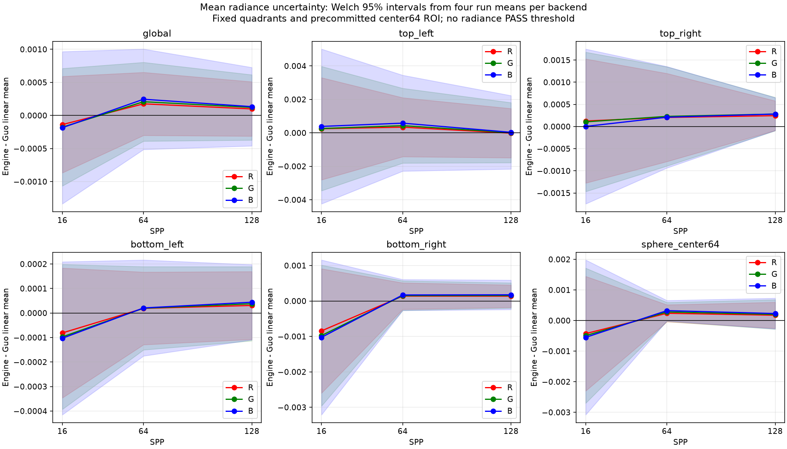

# gallery_nlayer_sphere_alpha01_n2

**Radiance: OPEN · Variance: PASS · 사용자 육안 확인: 대기**

Reference: Guo EfficientComplexLayered Mitsuba 0.6 fork / multilayered_guo2018

환경맵/금속 반사율 수정 후 최종 production shader(0be9f4cf...)로 다시 렌더한 N2입니다. 지정 Guo reference와 사전 선택한 중심64 ROI를 그대로 사용했습니다. 128 SPP x 4 global Y +0.0437867%, 중심 +0.180217%; 여섯 고정 영역의 RGB/Y Welch 95% 구간은 모두 0을 포함합니다. 양쪽 분산 수렴 PASS, engine/Guo Y variance ratio global 0.0997893, 중심 0.2618415입니다. 기존 엔진 baseline은 별도 보존했습니다. 이 결과는 정확한 BSDF/filter 모델 동등성이나 전체 단계 승인을 의미하지 않습니다.

평균 영상은 여러 seed의 평균이며 단일 렌더와 구분했습니다. 노이즈 영상은 seed 간 분산입니다. 노이즈 비율 1은 통과 기준이 아닙니다. 색상 스케일·SPP·seed 수는 각 그림에 표시됩니다.

## convergence.png

## mean_difference.png

## noise_stddev.png

## radiance_uncertainty.png

## surface_roi.png

