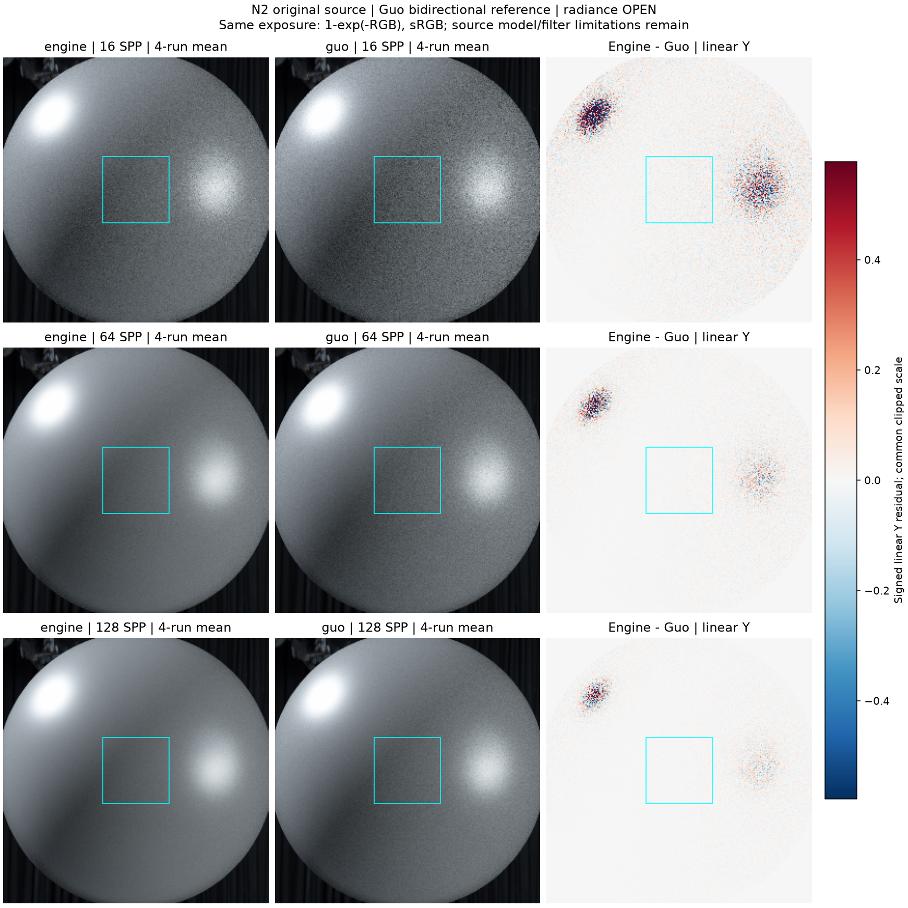
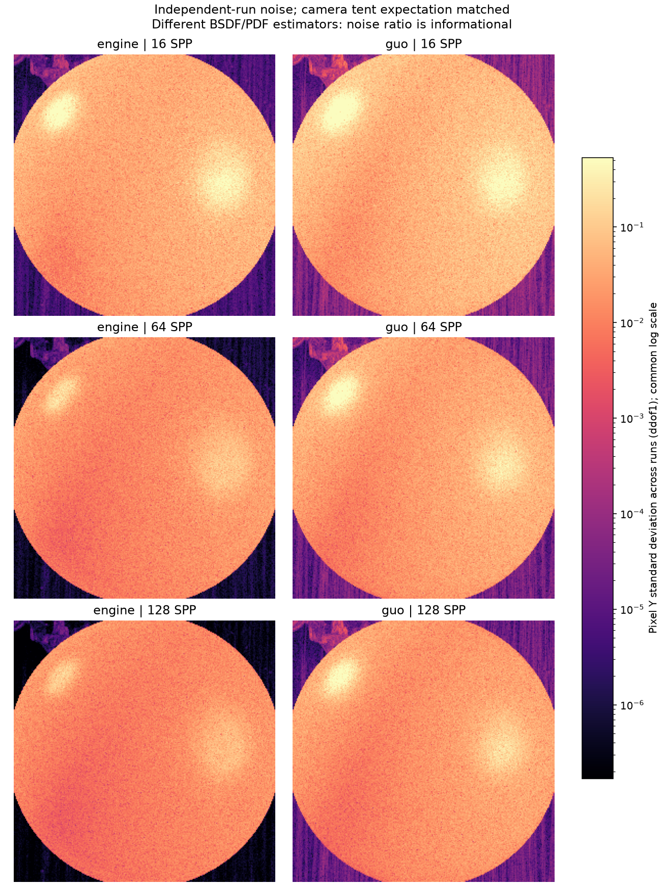
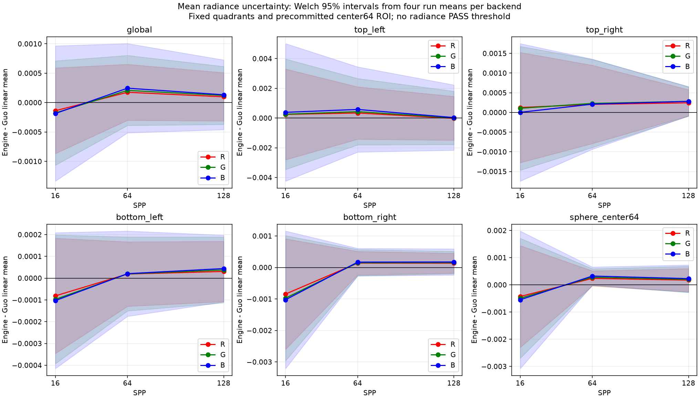
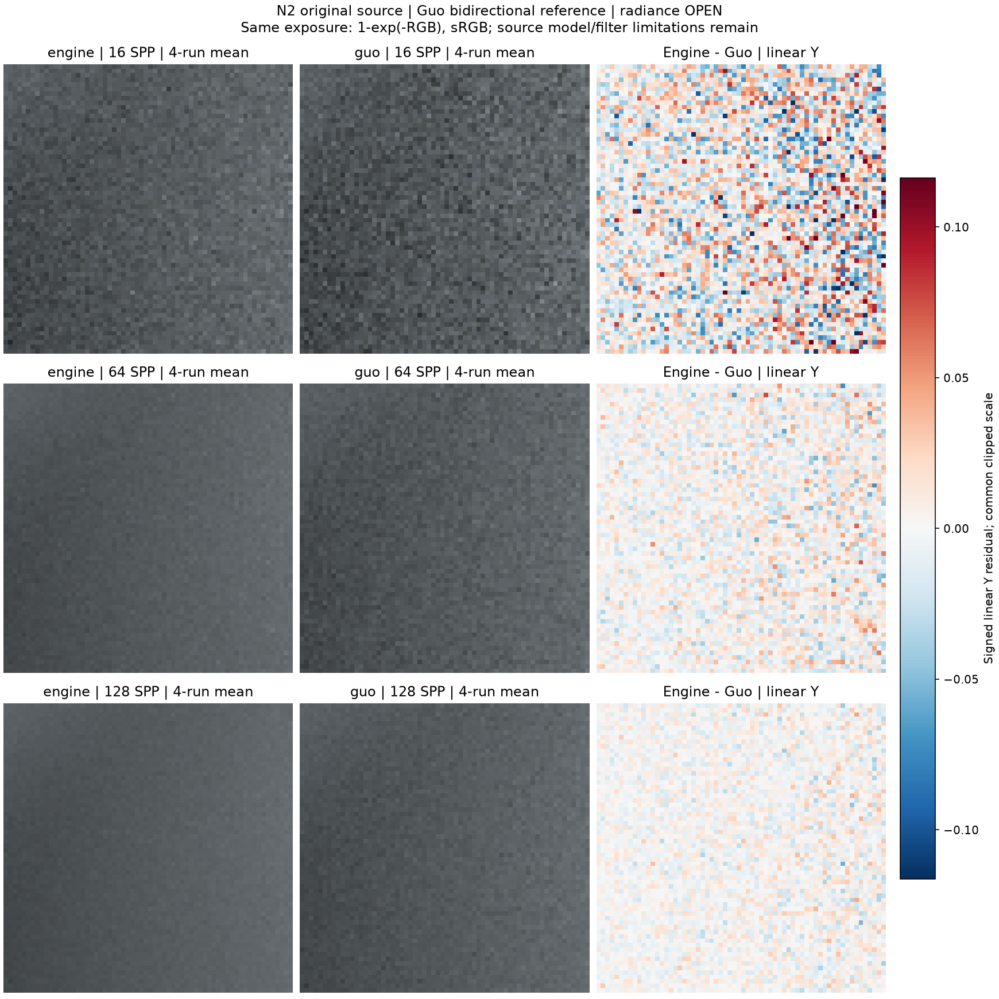

# gallery_nlayer_sphere_alpha01_n2

**Radiance: OPEN · Variance: PASS · 사용자 육안 확인: 승인 (기존 게시 이미지)**

Reference: Guo EfficientComplexLayered Mitsuba 0.6 fork / multilayered_guo2018

지정된 Guo renderer로 카메라 방향, 독립 seed, tent pixel sampling을 검증하여 재렌더했습니다. 원본 Guo BSDF/core binary 47개는 변경하지 않았으며 sampling/camera adapter만 별도로 사용했습니다. 128 SPP x 4의 global Y 차이 +0.04379%, 중앙64x64 표면 ROI +0.18022%; global/4quadrants/center ROI의 RGB/Y 평균 차이 95% 구간이 모두 0을 포함합니다. 관측된 N-layer 엔진 결함은 없습니다. Engine/Guo Y variance ratio는 global 0.09979, 중앙 0.26184이며 양쪽 수렴 검사는 통과했습니다. Guo 환경맵 EWA 및 separable G와 엔진의 필터/G 모델 차이는 남습니다. 실패한 seed adapter 및 카메라 방향 시도는 최종 결과에서 제외했습니다.

반복 검증의 평균 영상은 여러 seed를 평균한 결과이며, 대표 이미지로 표시된 단일 seed 렌더와 구분합니다. 노이즈 영상은 seed 간 분산 또는 표준편차입니다. 노이즈 비율 1은 통과 기준이 아닙니다. 색상 스케일·SPP·seed 수는 각 그림에 표시됩니다.

## convergence.png

## mean_difference.png

## noise_stddev.png

## radiance_uncertainty.png

## surface_roi.png

