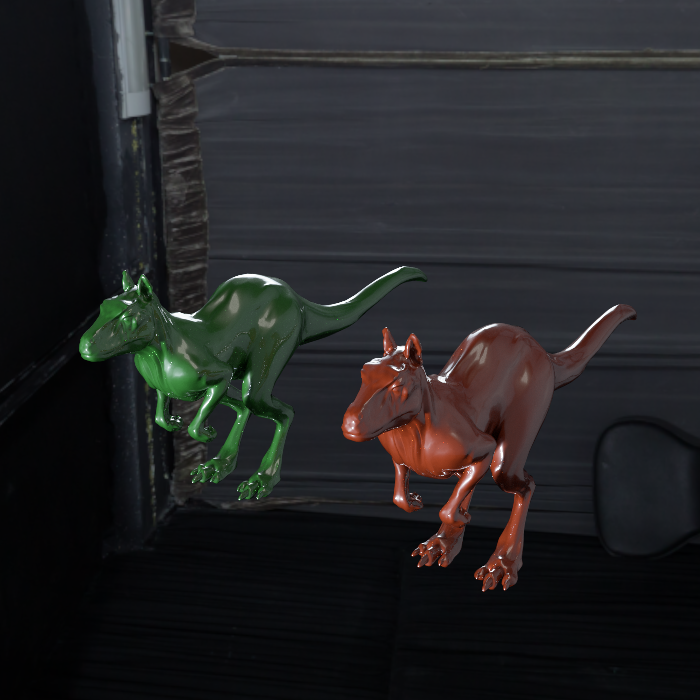
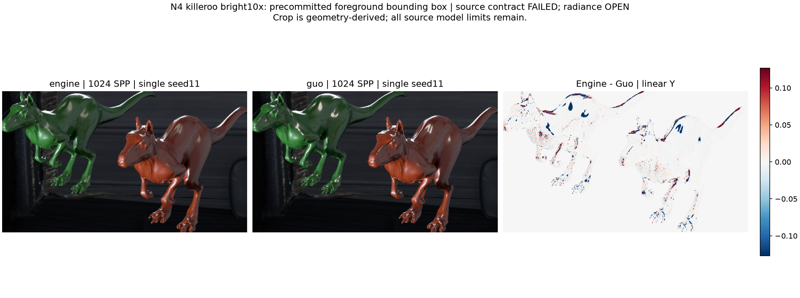
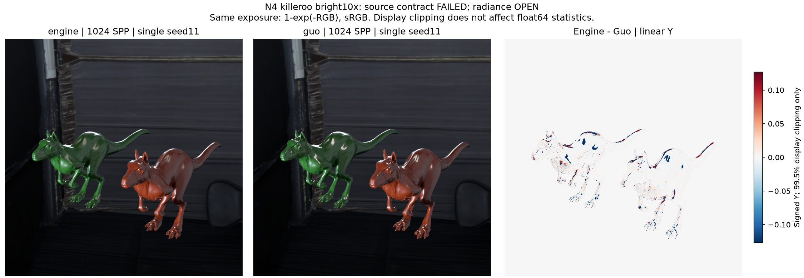

# gallery_nlayer_killeroo_n4_alpha01_bright10x

**Radiance: OPEN · Variance: NOT_APPLICABLE_SINGLE_SEED · 사용자 육안 확인: 대기 (새 이미지)**

Reference: Guo EfficientComplexLayered Mitsuba 0.6 / original multilayered_guo2018; verified seed/tent/camera adapter

Source contract: **FAILED_FINITE_LIGHT_AND_NORMAL_MATCH**

대표 이미지용 1024 SPP / seed11 한 장씩입니다. 엔진과 Guo의 원래 해상도 및 공통 노출을 유지한 clean beauty PNG를 포함합니다. 평균 Y 차이는 전체 -2.616903%, 전경 -7.783979%; 단일 영상 SSIM 0.99920810 / PASSED. 이 seed는 반복 검증 seed11과 stream을 공유하므로 추가 독립 표본이 아니며 분산이나 신뢰구간을 추정하지 않습니다. 과거 대표 이미지 기록에 사용된 Killeroo N4 alpha01 bright10x 원본입니다. 구형 광원의 NEE에는 MIS 가중치가 있지만 엔진 씬에는 반사 광선이 만날 광원 표면과 차폐가 없어 기여가 누락됩니다. 원본의 비단위 vertex normal 보간·방향 정렬 정책도 Guo와 다릅니다. 서로 다른 광량 기여를 비교하므로 낮은 분산을 효율 개선으로 해석하지 않습니다. 소스 계약 FAILED이며 영상 지표 통과 여부로 덮지 않습니다. 원본을 보존한 진단으로 게시하고 다음 단계 PASS로 사용하지 않습니다. Guo의 primary-ray differential은 1/sqrt(SPP)로 축소되어 환경맵 EWA 필터도 SPP에 따라 달라집니다. 따라서 배경의 평균 변화와 표본 분산 감소를 동일시하지 않으며, geometry 기반 전경 결과를 별도로 제시합니다.

반복 검증의 평균 영상은 여러 seed를 평균한 결과이며, 대표 이미지로 표시된 단일 seed 렌더와 구분합니다. 노이즈 영상은 seed 간 분산 또는 표준편차입니다. 노이즈 비율 1은 통과 기준이 아닙니다. 색상 스케일·SPP·seed 수는 각 그림에 표시됩니다.

## engine_hero1024_seed11_beauty.png

## foreground_comparison.png

## guo_hero1024_seed11_beauty.png

## mean_difference_spp1024.png

