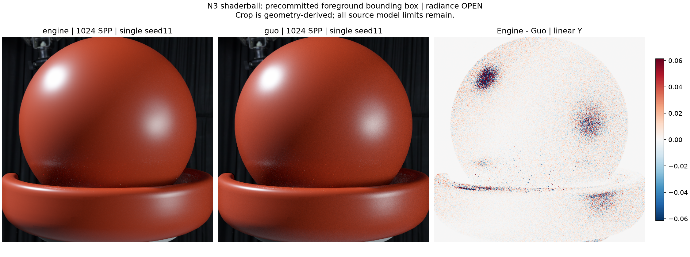
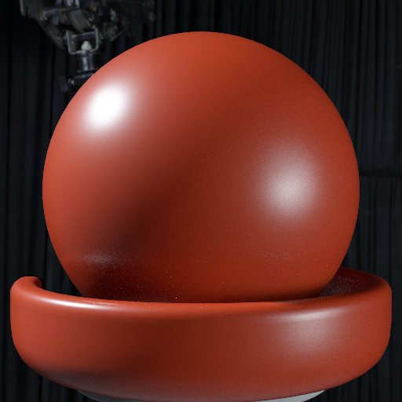
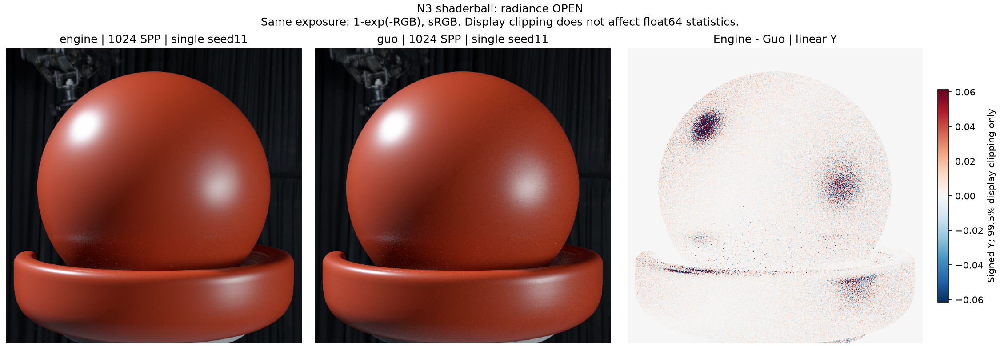

현재 사용자 육안 상태: **미승인 · superseded baseline 보존**. Radiance/variance의 역사적 판정은 바꾸지 않습니다.

---

# gallery_nlayer_shaderball_n3

**Radiance: OPEN · Variance: NOT_APPLICABLE_SINGLE_SEED · 사용자 육안 확인: 대기 (새 이미지)**

Reference: Guo EfficientComplexLayered Mitsuba 0.6 / original multilayered_guo2018; verified seed/tent/camera adapter

Source contract: **MATCHED_WITH_DISCLOSED_MODEL_FILTER_LIMITS**

대표 이미지용 1024 SPP / seed11 한 장씩입니다. 엔진과 Guo의 원래 해상도 및 공통 노출을 유지한 clean beauty PNG를 포함합니다. 평균 Y 차이는 전체 +0.413067%, 전경 +0.412714%; 단일 영상 SSIM 0.99877184 / PASSED. 이 seed는 반복 검증 seed11과 stream을 공유하므로 추가 독립 표본이 아니며 분산이나 신뢰구간을 추정하지 않습니다. 원본 Shaderball N3의 공유 PLY와 카메라·광학 설정을 유지했습니다. Smith G와 환경맵 필터 모델 차이는 남으며, 관측된 작은 평균 잔차를 전부 노이즈 또는 특정 원인으로 단정하지 않습니다. Radiance OPEN입니다. Guo의 primary-ray differential은 1/sqrt(SPP)로 축소되어 환경맵 EWA 필터도 SPP에 따라 달라집니다. 따라서 배경의 평균 변화와 표본 분산 감소를 동일시하지 않으며, geometry 기반 전경 결과를 별도로 제시합니다.

반복 검증의 평균 영상은 여러 seed를 평균한 결과이며, 대표 이미지로 표시된 단일 seed 렌더와 구분합니다. 노이즈 영상은 seed 간 분산 또는 표준편차입니다. 노이즈 비율 1은 통과 기준이 아닙니다. 색상 스케일·SPP·seed 수는 각 그림에 표시됩니다.

## engine_hero1024_seed11_beauty.png

## foreground_comparison.png

## guo_hero1024_seed11_beauty.png

## mean_difference_spp1024.png

