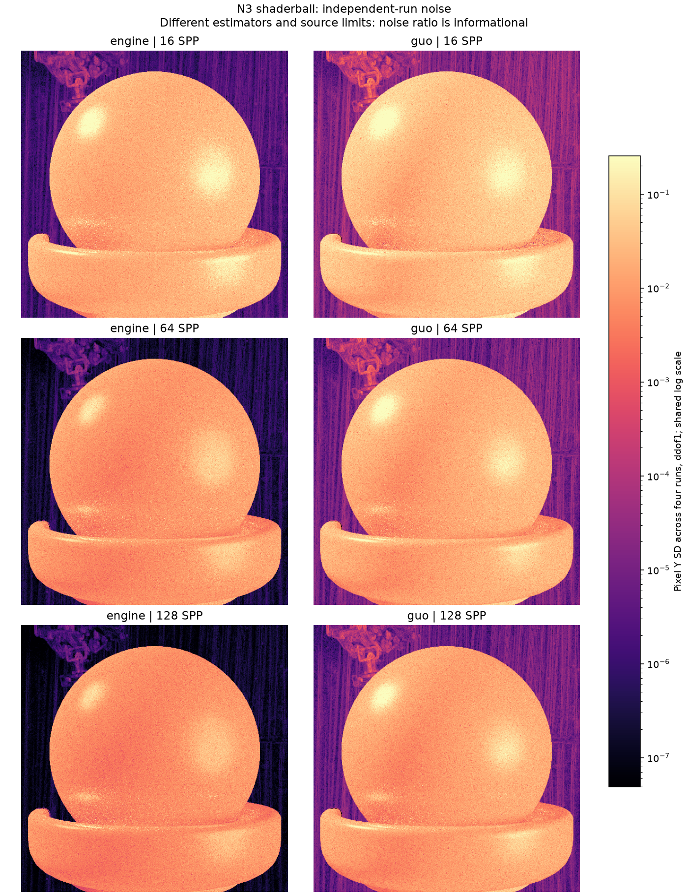
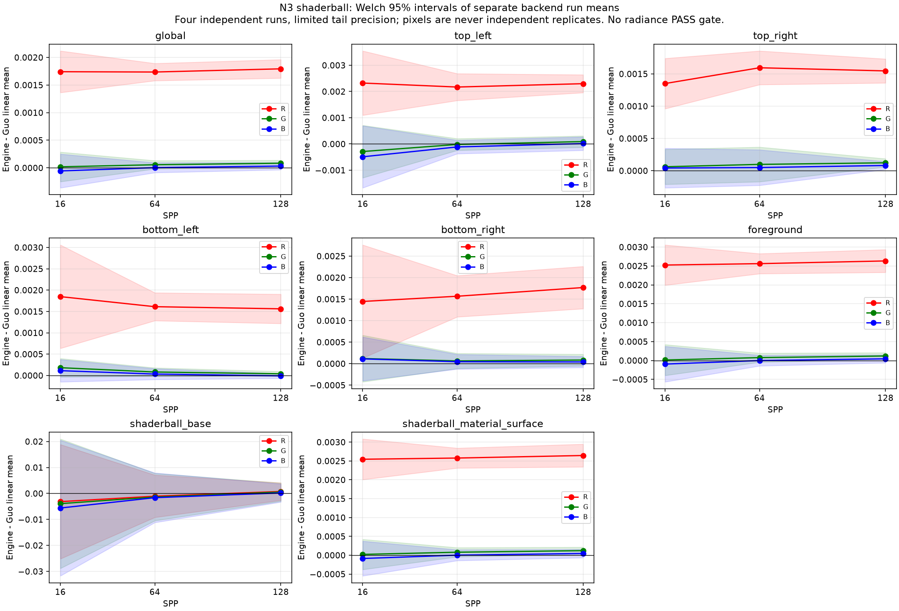

# gallery_nlayer_shaderball_n3

**Radiance: OPEN · Variance: PASS_VARIANCE_DECREASE_ONLY · 사용자 육안 확인: 대기 (새 이미지)**

Reference: Guo EfficientComplexLayered Mitsuba 0.6 / original multilayered_guo2018; verified seed/tent/camera adapter

Source contract: **MATCHED_WITH_DISCLOSED_MODEL_FILTER_LIMITS**

16/64/128 SPP, renderer별 독립 seed 4개를 비교했습니다. 128 SPP 평균 Y 차이는 전체 +0.387351%, 전경 +0.384611%; 전체 Y 차이의 Welch 95% 구간은 [0.00037096563, 0.00051702512]입니다. 기존 SSIM .99 검사 0.99757259 / PASSED; 분산 감소 PASS_VARIANCE_DECREASE_ONLY. 128 SPP 전경 engine/Guo Y 분산 비율 0.154714이며, 비율 1을 통과 기준으로 요구하지 않습니다. 사전에 정한 전경·재질 영역을 사용했고 픽셀을 독립 표본으로 세지 않았습니다. 원본 Shaderball N3의 공유 PLY와 카메라·광학 설정을 유지했습니다. Smith G와 환경맵 필터 모델 차이는 남으며, 관측된 작은 평균 잔차를 전부 노이즈 또는 특정 원인으로 단정하지 않습니다. Radiance OPEN입니다. Guo의 primary-ray differential은 1/sqrt(SPP)로 축소되어 환경맵 EWA 필터도 SPP에 따라 달라집니다. 따라서 배경의 평균 변화와 표본 분산 감소를 동일시하지 않으며, geometry 기반 전경 결과를 별도로 제시합니다.

반복 검증의 평균 영상은 여러 seed를 평균한 결과이며, 대표 이미지로 표시된 단일 seed 렌더와 구분합니다. 노이즈 영상은 seed 간 분산 또는 표준편차입니다. 노이즈 비율 1은 통과 기준이 아닙니다. 색상 스케일·SPP·seed 수는 각 그림에 표시됩니다.

## convergence.png

## foreground_comparison.png

## mean_difference_spp128.png

## mean_difference_spp16.png

## mean_difference_spp64.png

## noise_stddev.png

## precommitted_regions.png

## radiance_uncertainty.png

