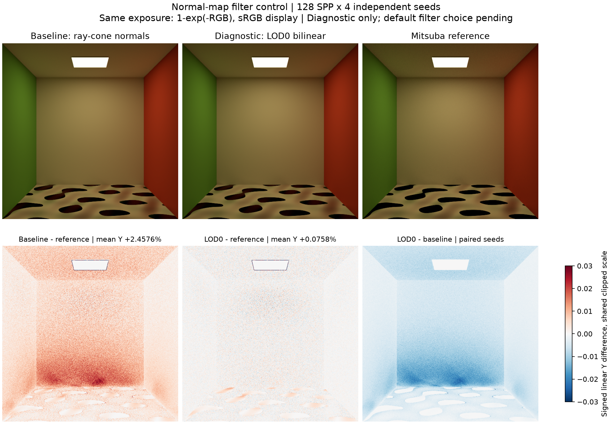
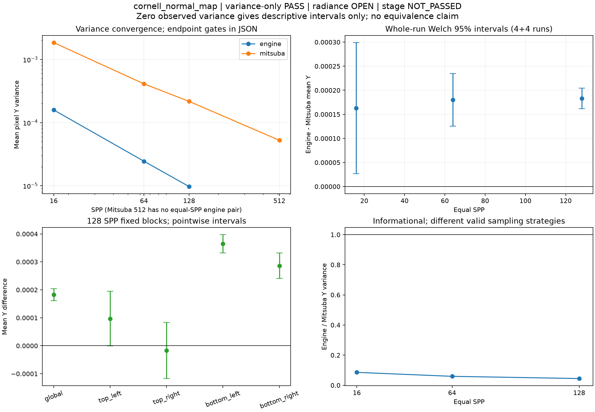
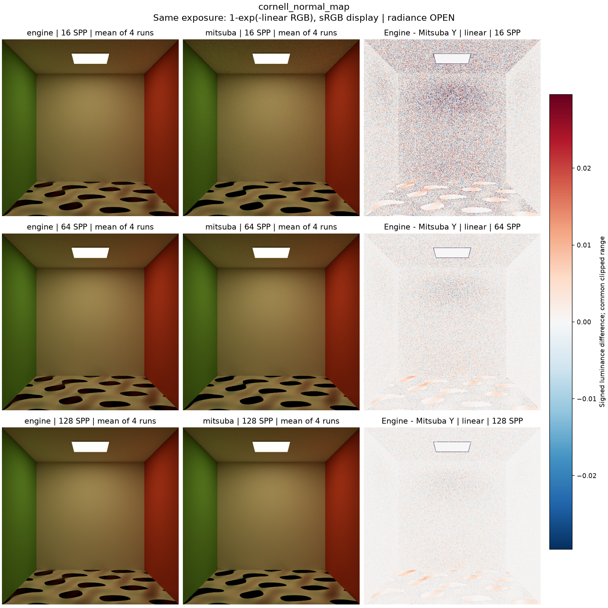
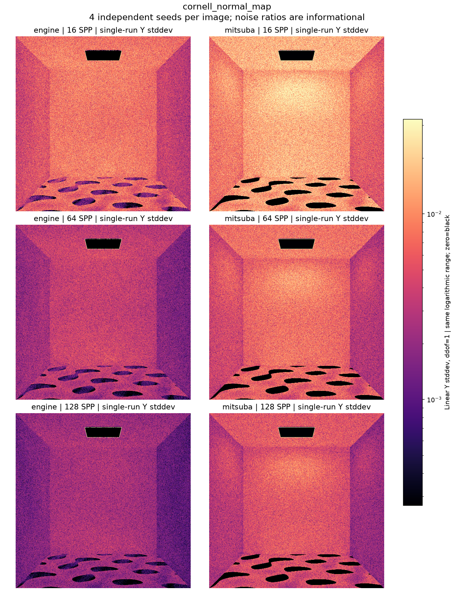

현재 사용자 육안 상태: **승인**. Radiance/variance의 역사적 판정은 바꾸지 않습니다.

---

# cornell_normal_map

**Radiance: OPEN · Variance: PASS · 사용자 육안 확인: 승인 (기존 게시 이미지)**

Reference: Mitsuba RGB

기존 ray-cone normal-map mip filtering을 base-level bilinear로만 바꾼 대조 실험입니다. 128 SPP 평균 Y 차이 +2.4576% → +0.0758%; 바닥 ROI는 약 +0.3%가 남습니다. 원인 분리를 위한 shader overlay이며 production 수정이나 전체 통과를 뜻하지 않습니다. 원래 shader는 복구했습니다.

반복 검증의 평균 영상은 여러 seed를 평균한 결과이며, 대표 이미지로 표시된 단일 seed 렌더와 구분합니다. 노이즈 영상은 seed 간 분산 또는 표준편차입니다. 노이즈 비율 1은 통과 기준이 아닙니다. 색상 스케일·SPP·seed 수는 각 그림에 표시됩니다.

## normal_filter_before_after_128.png

## convergence_uncertainty.png

## mean_difference.png

## noise_comparison.png

