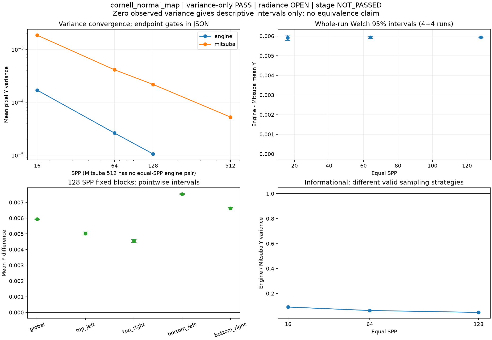
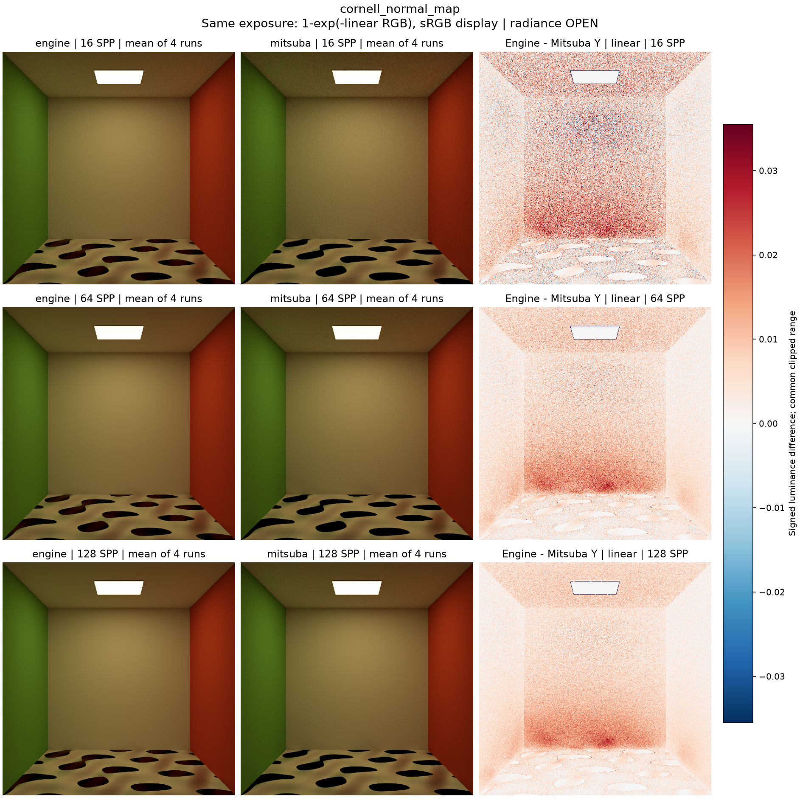
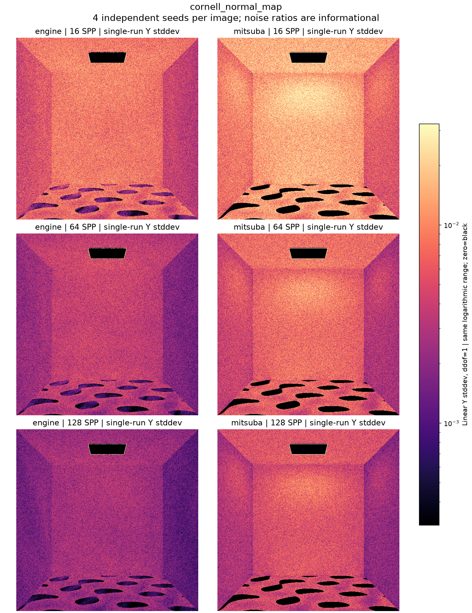

현재 사용자 육안 상태: **승인**. Radiance/variance의 역사적 판정은 바꾸지 않습니다.

---

# cornell_normal_map

**Radiance: OPEN · Variance: PASS · 사용자 육안 확인: 승인 (기존 게시 이미지)**

Reference: Mitsuba RGB

PBRT의 spectral/RGB 차이만으로 설명되는지 확인하기 위한 원본 Mitsuba RGB 비교입니다. 필터링 원인 대조 실험은 별도로 진행 중입니다.

반복 검증의 평균 영상은 여러 seed를 평균한 결과이며, 대표 이미지로 표시된 단일 seed 렌더와 구분합니다. 노이즈 영상은 seed 간 분산 또는 표준편차입니다. 노이즈 비율 1은 통과 기준이 아닙니다. 색상 스케일·SPP·seed 수는 각 그림에 표시됩니다.

## convergence_uncertainty.png

## mean_difference.png

## noise_comparison.png

