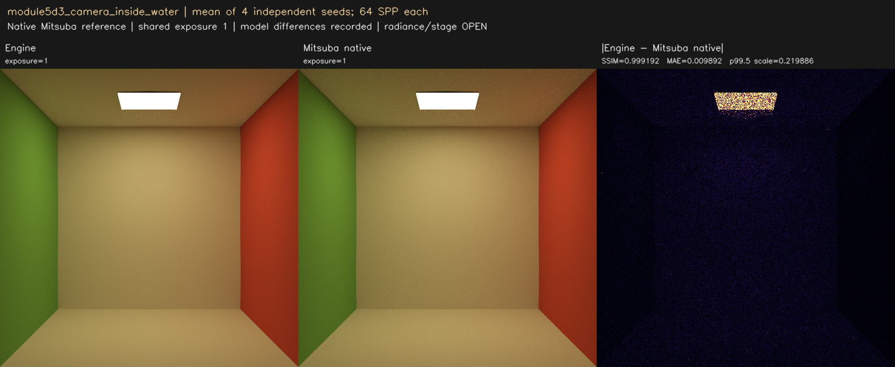
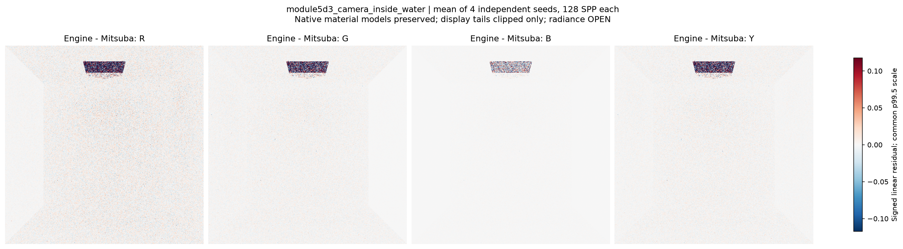
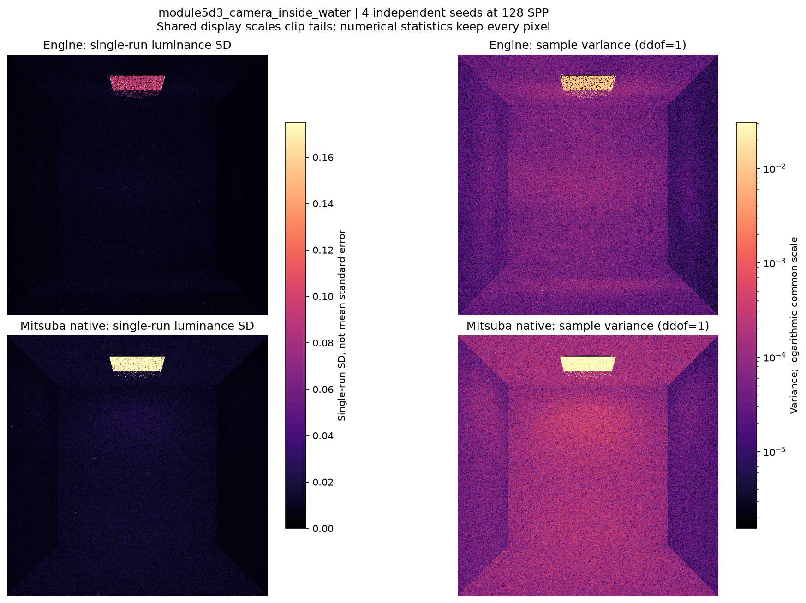
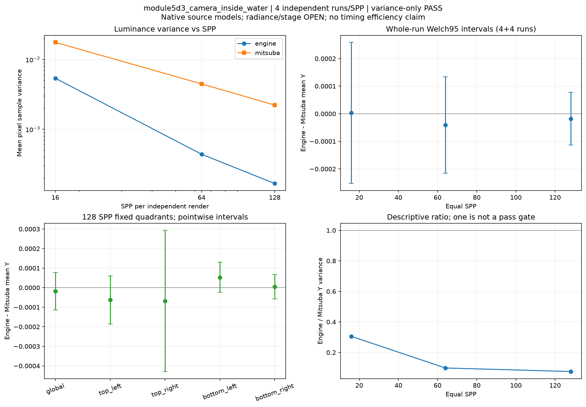

# module5d3_camera_inside_water

**Radiance: OPEN · Variance: PASS · 사용자 육안 확인: 대기**

Reference: Mitsuba 3.9.1 RGB

같은 RGB 레퍼런스와 실제 엔진 메시로 비교했습니다. 128 SPP x 4 평균 Y 차이 -0.004007%. 기존 전체 영상 SSIM .99 기준: 0.999580, PASSED. 기존 영상 기준의 통과와 정확한 재질 모델 일치는 별도입니다. Complex-IOR/Schlick, Smith G, texture filtering 등 확인된 모델 차이는 유지한 native-reference 비교입니다. Water/inside/thin의 semantic-AOV ROI 기준 전체를 재실행한 결과는 아닙니다. Environment seam 수정 전 기준 영상은 보존합니다.

평균 영상은 여러 seed의 평균이며 단일 렌더와 구분했습니다. 노이즈 영상은 seed 간 분산입니다. 노이즈 비율 1은 통과 기준이 아닙니다. 색상 스케일·SPP·seed 수는 각 그림에 표시됩니다.

## radiance_mean4_spp16.png

## radiance_mean4_spp64.png

## radiance_mean4_spp128.png

## radiance_seed11_spp128.png

## signed_residuals.png

## noise_variance.png

## convergence_uncertainty.png

