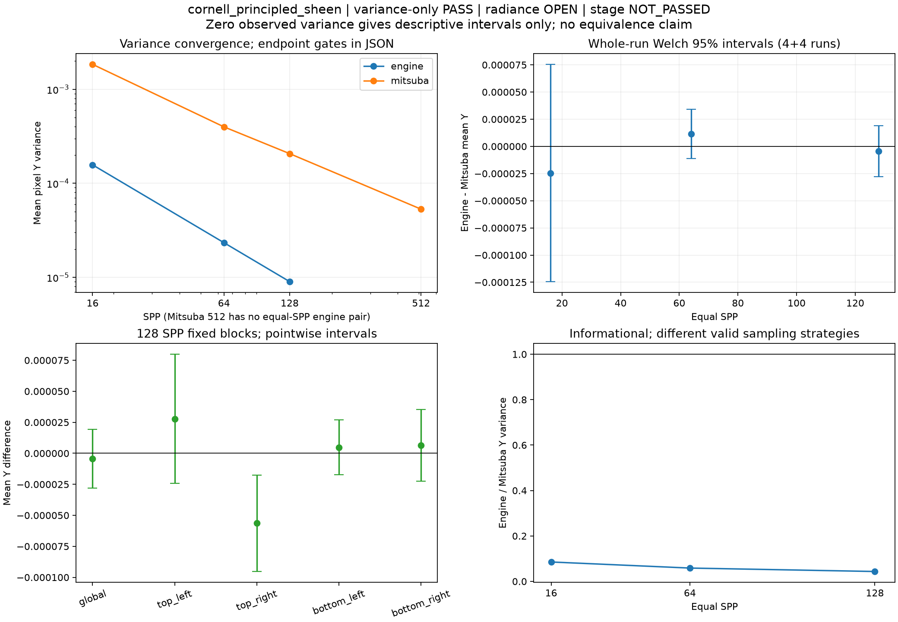
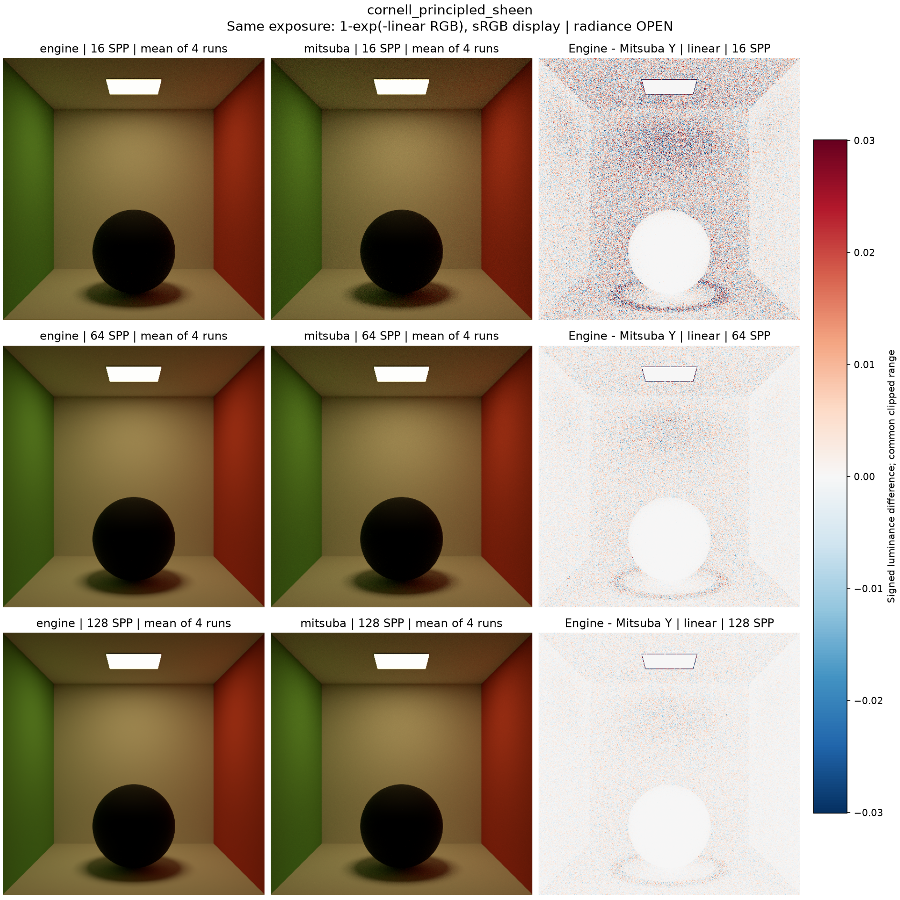
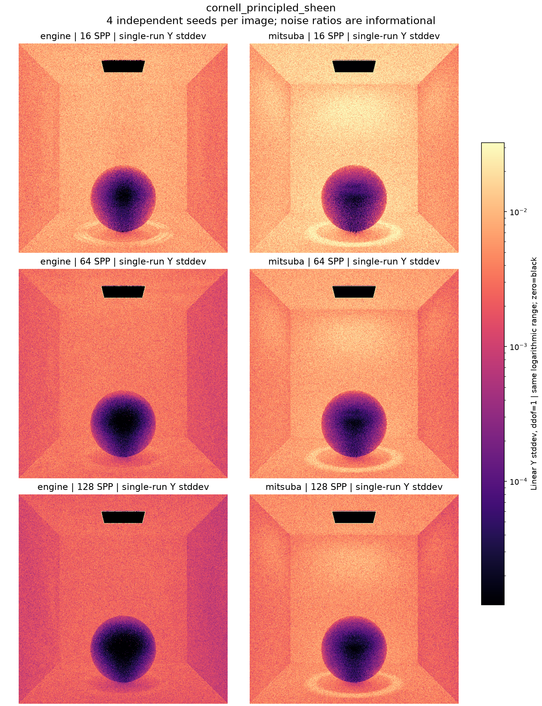

# cornell_principled_sheen

**Radiance: OPEN · Variance: See report · 사용자 육안 확인: 대기**

Reference: Mitsuba RGB

메시를 맞춘 보충 비교. float64 통계 교정 후 결과이며 radiance 판정과 분산 판정을 분리합니다.

평균 영상은 여러 seed의 평균이며 단일 렌더와 구분했습니다. 노이즈 영상은 seed 간 분산입니다. 노이즈 비율 1은 통과 기준이 아닙니다. 색상 스케일·SPP·seed 수는 각 그림에 표시됩니다.

## convergence_uncertainty.png

## mean_difference.png

## noise_comparison.png

