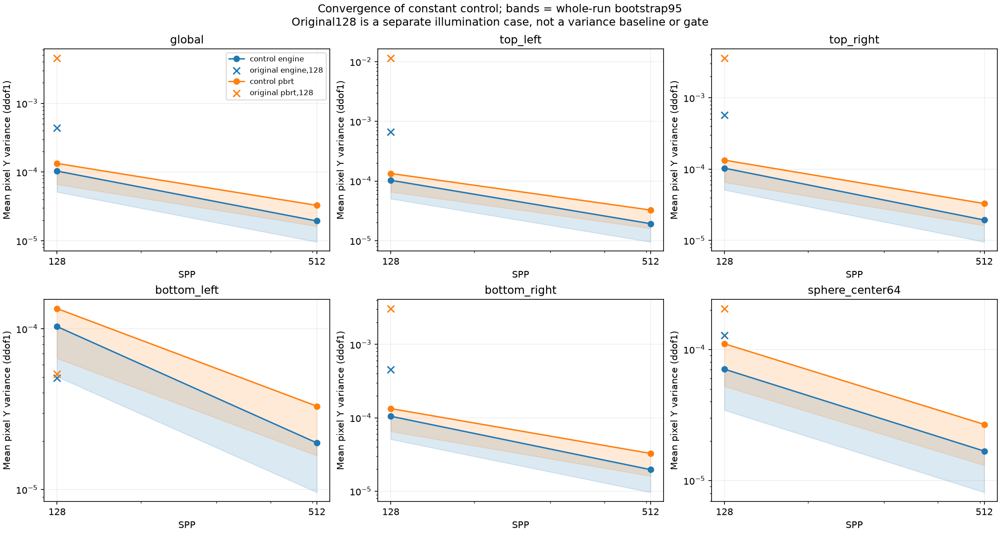
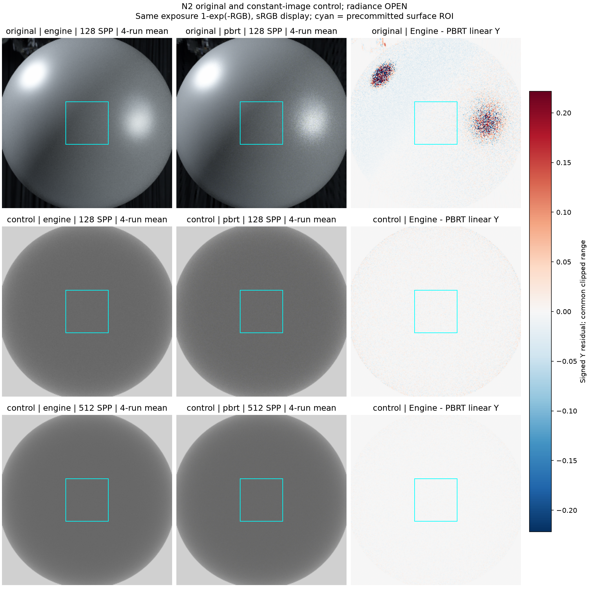
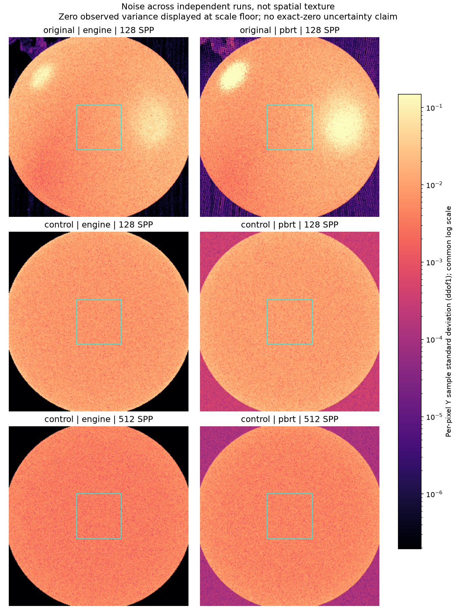
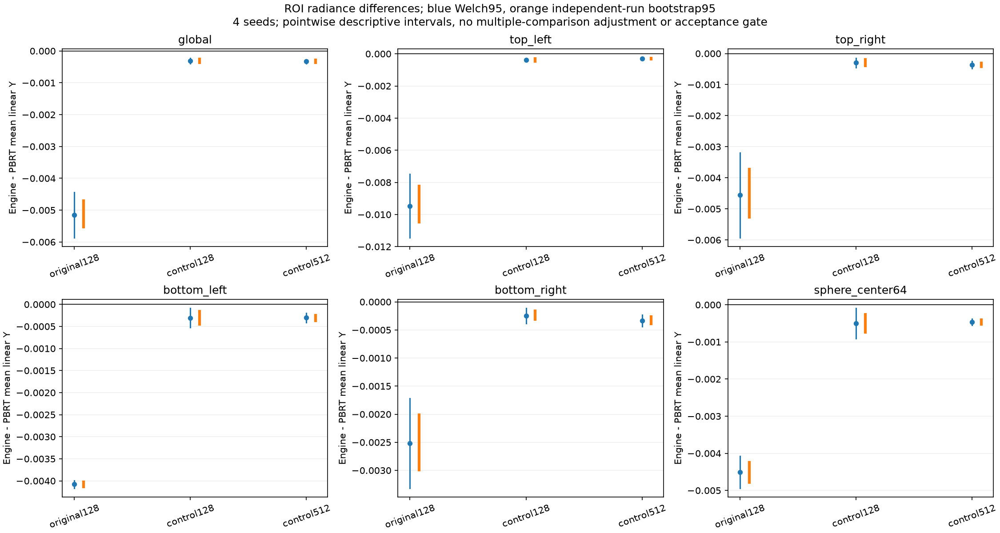
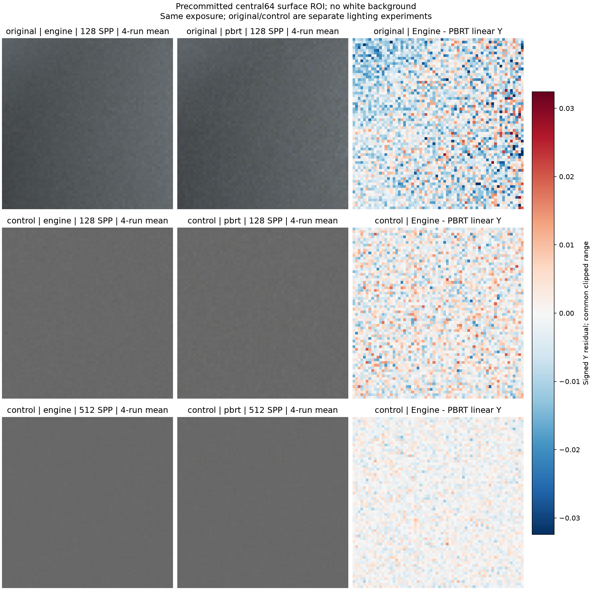

# gallery_nlayer_sphere_alpha01_n2_constant_env_matched--analysis_constant_control

**Radiance: OPEN · Variance: See report · 사용자 육안 확인: 대기**

Reference: PBRT (보조 진단; 지정 Guo 레퍼런스 아님)

Guo 검증을 대체하지 않는 과거 PBRT/환경맵/내부 깊이 진단입니다. 원래 결과를 보존합니다.

평균 영상은 여러 seed의 평균이며 단일 렌더와 구분했습니다. 노이즈 영상은 seed 간 분산입니다. 노이즈 비율 1은 통과 기준이 아닙니다. 색상 스케일·SPP·seed 수는 각 그림에 표시됩니다.

## convergence.png

## mean_difference.png

## noise_stddev.png

## roi_mean_uncertainty.png

## surface_roi.png

