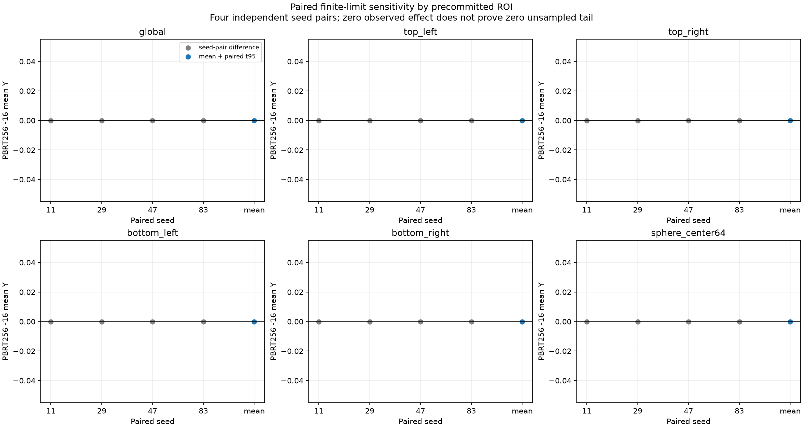
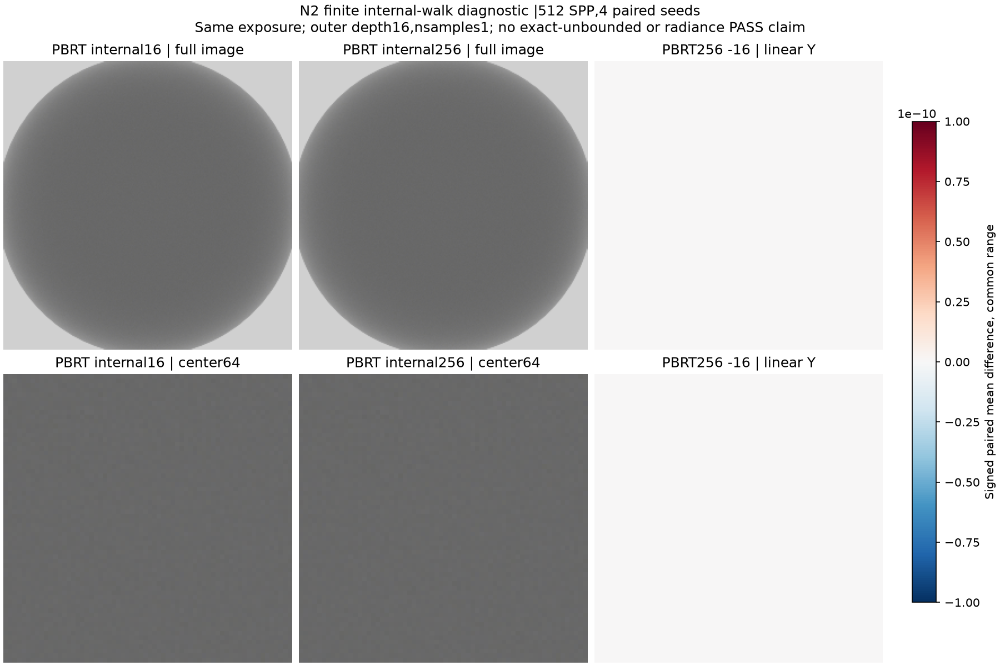

현재 사용자 육안 상태: **승인**. Radiance/variance의 역사적 판정은 바꾸지 않습니다.

---

# gallery_nlayer_sphere_alpha01_n2_constant_env_matched--analysis_internal256_diagnostic

**Radiance: OPEN · Variance: See report · 사용자 육안 확인: 승인 (기존 게시 이미지)**

Reference: PBRT (보조 진단; 지정 Guo 레퍼런스 아님)

Guo 검증을 대체하지 않는 과거 PBRT/환경맵/내부 깊이 진단입니다. 원래 결과를 보존합니다.

반복 검증의 평균 영상은 여러 seed를 평균한 결과이며, 대표 이미지로 표시된 단일 seed 렌더와 구분합니다. 노이즈 영상은 seed 간 분산 또는 표준편차입니다. 노이즈 비율 1은 통과 기준이 아닙니다. 색상 스케일·SPP·seed 수는 각 그림에 표시됩니다.

## paired_roi_uncertainty.png

## pbrt16_256_comparison.png

