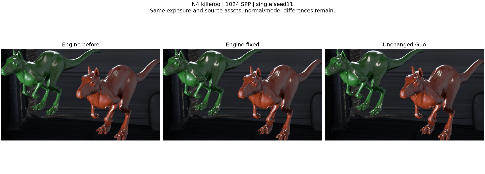
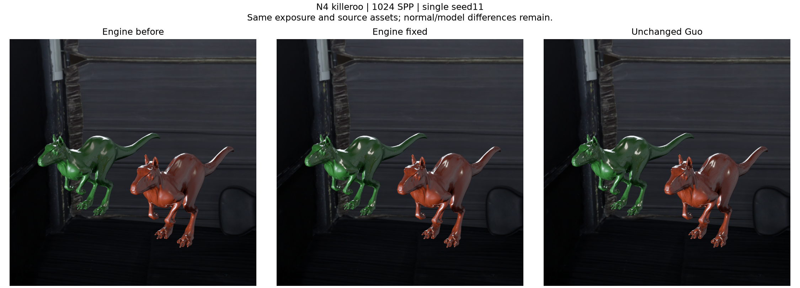
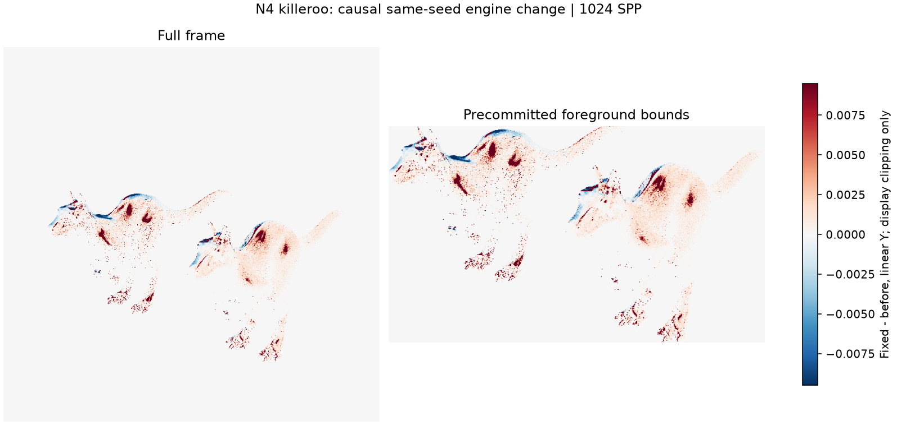
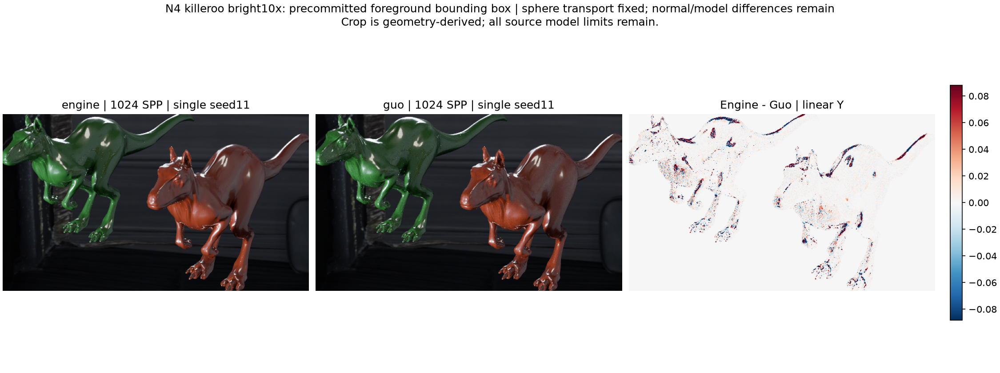
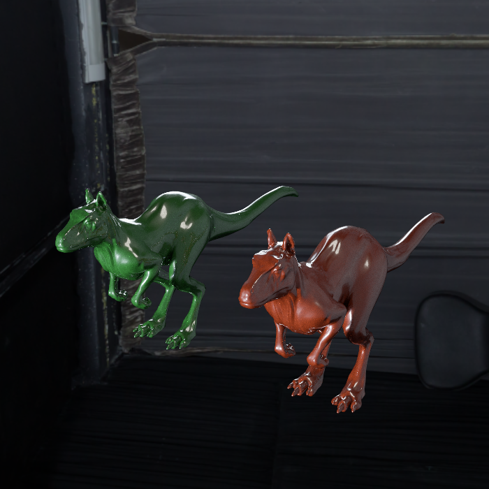
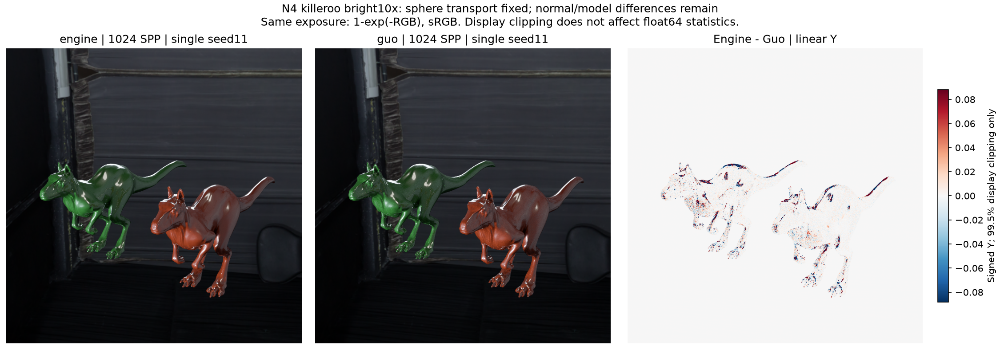

# gallery_nlayer_killeroo_n4_alpha01_bright10x

**Radiance: OPEN · Variance: NOT_APPLICABLE_SINGLE_SEED · 사용자 육안 확인: 대기 (새 이미지)**

Reference: Guo EfficientComplexLayered Mitsuba 0.6 / unchanged verified original reference

Source contract: **SPHERE_FIXED_NORMAL_AND_MODEL_DIFFERENCES_REMAIN**

구형 광원에 BSDF/phase 광선이 도달할 때의 MIS 기여와 불투명 차폐를 복구했습니다. 기존 광원 선택 PMF·power heuristic·면적 샘플링 정책은 유지했습니다. 같은 원본 Guo reference 대비 평균 Y 차이: 전체 -2.616903% → +0.351863%, 전경 -7.783979% → -0.799655%. 기존 SSIM .99 검사 0.99942288 / PASSED. 1024 SPP seed11 대표 이미지입니다. 수정 전/후/Guo 비교와 동일 노출 clean beauty PNG를 제공합니다. 기존 반복 검증의 seed11과 stream을 공유하므로 추가 독립 표본·분산·신뢰구간 근거가 아닙니다. Killeroo의 원본 비단위 vertex normal 보간·방향 정렬과 Guo의 처리 차이, BSDF/filter 모델 차이는 그대로 남습니다. 구형 광원 수정의 완료와 원본 씬 전체의 radiance 동등성을 구분하며 남은 잔차를 숨기지 않습니다. Ray-cone/normal map/PLY/카메라/재질/Guo reference를 변경하지 않았습니다. 새 이미지의 사용자 육안 확인은 대기입니다.

반복 검증의 평균 영상은 여러 seed를 평균한 결과이며, 대표 이미지로 표시된 단일 seed 렌더와 구분합니다. 노이즈 영상은 seed 간 분산 또는 표준편차입니다. 노이즈 비율 1은 통과 기준이 아닙니다. 색상 스케일·SPP·seed 수는 각 그림에 표시됩니다.

## before_after_foreground.png

## before_after_reference.png

## engine_hero1024_seed11_beauty.png

## fix_change_linear_y.png

## foreground_comparison.png

## guo_hero1024_seed11_beauty.png

## mean_difference_spp1024.png

