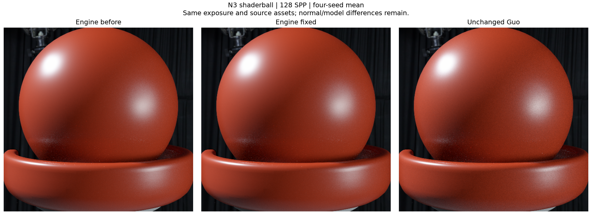
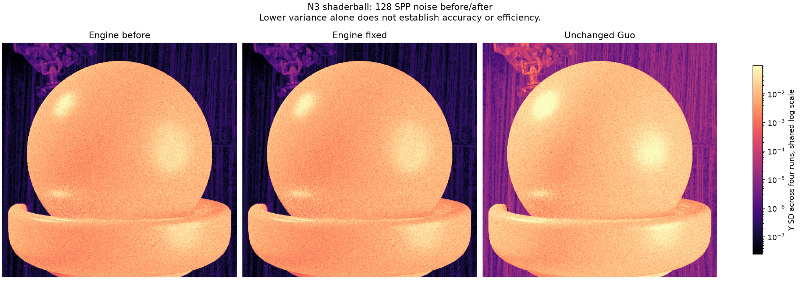
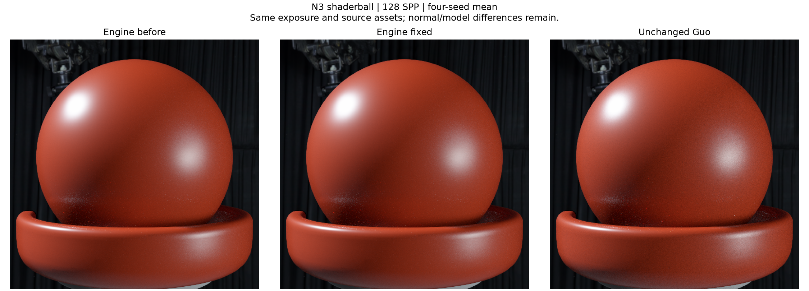
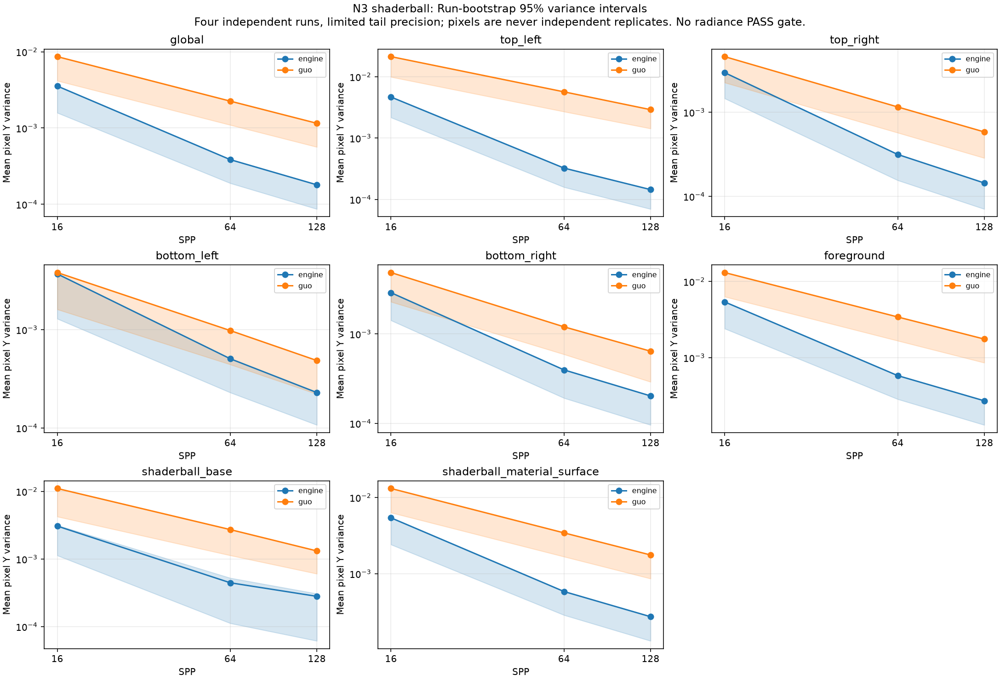
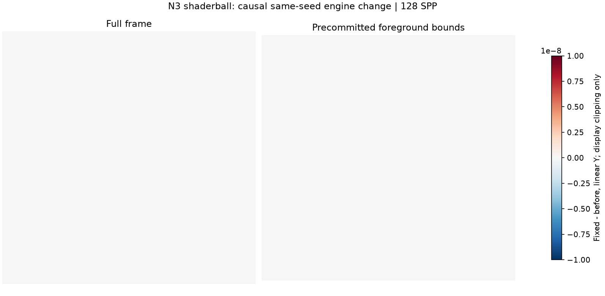
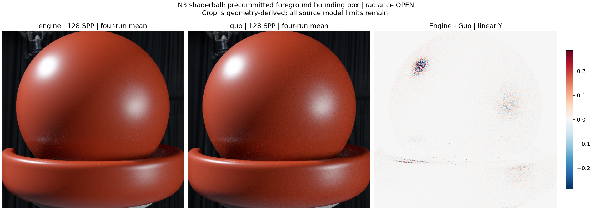
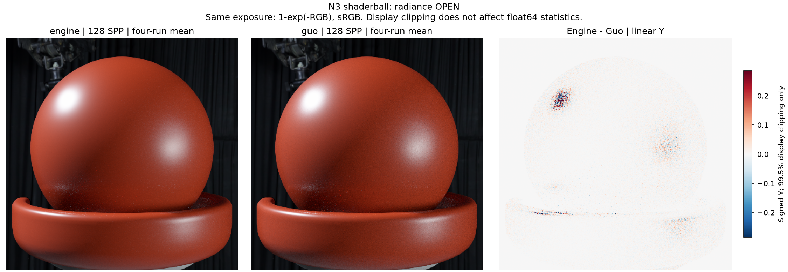
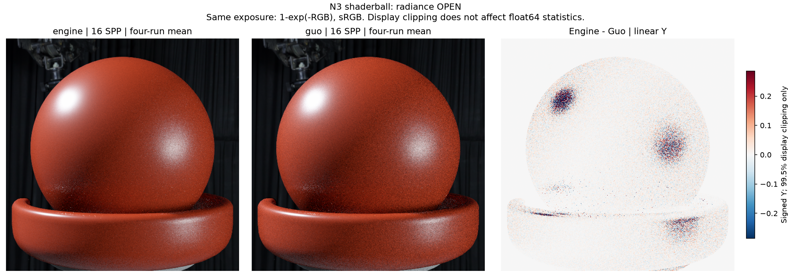
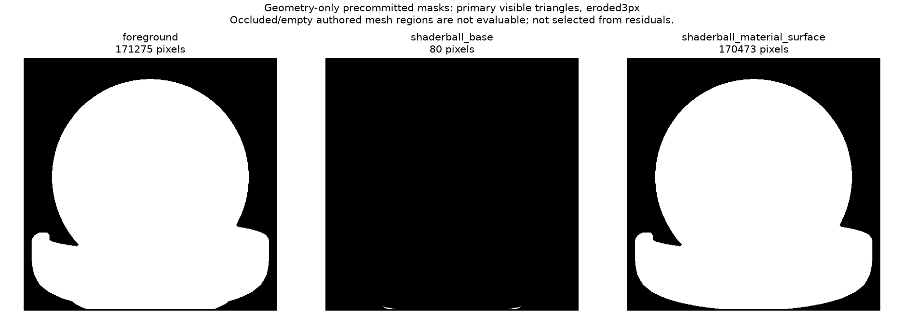

# gallery_nlayer_shaderball_n3

**Radiance: OPEN · Variance: PASS_VARIANCE_DECREASE_ONLY · 사용자 육안 확인: 대기 (새 이미지)**

Reference: Guo EfficientComplexLayered Mitsuba 0.6 / unchanged verified original reference

Source contract: **MATCHED_WITH_DISCLOSED_MODEL_FILTER_LIMITS**

구형 광원에 BSDF/phase 광선이 도달할 때의 MIS 기여와 불투명 차폐를 복구했습니다. 기존 광원 선택 PMF·power heuristic·면적 샘플링 정책은 유지했습니다. 같은 원본 Guo reference 대비 평균 Y 차이: 전체 +0.387351% → +0.387351%, 전경 +0.384611% → +0.384611%. 기존 SSIM .99 검사 0.99757259 / PASSED. 16/64/128 SPP × 독립 seed 4개, 수정 전후 같은 seed끼리 비교했습니다. 분산 감소: PASS_VARIANCE_DECREASE_ONLY. 128 SPP 전경 fixed/before Y 분산 비율 1.000000, fixed/Guo 비율 0.154714. 광량 누락을 고친 전후이므로 분산이 작다는 이유만으로 정확도·효율이 높다고 판단하지 않습니다. 구형 광원이 없는 N3 회귀이며, 선형 EXR pixel array가 전후 모든 checkpoint에서 동일한지 확인한 결과: True. Ray-cone/normal map/PLY/카메라/재질/Guo reference를 변경하지 않았습니다. 새 이미지의 사용자 육안 확인은 대기입니다.

반복 검증의 평균 영상은 여러 seed를 평균한 결과이며, 대표 이미지로 표시된 단일 seed 렌더와 구분합니다. 노이즈 영상은 seed 간 분산 또는 표준편차입니다. 노이즈 비율 1은 통과 기준이 아닙니다. 색상 스케일·SPP·seed 수는 각 그림에 표시됩니다.

## before_after_foreground.png

## before_after_noise.png

## before_after_reference.png

## convergence.png

## fix_change_linear_y.png

## foreground_comparison.png

## mean_difference_spp128.png

## mean_difference_spp16.png

## mean_difference_spp64.png

## noise_stddev.png

## precommitted_regions.png

## radiance_uncertainty.png

