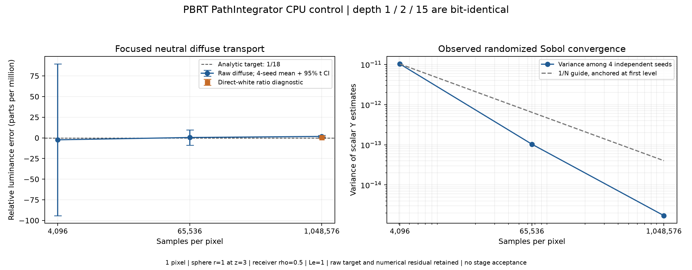

# lambertian_sphere_scalar

**Radiance: OPEN · Variance: OBSERVED_DECREASE_FOUR_SEEDS · 사용자 육안 확인: 대기 (새 이미지)**

Reference: PBRT-v4 CPU PathIntegrator + analytic Lambertian sphere integral

Source contract: **NEUTRAL_DIFFUSE_SCALAR_CONTROL**

엔진 GPU 검사와 같은 구면/수광판 배치의 중성색 대조입니다. RGB×RGB와 spectral 변환의 차이를 피하려 반사율 .5, 방출량 1로 고정했고 해석적 기대값은 1/18입니다. 실제 PBRT CPU 40개 렌더가 정상 종료했습니다. 1,048,576 SPP × 4 평균 Y는 해석값 대비 +1.758 ppm(+0.0001758%)입니다. depth 1/2/15 결과는 동일하고 세 SPP 수준에서 seed 간 분산이 감소합니다. 흰색 광원 비율 보정은 1ppm 규모의 색 변환·수치 오차를 살펴보는 별도 진단이며 원본값을 함께 표시했습니다. N4/Guo 영상에는 어떤 밝기 보정도 적용하지 않았습니다. 이 대조는 N-layered Guo reference를 대신하지 않습니다.

반복 검증의 평균 영상은 여러 seed를 평균한 결과이며, 대표 이미지로 표시된 단일 seed 렌더와 구분합니다. 노이즈 영상은 seed 간 분산 또는 표준편차입니다. 노이즈 비율 1은 통과 기준이 아닙니다. 색상 스케일·SPP·seed 수는 각 그림에 표시됩니다.

## scalar_control_convergence_v2.png

