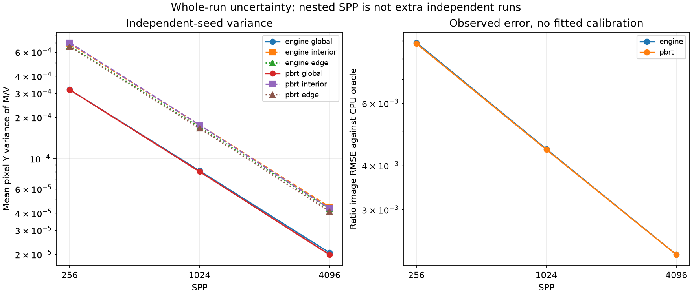
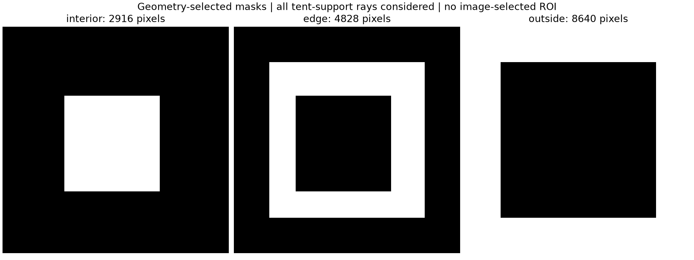
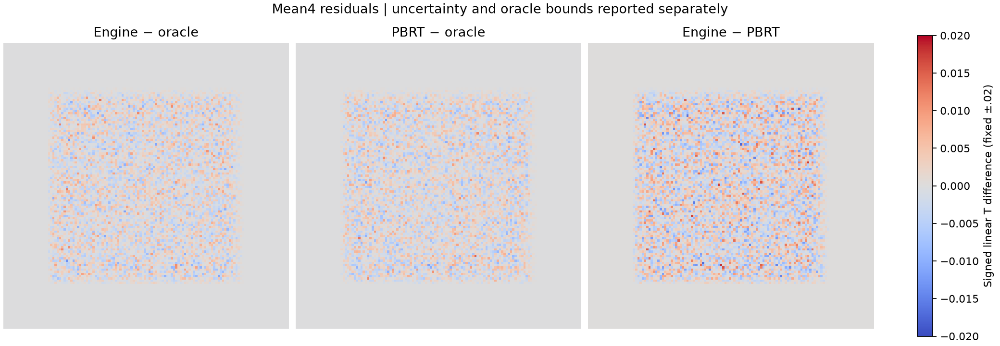
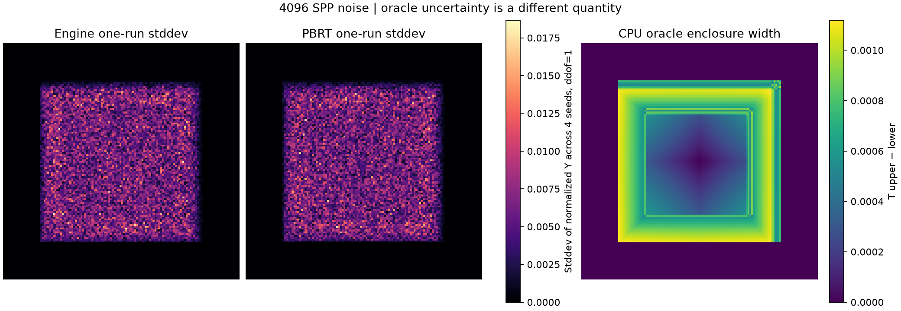
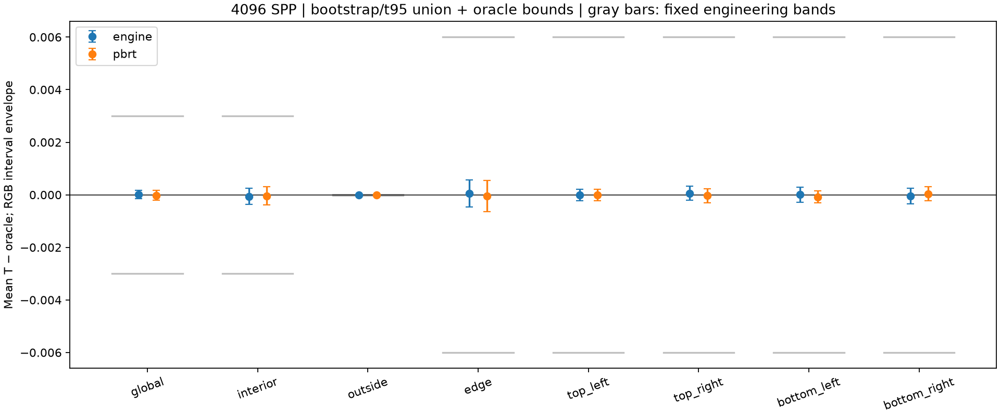
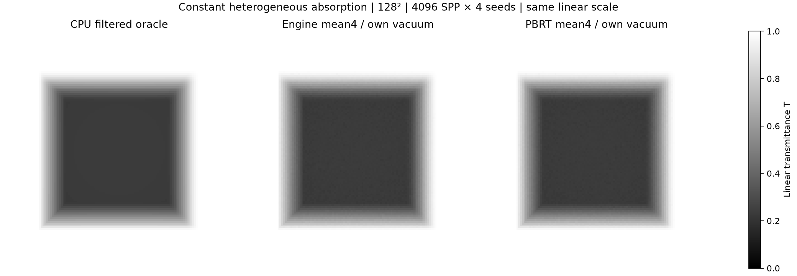

# gallery_medium_stage2_constant_absorption_128

**Radiance: INCONCLUSIVE · Variance: PASS_VARIANCE_DECREASE_ONLY · 사용자 육안 확인: 대기 (새 Stage 2 이미지)**

Reference: PBRT v4

상수/램프 흡수량과 분산 감소는 해당 고정 기준을 충족했습니다. 알려진 경계 접촉 결함이 남아 전체 판정은 INCONCLUSIVE입니다. Spectral white와 RGB white는 각자의 vacuum으로 정규화합니다.

[수치·불확실성·측정 범위](summary.json) · [입력/이미지 해시 증빙](analysis_receipt.json)

평균·분산·노이즈·깊이 차이와 소스 계약은 별도 판정입니다. 사용자 육안 승인이나 전체 Stage 2 PASS를 자동 부여하지 않습니다.

## convergence.png

동일 seed의 SPP checkpoint는 누적 prefix입니다. 독립 표본 수는4이며, 분산 감소와 평균 일치를 별도로 확인합니다.

## geometry_masks.png

영상 잔차를 보고 선택하지 않은 camera/boundary 기반의 고정 비교 영역입니다.

## linear_residuals.png

선형 평균 영상의 잔차입니다. 오차를 보기 위한 컬러 스케일이며 display 밝기 차이로 해석하지 않습니다.

## noise_and_oracle_bounds.png

독립 seed의 표본 노이즈와 CPU oracle 수치 오차 범위를 구분합니다. 축·범례의 수량과 공통 스케일을 확인하세요.

## regional_uncertainty.png

기하로 미리 정한 영역의 RGB/휘도 평균과95% 불확실성입니다. 회색 허용범위 및 oracle의 수치 오차를 함께 봅니다.

## transmittance_comparison.png

4096 SPP ×4seed 평균 투과율. 각 renderer의 medium/vacuum 비와 독립 CPU 적분 oracle을 같은 스케일로 비교합니다.

