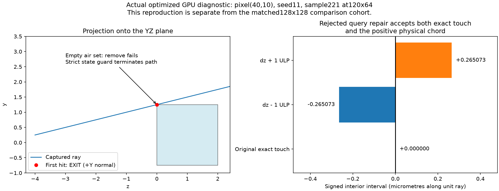
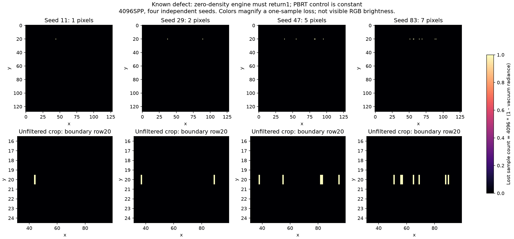

# boundary_tangent_defect

**Radiance: FAIL_DETERMINISTIC_VACUUM · Variance: NOT_A_STOCHASTIC_VARIANCE_FAILURE · 사용자 육안 확인: 대기 (새 Stage 2 이미지)**

Reference: PBRT vacuum + actual DXR diagnostics

결정론적 진공 대조군 FAIL. exact-edge tangent가 진입 없이 EXIT로 관측되며 경로가 종료됩니다. query-only 수정 두 개는 음성 대조군을 통과하지 못해 적용하지 않았습니다. 진단 그림과 원자료를 그대로 보존합니다.

[수치·불확실성·측정 범위](summary.json) · [입력/이미지 해시 증빙](analysis_receipt.json)

평균·분산·노이즈·깊이 차이와 소스 계약은 별도 판정입니다. 사용자 육안 승인이나 전체 Stage 2 PASS를 자동 부여하지 않습니다.

## tangent_diagnostic.png

실제 GPU 캡처 광선의 경계 접촉과 거부한 수정의 ±1ULP 반례입니다. 엔진 수정 완료 그림이 아닙니다.

## vacuum_sample_loss.png

단일 sample 손실을4096배 확대한 위치도입니다. 네 seed의15개 pixel/seed에서 각각1/SPP 손실이 있습니다.

