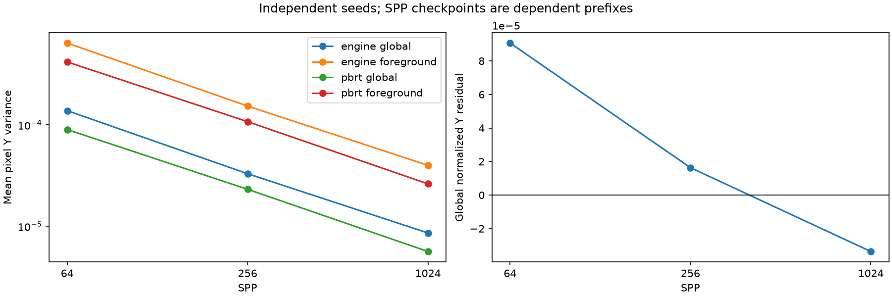
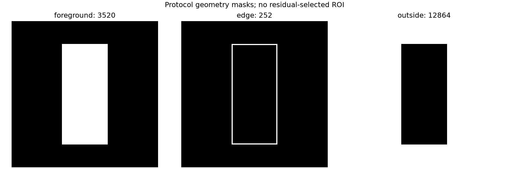
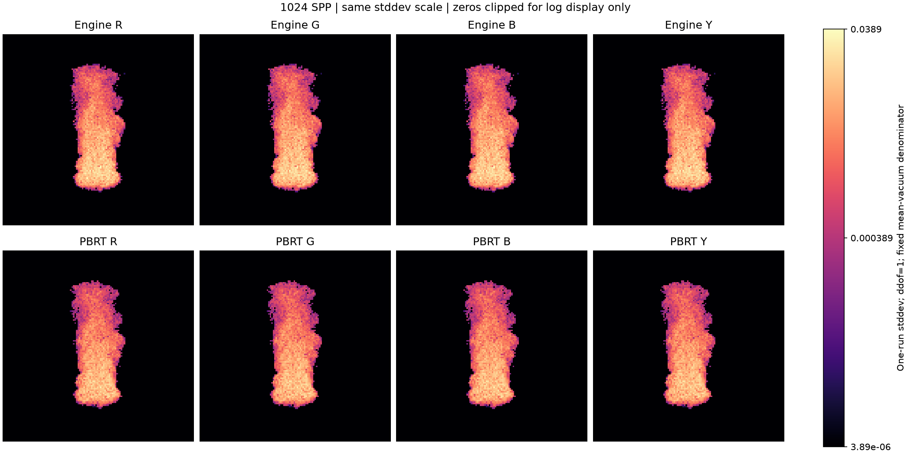
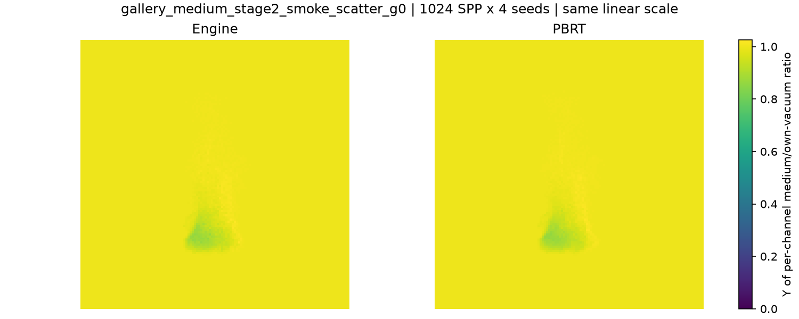
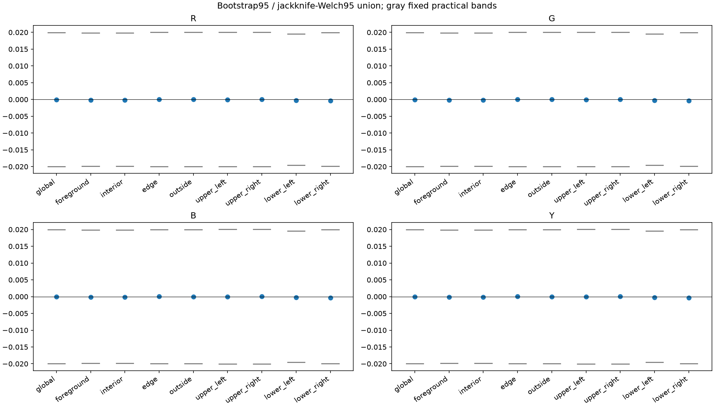
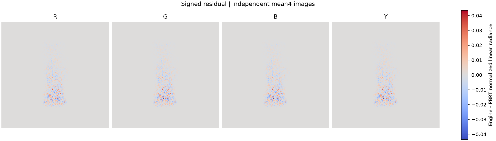

# gallery_medium_stage2_smoke_scatter_g0

**Radiance: INCONCLUSIVE · Variance: PASS_SCOPED · 사용자 육안 확인: 대기 (새 Stage 2 이미지)**

Reference: PBRT v4

단일 air-contributor 경계, 중성 optical coefficients, 동일한 density/camera/광원 조건입니다. 평균·노이즈·depth16→32를 각각 평가합니다. 알려진 boundary tangent 결함으로 전체 판정은 INCONCLUSIVE입니다.

[수치·불확실성·측정 범위](summary.json) · [입력/이미지 해시 증빙](analysis_receipt.json)

평균·분산·노이즈·깊이 차이와 소스 계약은 별도 판정입니다. 사용자 육안 승인이나 전체 Stage 2 PASS를 자동 부여하지 않습니다.

## convergence.png

동일 seed의 SPP checkpoint는 누적 prefix입니다. 독립 표본 수는4이며, 분산 감소와 평균 일치를 별도로 확인합니다.

## geometry_masks.png

영상 잔차를 보고 선택하지 않은 camera/boundary 기반의 고정 비교 영역입니다.

## noise_stddev_rgb_y.png

1024 SPP ×4seed 산란 비교입니다. 각 renderer의 matched vacuum으로 정규화했으며 그림 제목·범례의 선형 평균/잔차/표본 표준편차를 구분합니다. 전체 Stage2는 경계 결함 때문에 미통과입니다.

## normalized_radiance.png

1024 SPP ×4seed 산란 비교입니다. 각 renderer의 matched vacuum으로 정규화했으며 그림 제목·범례의 선형 평균/잔차/표본 표준편차를 구분합니다. 전체 Stage2는 경계 결함 때문에 미통과입니다.

## regional_uncertainty.png

기하로 미리 정한 영역의 RGB/휘도 평균과95% 불확실성입니다. 회색 허용범위 및 oracle의 수치 오차를 함께 봅니다.

## signed_residual_rgb_y.png

1024 SPP ×4seed 산란 비교입니다. 각 renderer의 matched vacuum으로 정규화했으며 그림 제목·범례의 선형 평균/잔차/표본 표준편차를 구분합니다. 전체 Stage2는 경계 결함 때문에 미통과입니다.

