# glass_smoke_lighting_v3

**Radiance: {"smoke": "PASS_SCOPED", "clear": "PASS_SCOPED"} · Variance: {"smoke": "PASS_SCOPED", "clear": "PASS_SCOPED"} · 육안: 사용자 검토 대기**

실제 유리구슬 내부 smoke와 동일 glass clear 대조. 68 EXR 정상완료; smoke/clear 평균·분산 감소·depth 기준 PASS_SCOPED. 독립 검산2456항목 일치. 사용자 육안 검토 PENDING, 전체 stage_pass=false.

Reference: PBRT v4 CPU volpath, wavelength jitter enabled; matched neutral optics, geometry, camera and tent film.

[실행·해시 영수증](analysis_receipt.json)

[전체 수치·불확실성·원본 EXR 경로](summary.json)

RGB 비교는 공통 exposure 1 + Reinhard + sRGB입니다. 별도 노출 맞춤·denoise를 하지 않았습니다. 512 hero는 단일 seed여서 분산·CI를 주장하지 않습니다.

원본 linear EXR/NPZ는 로컬 검증 자료에 보존됩니다. 수치 실패·미결정 및 측정 범위는 그대로 유지하며 사용자 승인이나 전체 단계 통과를 자동 부여하지 않습니다.

### beauty_hero512_smoke_pair.png

512×512 원본,2048 SPP,seed11: smoke 실제 RGB. 공통 exposure1 + Reinhard + sRGB, denoise 없음. 단일hero로 분산·CI·사용자 승인을 부여하지 않는다.

### beauty_hero512_seed11_2048.png

512×512 원본,2048 SPP,seed11: smoke와 clear 실제 RGB. 공통 exposure1 + Reinhard + sRGB, denoise 없음. 단일hero로 분산·CI·사용자 승인을 부여하지 않는다.

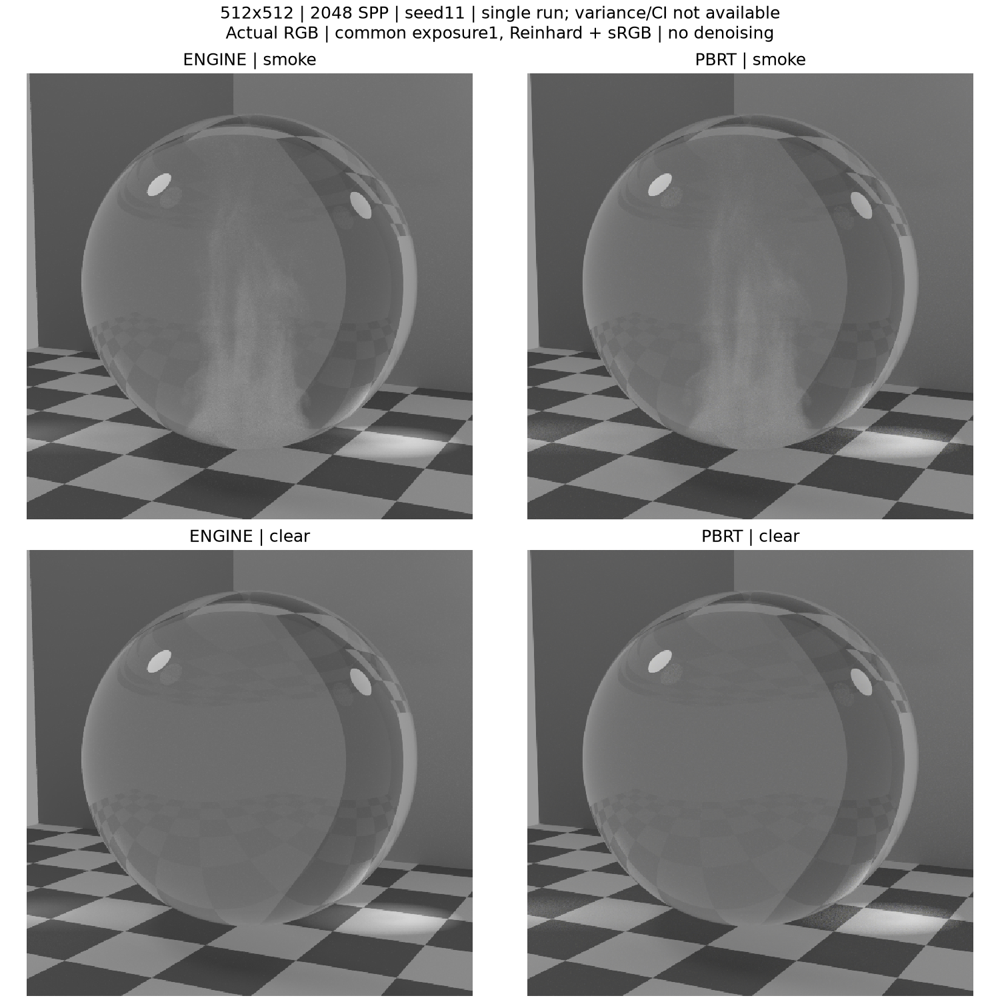

### beauty_hero512_clear_pair.png

512×512 원본,2048 SPP,seed11: clear 실제 RGB. 공통 exposure1 + Reinhard + sRGB, denoise 없음. 단일hero로 분산·CI·사용자 승인을 부여하지 않는다.

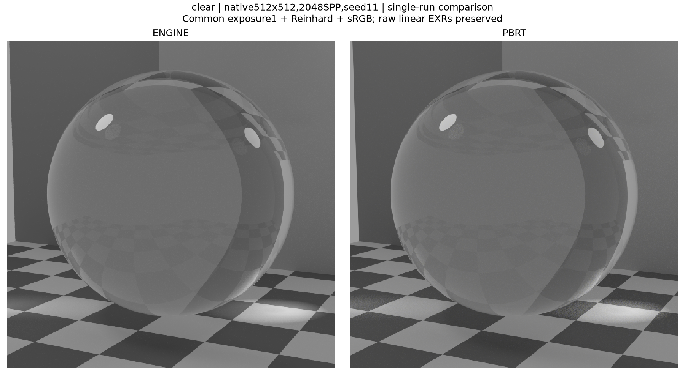

### hero512_clear_engine_RGB.png

512×512 native RGB: clear / engine,2048 SPP,seed11. 동일 표시식이며 단일표본이다.

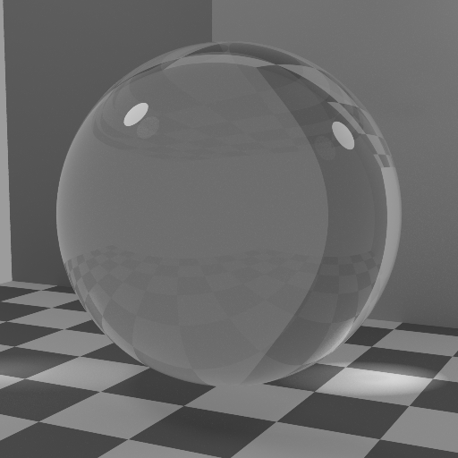

### hero512_clear_pbrt_RGB.png

512×512 native RGB: clear / PBRT,2048 SPP,seed11. 동일 표시식이며 단일표본이다.

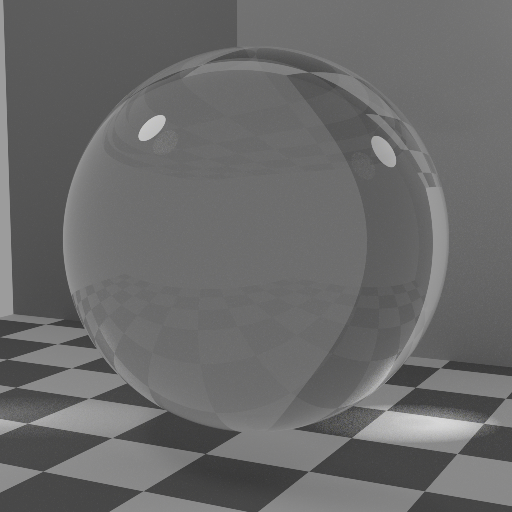

### hero512_smoke_engine_RGB.png

512×512 native RGB: smoke / engine,2048 SPP,seed11. 동일 표시식이며 단일표본이다.

### hero512_smoke_pbrt_RGB.png

512×512 native RGB: smoke / PBRT,2048 SPP,seed11. 동일 표시식이며 단일표본이다.

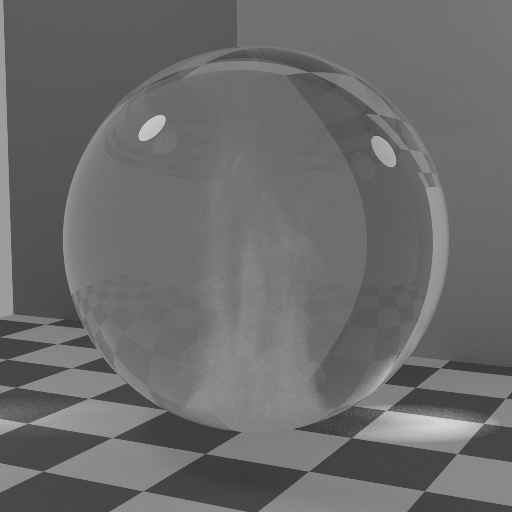

### beauty_single_seed11_1024.png

128×128,1024 SPP,seed11 단일표본. 위 smoke/아래 clear; 단일표본에서 분산이나 CI를 주장하지 않는다.

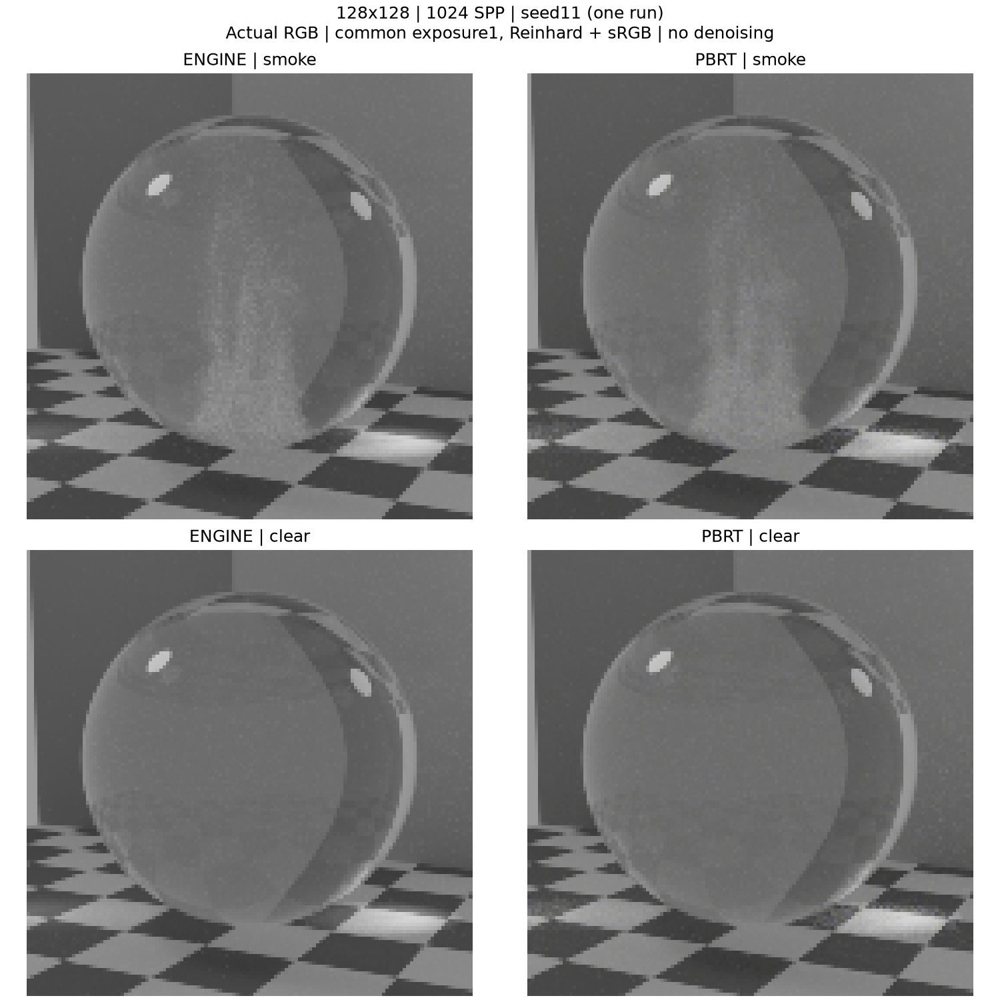

### beauty_mean4_1024.png

128×128, 1024 SPP/run, 독립4 seed 평균. 위 smoke/아래 clear, 왼쪽 engine/오른쪽 PBRT. 공통 exposure1 + Reinhard + sRGB.

### beauty_mean4_256.png

128×128, 256 SPP/run, 독립4 seed 평균. 위 smoke/아래 clear, 왼쪽 engine/오른쪽 PBRT. 공통 exposure1 + Reinhard + sRGB.

### beauty_mean4_64.png

128×128, 64 SPP/run, 독립4 seed 평균. 위 smoke/아래 clear, 왼쪽 engine/오른쪽 PBRT. 공통 exposure1 + Reinhard + sRGB.

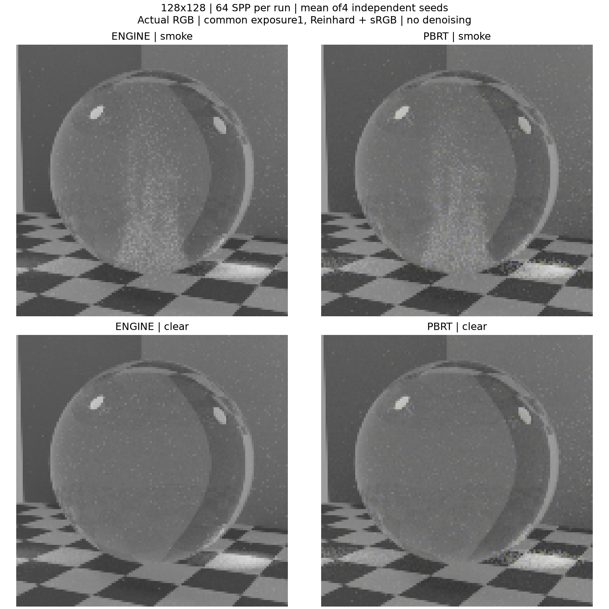

## 보조 진단: 잔차·노이즈·깊이·ROI

### clear_depth_tail_Y_CI.png

동일 renderer·seed의 depth64−32 Y 차이와 paired95% CI. 사전 band 안에서 통과하며 차이가 정확히0이라는 뜻은 아니다.

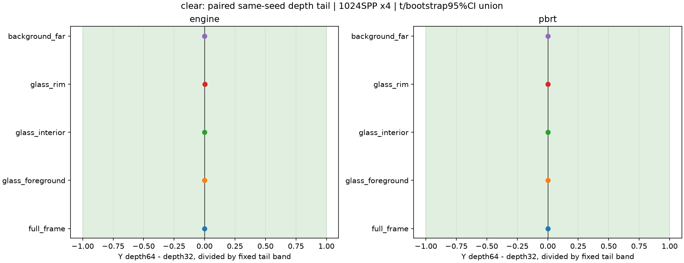

### clear_regional_mean_CI.png

1024 SPP×4,geometry-only5영역 RGB/Y 평균차의 marginal95% Welch/bootstrap 합집합 CI. 초록은 사전 engineering band이며 동시 신뢰구간 주장이 아니다.

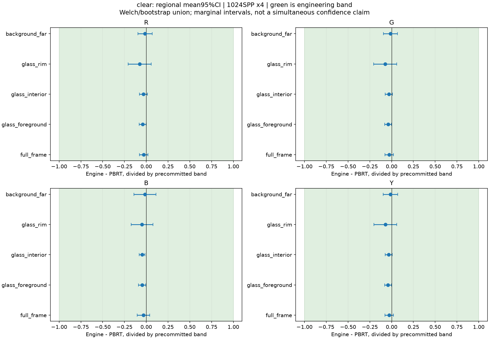

### clear_signed_residual_RGB_Y.png

1024 SPP 독립4 seed 평균의 raw linear engine−PBRT RGB/Y 잔차. 공통 발산색 스케일의 보조 진단이다.

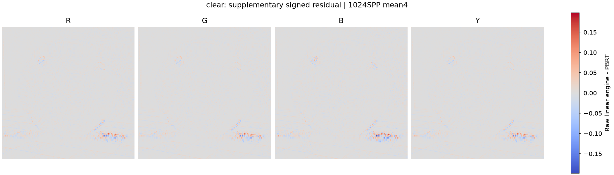

### clear_stddev_RGB_Y.png

1024 SPP×4 독립 seed의 표본분산(ddof1) 또는 그 제곱근. 위 engine/아래 PBRT, RGB/Y 공통 스케일. 표시 floor는 그림에만 적용한다.

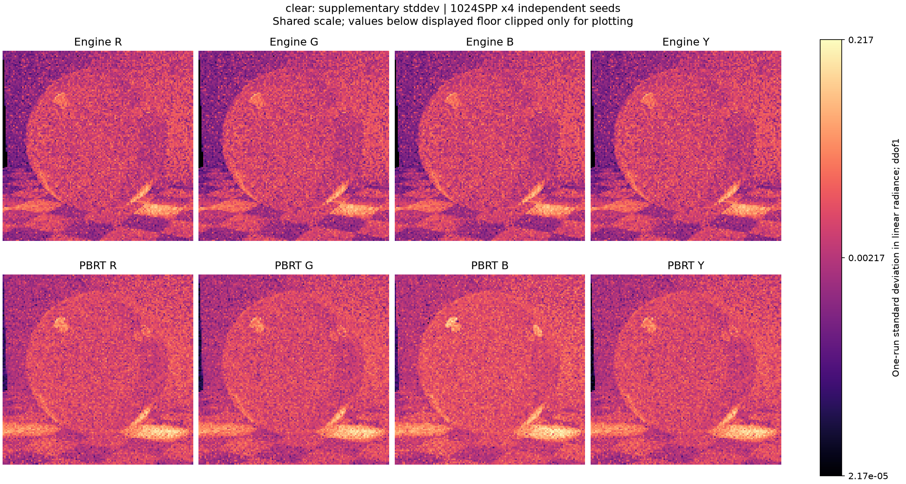

### clear_variance_RGB_Y.png

1024 SPP×4 독립 seed의 표본분산(ddof1) 또는 그 제곱근. 위 engine/아래 PBRT, RGB/Y 공통 스케일. 표시 floor는 그림에만 적용한다.

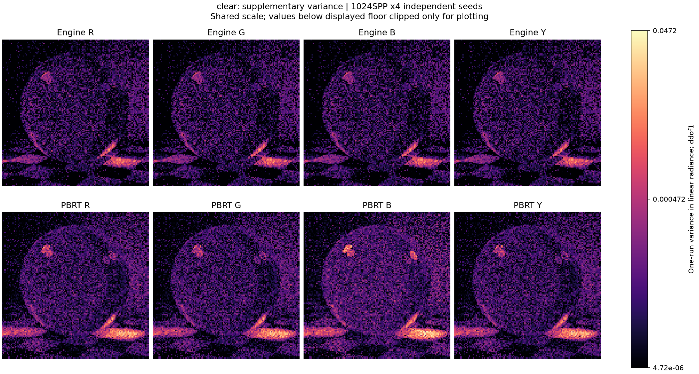

### clear_variance_convergence.png

64/256/1024 SPP의 독립 seed Y분산. 같은 seed의 중첩 SPP는 종속이며 PBRT spectral sampling noise를 포함한다.

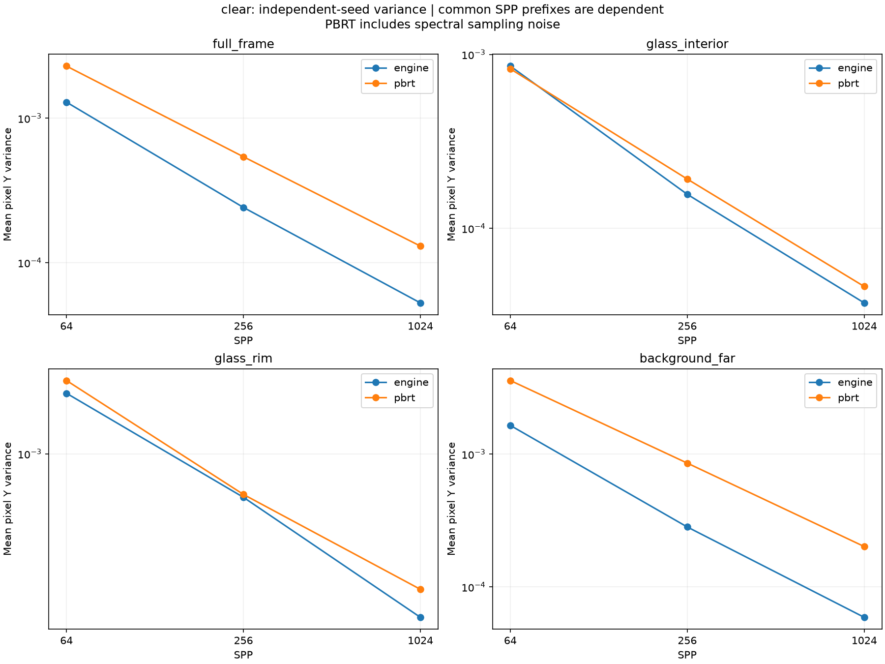

### geometry_ROIs.png

렌더 결과를 보기 전에 고정한 geometry-only 영역. 밝기나 residual로 영역을 선택하지 않았다.

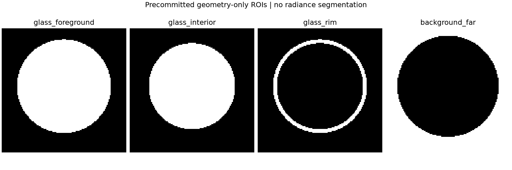

### smoke_depth_tail_Y_CI.png

동일 renderer·seed의 depth64−32 Y 차이와 paired95% CI. 사전 band 안에서 통과하며 차이가 정확히0이라는 뜻은 아니다.

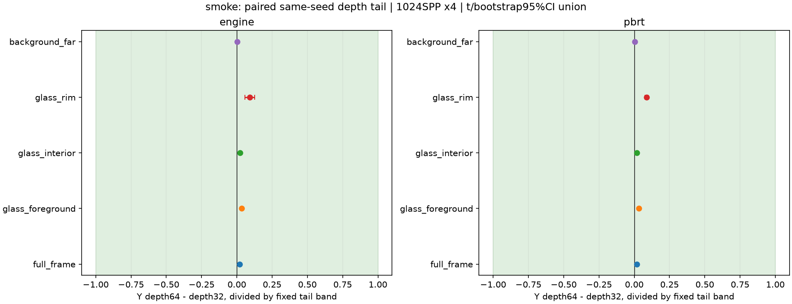

### smoke_regional_mean_CI.png

1024 SPP×4,geometry-only5영역 RGB/Y 평균차의 marginal95% Welch/bootstrap 합집합 CI. 초록은 사전 engineering band이며 동시 신뢰구간 주장이 아니다.

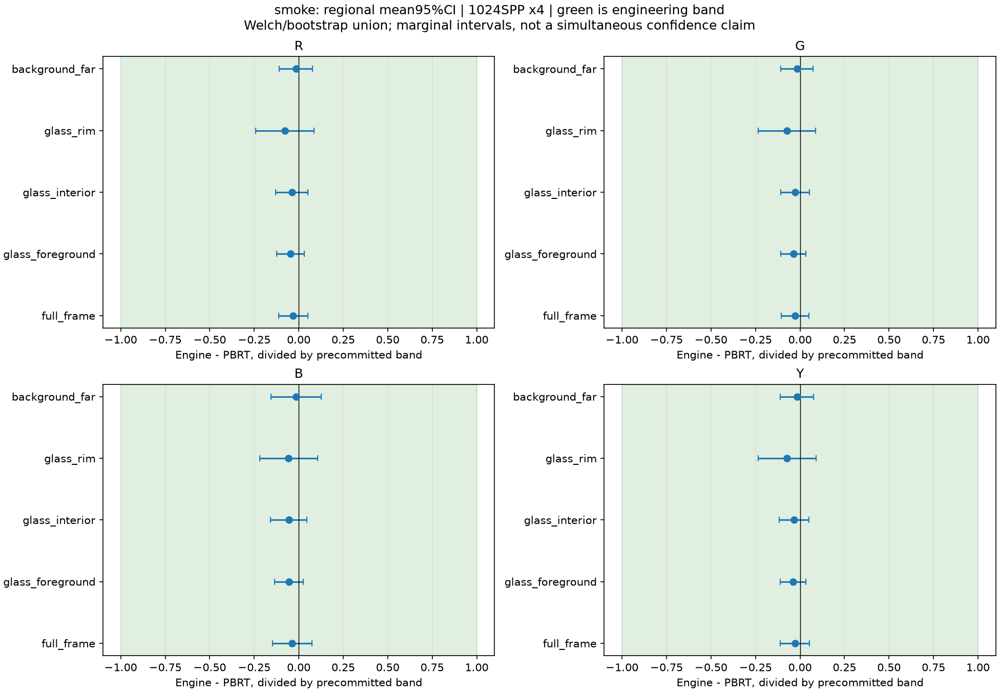

### smoke_signed_residual_RGB_Y.png

1024 SPP 독립4 seed 평균의 raw linear engine−PBRT RGB/Y 잔차. 공통 발산색 스케일의 보조 진단이다.

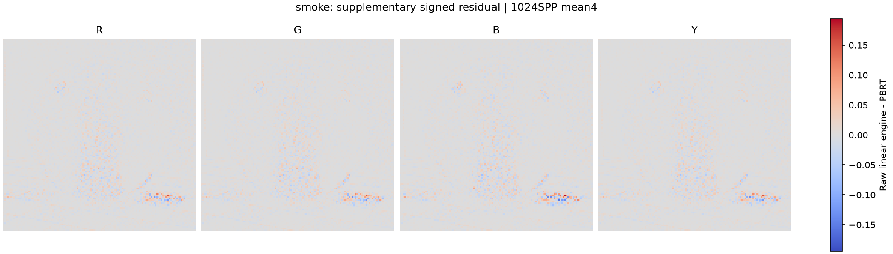

### smoke_stddev_RGB_Y.png

1024 SPP×4 독립 seed의 표본분산(ddof1) 또는 그 제곱근. 위 engine/아래 PBRT, RGB/Y 공통 스케일. 표시 floor는 그림에만 적용한다.

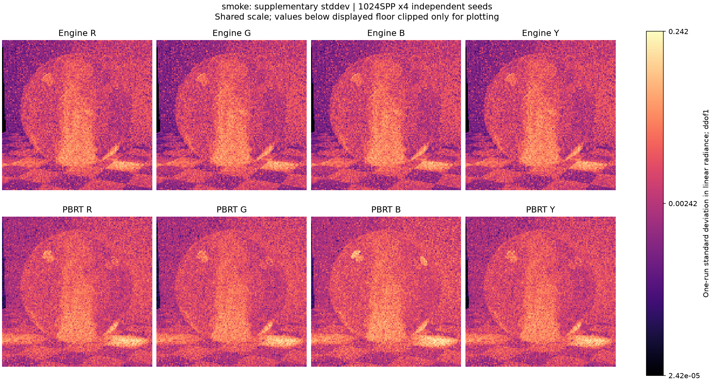

### smoke_variance_RGB_Y.png

1024 SPP×4 독립 seed의 표본분산(ddof1) 또는 그 제곱근. 위 engine/아래 PBRT, RGB/Y 공통 스케일. 표시 floor는 그림에만 적용한다.

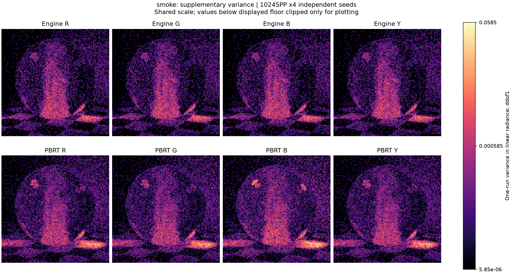

### smoke_variance_convergence.png

64/256/1024 SPP의 독립 seed Y분산. 같은 seed의 중첩 SPP는 종속이며 PBRT spectral sampling noise를 포함한다.

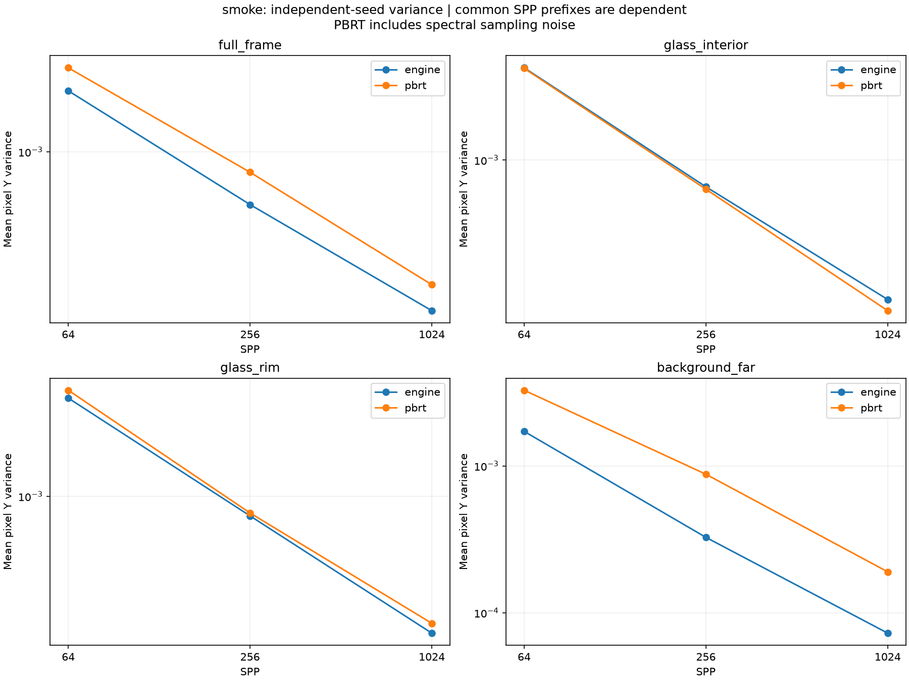
