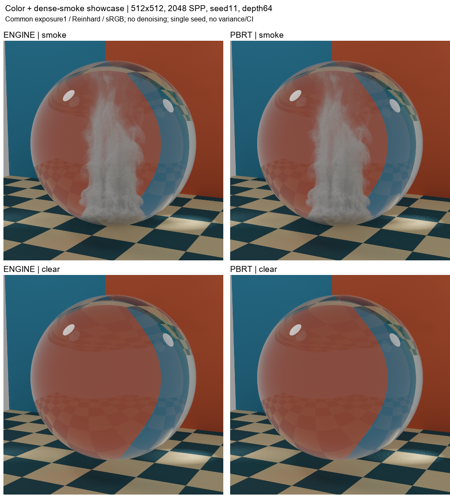
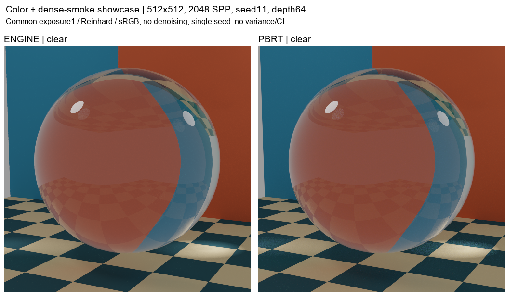
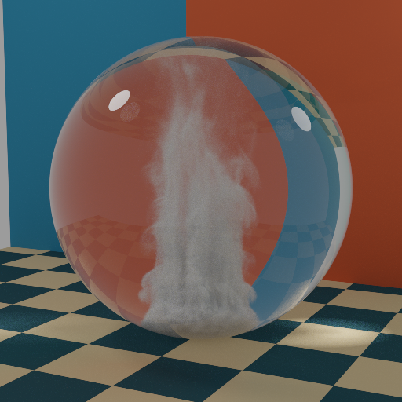
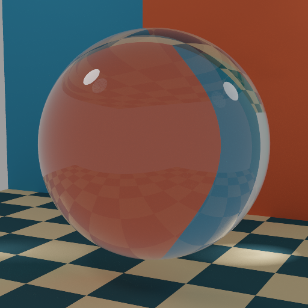

# 채도·연기량을 높인 대표 이미지

채도를 높인 주변 배경과8배 짙은 smoke(밀도 배율1.44), 동일 glass clear 대조. 512²/2048SPP/seed11/depth64 실제 렌더. 이전68EXR의 수치 통과를 새 scene에 옮기지 않는다.

사용자는 기존 Stage3 비교24장을 승인한 뒤 이번 대표 구성 변경을 요청하고, 렌더를 마치면4단계로 진행하도록 지시했습니다. 새7장은 별도 승인받은 이미지라고 기록하지 않으며 추가 승인 gate도 만들지 않습니다.

공통 exposure1 + Reinhard + sRGB, denoise 없음. Engine/PBRT 모두 실제512² 원본 RGB입니다. 단일seed이므로 분산·CI·새 numerical PASS를 주장하지 않습니다. 기존 neutral68 EXR와 통계/승인 자료는 그대로 보존합니다.

[정상4 EXR와 원본 SHA](render_receipt.json) · [개별7 PNG artifact QA](artifact_qa.json) · [새 source 변경](preparation_receipt.json)

## smoke_pair.png

Actual engine/PBRT beauty comparison. Saturated background and density8x are new authored changes; original68-EXR formal gates are not rerun or transferred.

## smoke_clear_quad.png

Actual engine/PBRT beauty comparison. Saturated background and density8x are new authored changes; original68-EXR formal gates are not rerun or transferred.

## clear_pair.png

Actual engine/PBRT beauty comparison. Saturated background and density8x are new authored changes; original68-EXR formal gates are not rerun or transferred.

## smoke_engine_RGB.png

smoke / engine, native512,2048SPP,seed11,depth64. Actual RGB at common exposure1/Reinhard/sRGB; single-seed showcase only.

## smoke_pbrt_RGB.png

smoke / pbrt, native512,2048SPP,seed11,depth64. Actual RGB at common exposure1/Reinhard/sRGB; single-seed showcase only.

## clear_engine_RGB.png

clear / engine, native512,2048SPP,seed11,depth64. Actual RGB at common exposure1/Reinhard/sRGB; single-seed showcase only.

## clear_pbrt_RGB.png

clear / pbrt, native512,2048SPP,seed11,depth64. Actual RGB at common exposure1/Reinhard/sRGB; single-seed showcase only.

