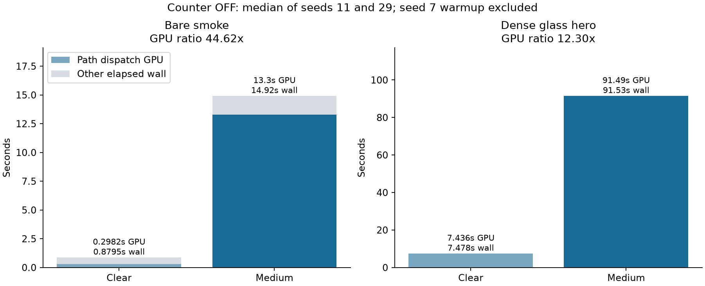
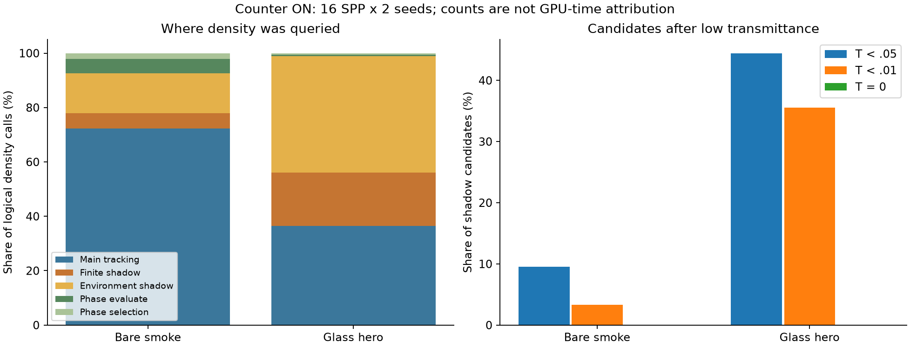

# Medium instrumentation results

36 normal-exit EXRs; 24 decoded RGB image pairs bit-identical. 12 counter dumps pass accounting and overflow checks.

GPU timing uses the unchanged production shader. Counter-on time is excluded. Every process starts with predeclared timestamp-disabled seed7; only seeds11/29 are reported. Startup Primary GPU time is not measured. Later Primary query counts are zero because the state is cached.

| Workload | GPU clear → medium, s | GPU paired ratio | Wall clear → medium, s | Wall paired ratio |
|---|---:|---:|---:|---:|
| Bare smoke | 0.298197 → 13.303929 | 44.615x | 0.879501 → 14.921663 | 16.968x |
| Dense glass hero | 7.435673 → 91.485215 | 12.304x | 7.477763 → 91.532803 | 12.241x |

| Workload | Density calls/path | Main null fraction | Shadow share of density calls | Phase share | Shadow candidates after T < .01 |
|---|---:|---:|---:|---:|---:|
| Bare smoke | 2.175 | 96.74% | 20.30% | 7.35% | 3.30% |
| Dense glass hero | 68.852 | 98.21% | 62.42% | 1.18% | 35.54% |

These are algorithm-event counts, not DRAM transactions or percentages of time. The low-transmittance subsets overlap. Two seeds provide a descriptive range, not a confidence interval or new convergence gate. No transport optimization, local-majorant change, roulette change, or sampling-policy change is included. PBRT was not rerendered in this engine instrumentation experiment; the previous matched performance comparison remains unchanged.

## Follow-up priorities

1. Test rejection of already blocked shadow connections before medium tracking. Source review confirmed that the engine currently tracks the interval before returning zero for a known material blocker, while the measured PBRT implementation checks that blocker first. This is a bounded control-flow experiment, separate from changing the light sampling policy. Blocked-only candidate cost was not counted, so the total shadow share is not a promised saving.
2. Investigate conservative local majorants for both scenes: the measured high main null fraction establishes substantial rejected-candidate work. Fewer candidates do not automatically imply lower ratio-tracking variance or better error per second.
3. After those changes, reconsider compensated low-transmittance roulette from the residual workload. A deterministic small-value cutoff is not an unbiased replacement. Phase reuse is a smaller work-share candidate in these fixtures.

The host-glass fixture has zero pure-boundary helper invocations in all diagnostic seeds. That helper cannot directly explain its dynamic work increase; this does not rule out shared shader register/code-size effects. Exact-zero shadow candidates are counted separately from merely small nonzero transmittance.

The historical first attempt could not retain startup timing through auxiliary context reuse; the revised measurement scope starts after warmup. A diagnostic-only binding error was corrected before this cohort. Generic profile history outside this stable-scene protocol remains outside the claim. Long process-exit delays are recorded separately and excluded from the render-loop and GPU intervals.

[Machine-readable results](summary.json)

## Timing drift control

A separate three-image, normal-exit control disabled both timestamps and counters in the same current host. Its three RGB images are bit-identical to the timestamp-ON run. Excluding warmup7, median hero wall time was 92.074360s; median paired ON/OFF wall ratio was 0.9941x.

The current hero timing is substantially longer than the historical Stage4 median43.469416s. The control does not support attributing that difference to marker activation alone. Fixed ON→OFF order, historical host-binary differences and execution-state drift were not causally separated; no historical baseline was rerendered. Keep this experiment separate from the previous multi-block PBRT comparison. Current timestamps describe GPU intervals in this execution state, not isolated hardware-busy cycles.
