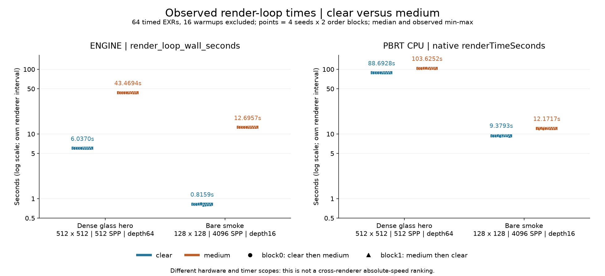
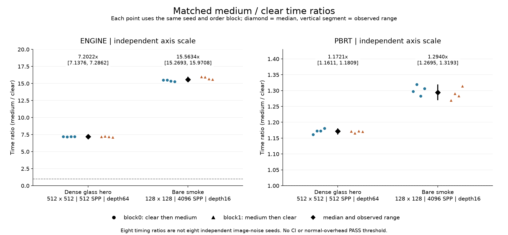

# Stage4 측정 결과: 매질 추가 비용

두 matched workload의 관측 비교를 완료했습니다. 엔진의 매질 추가 시간비가 PBRT보다 크게 나타났으므로 성능 개선 과제로 기록합니다. **정상 overhead PASS 또는 특정 병목의 인과 판정은 아닙니다.**

**전체 내부 증거는 로컬 보관; 공개자료는 비교 이미지와 결과입니다.** 신규 공개자료에는 실행 스크립트·엔진 패치·소스/빌드 보고서·내부 경로·학습 문서를 포함하지 않습니다. 기존 공개 이미지는 그대로 보존합니다.

| Workload | Renderer | clear 시간 중앙값(s) | medium 시간 중앙값(s) | 같은seed 시간비8개 중앙값 | 관측범위 |
|---|---|---:|---:|---:|---:|
| dense_glass_hero | engine | 6.036965 | 43.469416 | 7.2022x | 7.1376–7.2862x |
| dense_glass_hero | pbrt | 88.692837 | 103.625233 | 1.1721x | 1.1611–1.1809x |
| bare_smoke | engine | 0.815881 | 12.695721 | 15.5634x | 15.2693–15.9708x |
| bare_smoke | pbrt | 9.379334 | 12.171657 | 1.2940x | 1.2695–1.3193x |

각 비율은 같은seed·같은order block의 medium/clear이며, **비율의 중앙값은 시간 중앙값을 나눈 값과 다릅니다**. Hero는512²/512SPP/depth64, bare는128²/4096SPP/depth16입니다.4개 measured seeds(11/29/47/83)와 두 반대 순서 block을 사용했고 seed7 warmup은 제외했습니다.

엔진 시간은 frameCPU/scheduling/마지막 GPU완료 대기를 포함한 wall이며 load/current image output/shutdown을 제외합니다. PBRT는 자체 render-loop 시간입니다. 서로 다른 hardware/scope의 절대속도 순위를 의미하지 않습니다. 단일SPP checkpoint를 사용해 이전checkpoint 출력이 섞이지 않습니다.

전체80EXR/48process가 정상 완료됐으며64개 시간 측정+16개warmup입니다.40개 반복block image쌍은 모두 비트가 같습니다. 이미지 noise는 독립4seed만 사용하며8개로 부풀리지 않았습니다. Hero rawY pixel 분산 E/P 점추정은1.0644538232입니다. Bare는 wavelengthjitter OFF에서 clearY E .0500019267/P .0508508272가 달라 각자 Vmedium/meanYclear²로 정규화한 비율1.6222635647을 보고합니다. 이는 분모 uncertainty를 전파하지 않은 서술적 점추정이며 rawRGB 합의·noise 통과·같은오차 효율의 gate가 아닙니다.

첫 실제process 시작~마지막 종료는4599.400284s(약76.66분)로 준비검사·재개·간격을 포함합니다.48process wall합4425.5673204s(engine2280.708597/PBRT2144.8587234),80결과의 render interval합engine631.004620172/PBRT2142.233345032s입니다. 차이는 로딩/출력/종료 등을 포함하며 종료 시간 단독으로 명명하지 않습니다.

환경은 측정 후 확인한 Ryzen9 7950X(16core/32logical),RTX4080/driver32.0.15.9186,Windows11Home build26200이며 PBRT는8CPUthreads입니다. 실행 중 온도·clock·utilization 연속 telemetry는 수집하지 않았습니다. 두 순서block으로 전체 열/순서 영향이 제거됐다고 주장하지 않습니다.

독립 검산은80EXR 별도 decode와516수치 재계산에서 최대차2.78e−17,blocker0을 확인했습니다. 모든 내부 실행·입력·코드·빌드 증거는 로컬에 남아 있습니다. [공개 원시 측정값과 설정](summary.json) · [결과 검증 요약](verification_summary.json).

이번 결과는 현재 장면에 매질을 넣었을 때의 workload 증가입니다. 과거 기능 추가 전 binary 비용, 특정 병목의 지배성, 모든 씬의 정상 성능은 미측정입니다. 성능상 약점은 남기고 추가 최적화를 이번 검증 완료의 숨은 조건으로 만들지 않습니다. 이 두 진단 PNG의 artifact QA와 새 사용자 시각 승인은 구분합니다.
