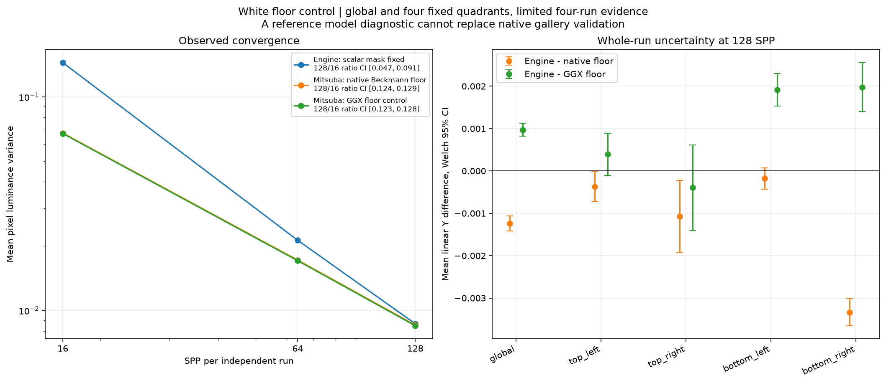
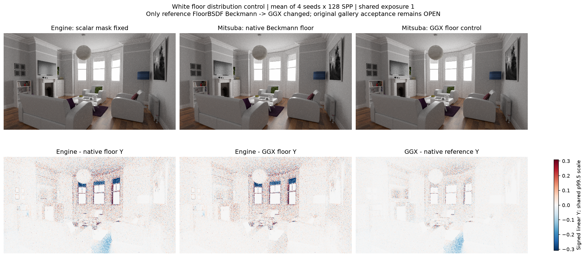
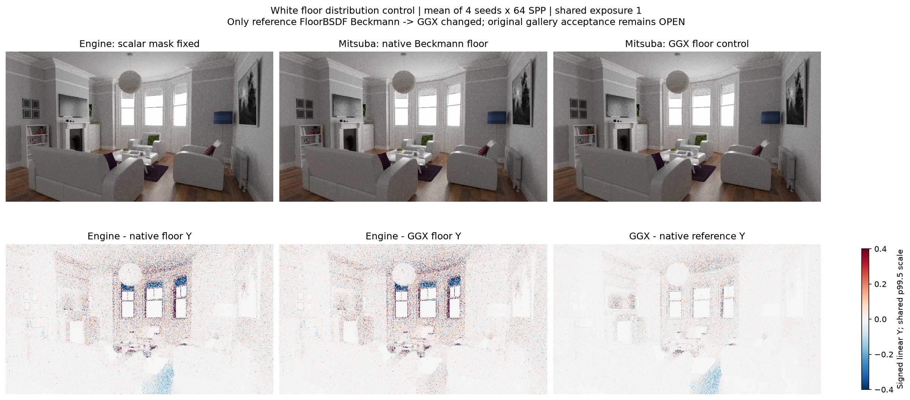
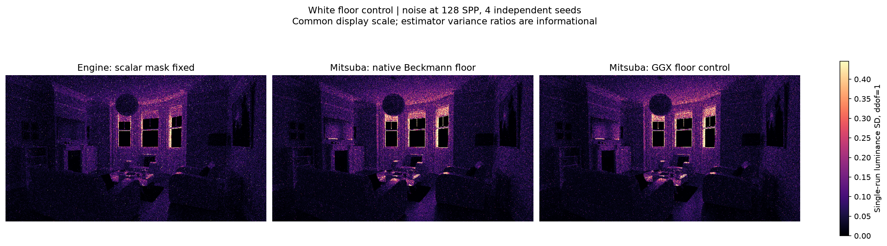

# gallery_white_room

**Radiance: OPEN · Variance: PASS · 사용자 육안 확인: 대기**

Reference: Mitsuba volpath: diagnostic floor Beckmann/GGX control

원본 White 바닥은 Beckmann, engine importer는 GGX로 매핑합니다. 같은 엔진 영상을 유지한 채 reference FloorBSDF의 distribution 한 속성만 GGX로 바꾼 원인 분리 대조군입니다. 평균 Y 차이: 원본 native volpath -0.181833%, floor GGX control +0.143293%. SSIM control 0.990240 / PASSED. XML 1338개 node 중 해당 값만 달라지고 193개 asset은 동일합니다. 이 결과는 바닥 분포에 대한 민감도를 측정하며, 원본 gallery의 검증 결과를 대체하거나 나머지 roughplastic/layered/filter 모델 차이를 해소하지 않습니다. 원본의 미통과 판정은 유지합니다.

평균 영상은 여러 seed의 평균이며 단일 렌더와 구분했습니다. 노이즈 영상은 seed 간 분산입니다. 노이즈 비율 1은 통과 기준이 아닙니다. 색상 스케일·SPP·seed 수는 각 그림에 표시됩니다.

## convergence_floor_uncertainty.png

## mean_floor_control_spp128.png

## mean_floor_control_spp16.png

## mean_floor_control_spp64.png

## noise_floor_control.png

