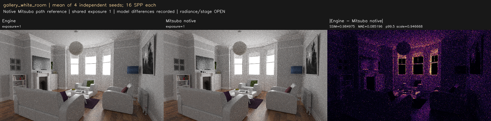
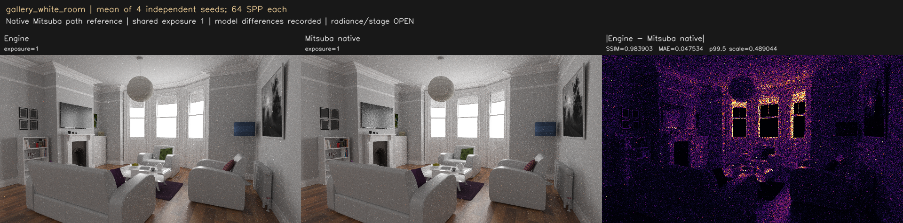
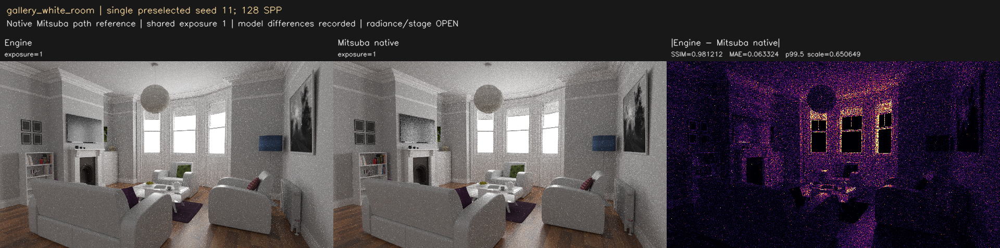
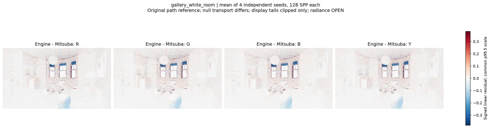
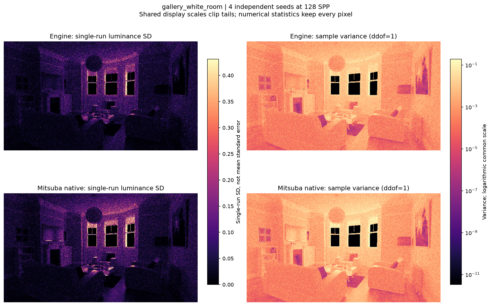
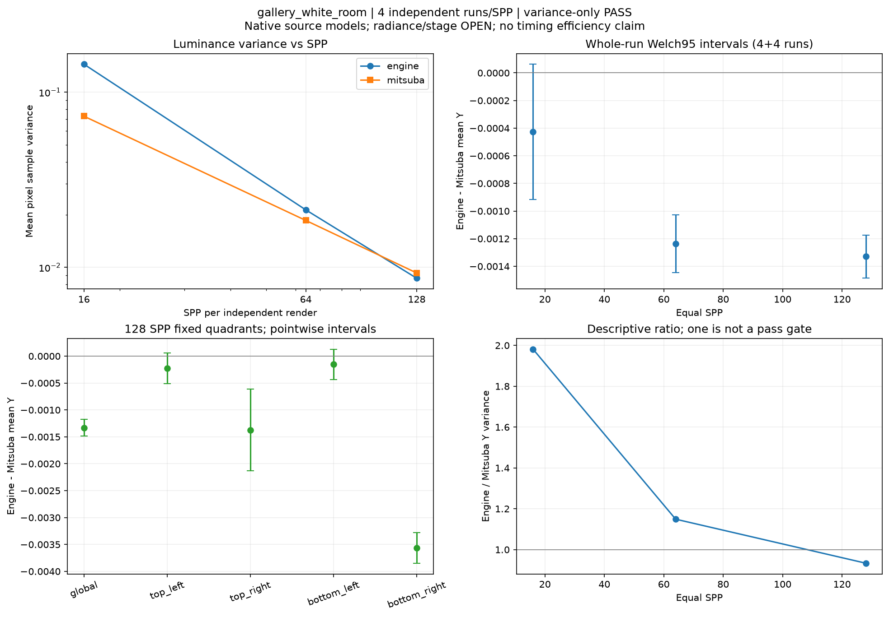

# gallery_white_room

**Radiance: OPEN · Variance: PASS · 사용자 육안 확인: 승인 (기존 게시 이미지)**

Reference: Mitsuba 3.9.1 original path control

블라인드·전등갓 7개 mesh의 버려졌던 scalar mask opacity를 기존 BLEND 경로로 복원했습니다. 동일한 원본 Mitsuba path reference 대비 평균 Y -0.172790% → -0.194988%. 기존 SSIM .99 검사 0.989367 / FAILED. Shader/exe/카메라/나머지 재질은 동일합니다. Mitsuba path는 null 통과도 깊이에 포함하므로 엔진과 유한 깊이 정의가 다릅니다. 이 결과는 보존하는 원본 path 대조군이며, 더 잘 맞는 null-depth 조건은 별도 volpath 비교를 보세요.

반복 검증의 평균 영상은 여러 seed를 평균한 결과이며, 대표 이미지로 표시된 단일 seed 렌더와 구분합니다. 노이즈 영상은 seed 간 분산 또는 표준편차입니다. 노이즈 비율 1은 통과 기준이 아닙니다. 색상 스케일·SPP·seed 수는 각 그림에 표시됩니다.

## radiance_mean4_spp16.png

## radiance_mean4_spp64.png

## radiance_mean4_spp128.png

## radiance_seed11_spp128.png

## signed_residuals.png

## noise_variance.png

## convergence_uncertainty.png

