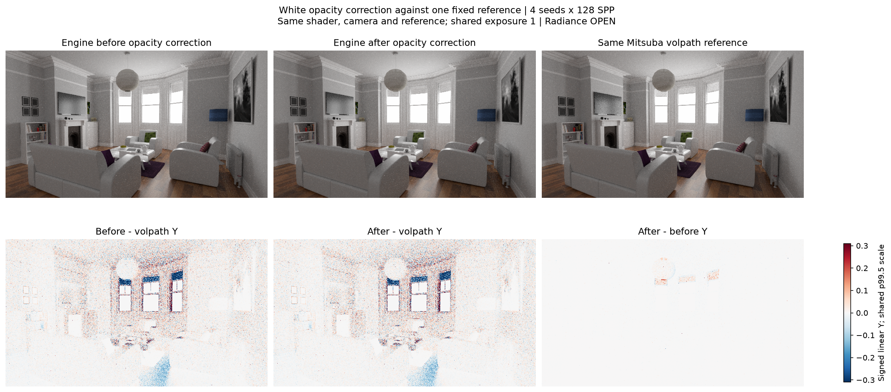
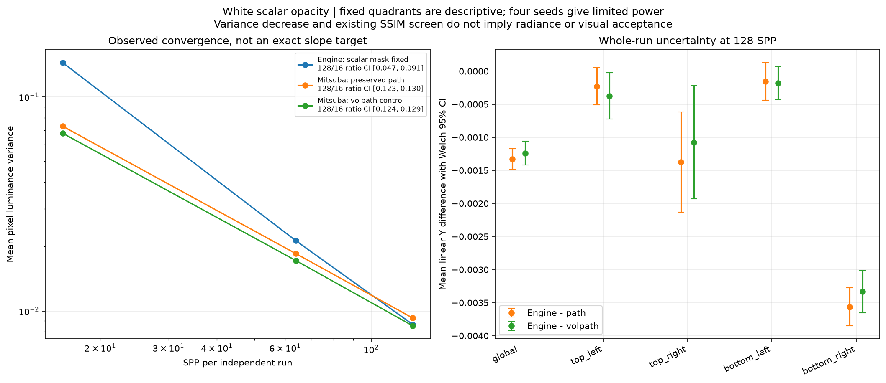
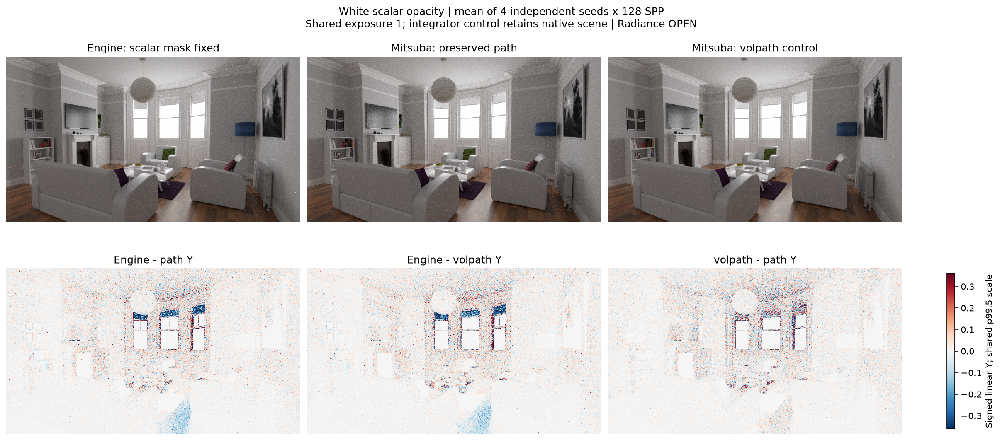
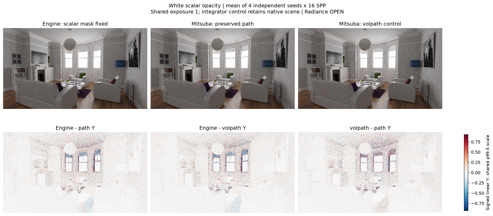
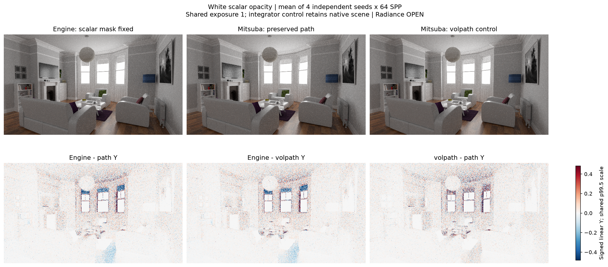
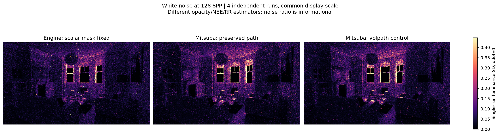

# gallery_white_room

**Radiance: OPEN · Variance: PASS · 사용자 육안 확인: 대기**

Reference: Mitsuba 3.9.1 native volpath null-depth control

수정 전후 엔진을 하나의 동일한 native Mitsuba volpath reference와 비교합니다. 128SPP x 4 평균 Y -0.159632% → -0.181833%, 기존 SSIM .99 검사 0.989897 / FAILED. 원본 XML에서 integrator 종류만 변경했고 193개 참조 asset 및 형상/카메라/재질/광원을 보존했습니다. null 통과를 실제 산란 깊이에 세지 않는 volpath가 엔진의 깊이 정의에 더 맞습니다. 수정 전후 same-seed paired 통계와 path→volpath reference 변화는 따로 계산했습니다. Engine의 확률적 opacity/shadow와 volpath의 결정론적 투과율 곱, RR 실행 시점은 다르므로 노이즈 비율 1을 요구하지 않습니다. 고정 영역별 밝기 차이·노이즈·수렴과 기존 path 결과를 모두 보존하며, 정확한 재질 모델 동등성과 radiance/단계 승인은 별도입니다.

평균 영상은 여러 seed의 평균이며 단일 렌더와 구분했습니다. 노이즈 영상은 seed 간 분산입니다. 노이즈 비율 1은 통과 기준이 아닙니다. 색상 스케일·SPP·seed 수는 각 그림에 표시됩니다.

## before_after_same_volpath.png

## convergence_radiance_uncertainty.png

## mean_reference_control_spp128.png

## mean_reference_control_spp16.png

## mean_reference_control_spp64.png

## noise_reference_control.png

