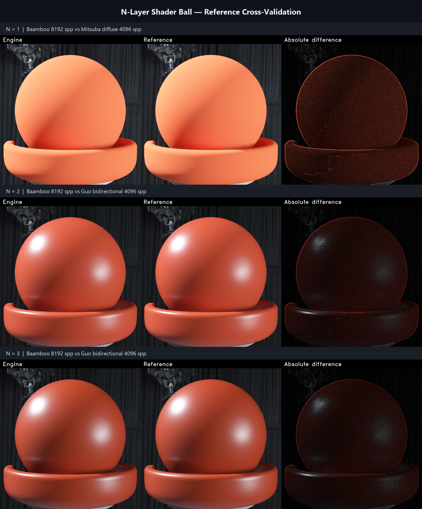

# N-Layer Shader Ball Showcase

The three panels use identical geometry, camera, environment map, and exposure.
Only the material stack changes:

- **N=1:** diffuse substrate.
- **N=2:** GGX rough dielectric interface (`alpha=0.09`, `IOR=1.32`) over the substrate.
- **N=3:** the N=2 coat, an RGB Beer absorption slab, a second GGX rough dielectric interface (`alpha=0.28`, `IOR=1.58`), a second RGB Beer slab, and the substrate.

Baamboo images are 512x512 at 8192 spp and max depth 16. PBRT-v4 and Mitsuba/Guo references are 4096 spp. All engine images contain zero non-finite and zero negative radiance pixels. The N=1/N=2/N=3 primary-ID, depth, and geometric-normal AOVs are bitwise identical, confirming that geometry and camera stayed fixed.

## Cross-validation

| Comparison | Blurred full-image SSIM | Mean ratio | Median ratio | Result |
|---|---:|---:|---:|---:|
| N=1 vs PBRT diffuse | 0.995359 | 0.978888 | 0.979436 | PASS |
| N=1 vs Mitsuba diffuse | 0.999802 | 1.001384 | 1.001253 | PASS |
| N=2 vs PBRT coated diffuse | 0.998432 | 0.985108 | 0.981432 | PASS |
| N=2 vs Guo bidirectional | 0.999967 | 1.001678 | 1.001028 | PASS |
| N=3 vs Guo bidirectional | 0.999969 | 1.004941 | 1.007206 | PASS |
| N=3 vs Guo unidirectional | 0.999679 | 1.021044 | 1.042394 | PASS |

The material ROI additionally passed the p99.9 and top-1%/top-0.1% energy-tail gates for all six comparisons. Guo images were horizontally reflected into the engine screen convention before comparison. See [`validation_summary.json`](validation_summary.json) for the complete thresholds, tail metrics, stack contract, and AOV hashes.

PBRT-v4 is an exact independent reference for N=1 and N=2. The Guo et al. 2018 arbitrary-layer implementation is the primary N=2/N=3 oracle; N=3 was rendered with both its bidirectional and unidirectional estimators. OpenPBR was not used as an image oracle because the available local contract does not provide arbitrary-N ground truth and defers homogeneous-volume support.

Individual panels: [`N=1`](n1.png), [`N=2`](n2.png), [`N=3`](n3.png).

## Asset attribution

The geometry is adapted from [USD Shader Ball for glTF](https://github.com/KhronosGroup/glTF-Sample-Assets/tree/main/Models/USDShaderBallForGltf), licensed under [CC BY 4.0 International](https://creativecommons.org/licenses/by/4.0/). Geometry and textures: Chris Rydalch; original specification and validation: André Mazzone; original scene, inspiration, and consultation: Thomas Anagnostou; glTF conversion: Eric Chadwick. The authored materials were replaced by the validation stacks described above.
